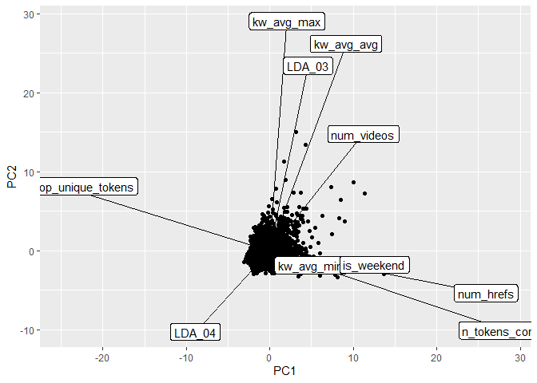
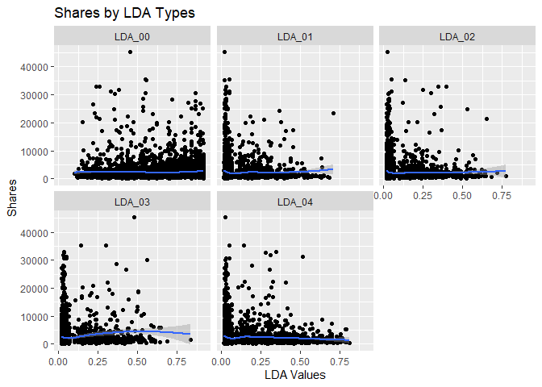
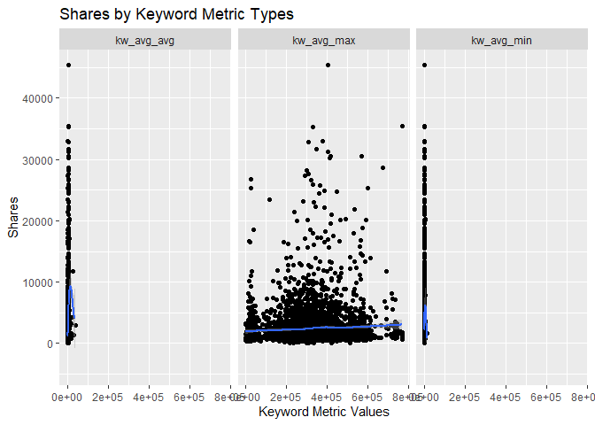
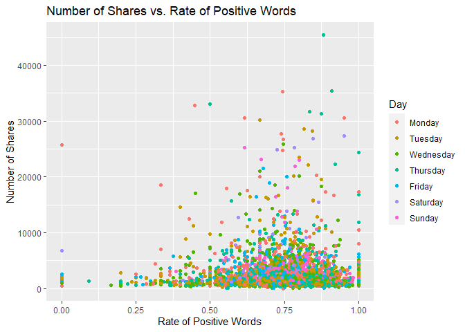
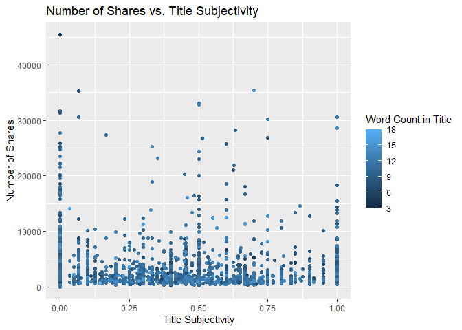

Project 3
================
Kara Belknap & Cassio Monti
2022-11-5

-   <a href="#report-for-the-bus-data-channel"
    id="toc-report-for-the-bus-data-channel">Report for the <em>bus</em>
    Data Channel</a>
    -   <a href="#introduction" id="toc-introduction">Introduction</a>
    -   <a href="#data-import-and-manipulation"
        id="toc-data-import-and-manipulation">Data Import and Manipulation</a>
        -   <a href="#required-packages" id="toc-required-packages">Required
            Packages</a>
        -   <a href="#read-in-the-data" id="toc-read-in-the-data">Read in the
            Data</a>
        -   <a href="#select-data-for-appropriate-data-channel"
            id="toc-select-data-for-appropriate-data-channel">Select Data for
            Appropriate Data Channel</a>
    -   <a href="#summarizations-for-the-bus-data-channel"
        id="toc-summarizations-for-the-bus-data-channel">Summarizations for the
        <em>bus</em> Data Channel</a>
        -   <a href="#data-manipulation-for-eda"
            id="toc-data-manipulation-for-eda">Data Manipulation for EDA</a>
        -   <a href="#eda-summary-statistics" id="toc-eda-summary-statistics">EDA:
            Summary Statistics</a>
        -   <a href="#eda-graphical-analysis" id="toc-eda-graphical-analysis">EDA:
            Graphical Analysis</a>
    -   <a href="#modeling" id="toc-modeling">Modeling</a>
        -   <a href="#data-manipulation-for-modeling"
            id="toc-data-manipulation-for-modeling">Data Manipulation for
            Modeling</a>
        -   <a href="#linear-regression-modeling"
            id="toc-linear-regression-modeling">Linear Regression Modeling</a>
        -   <a href="#tree-based-modeling" id="toc-tree-based-modeling">Tree-Based
            Modeling</a>
    -   <a href="#model-comparison--conclusion"
        id="toc-model-comparison--conclusion">Model Comparison &amp;
        Conclusion</a>
    -   <a href="#reference-list" id="toc-reference-list">Reference List</a>

# Report for the *bus* Data Channel

This report contains Exploratory Data Analysis (EDA) about the bus data
channel and a modeling section applying three regression methods which
attempt to predict trends about article sharing on the Mashable website.

## Introduction

The objective of this analysis is to provide a comprehensive overview
about publication metrics and their relationship with the number of
shares that those publications presented during the study period. These
data have been collected from Mashable website, one of the largest news
websites from which the content of all the bus channel articles
published in 2013 and 2014 was extracted. The full data description can
be found
[here](https://archive.ics.uci.edu/ml/datasets/Online+News+Popularity).
These data were originally collected and analyzed by Fernandes et
al. (2015), in which the authors performed classification task comparing
several machine learning algorithms. In the present study, a subset of
the data used by Fernandes et al.(2015) corresponding to the data
channel bus is used for regression purposes. The response variable is
the number of `shares` that the papers presented after publication. In
other words, we will try to predict the number of shares that the papers
will have before publication and evaluate the prediction of each
selected model based on some common metrics, such as RMSE (Root Mean
Squared Error), $R^2$ (Coefficient of Determination), and MAE (Mean
Absolute Error) applied to the test set. To perform the regression, the
methods Random Forest, Boosting, Multiple Linear Regression, and LASSO
regression will be used. More information about the methods will be
corresponding in further sections.

Some metrics have been calculated based on the information obtained from
Mashable website. For instance, the Latent Dirichlet Allocation (LDA)
was applied to the data set to identify the 5 top relevant topics and
then measure the closeness of the current article to such topic. There
are 5 relevance of topic metrics according to LDA:

-   `LDA_00`: Closeness to LDA topic 0  
-   `LDA_01`: Closeness to LDA topic 1  
-   `LDA_02`: Closeness to LDA topic 2  
-   `LDA_03`: Closeness to LDA topic 3  
-   `LDA_04`: Closeness to LDA topic 4

Additionally, some quality metrics related to the keywords have been
calculated and will be used in this analysis. These metrics represent
the average number of shares for publications with worst, best, and
average keywords. The classification of keywords under these groups was
made by the authors of the original paper. The keyword metrics are shown
below.

-   `kw_avg_min`: Worst keyword (avg. shares)  
-   `kw_avg_max`: Best keyword (avg. shares)  
-   `kw_avg_avg`: Avg. keyword (avg. shares)

Article content metrics were also used in this study. These are general
metrics about the body of the publication that can influence the number
of shares of that paper. The content summary metrics are shown below.

-   `num_videos`: Number of videos  
-   `n_tokens_content`: Number of words in the content  
-   `n_non_stop_unique_tokens`: Rate of unique non-stop words in the
    content  
-   `num_hrefs`: Number of links  
-   `num_self_hrefs`: Number of links to other articles published by
    Mashable  
-   `average_token_length`: Average length of the words in the content

These data were collected during 2013 and 2014 on daily basis. To
represent time dependent information, a binary variable indicating
whether the publication was made in a weekend or weekday, `is_weekend`
is used.

## Data Import and Manipulation

### Required Packages

Before we can begin our analysis, we must load in the following
packages:

``` r
library(tidyverse)
library(caret)
library(GGally)
library(knitr)
```

`Tidyverse` is used for data management and plotting through dplyr and
ggplot packages. `Caret` package is used for data splitting and
modeling. `GGally` is used for nice correlation and exploratory plots
assisting in the visualization. `knitr` package is used to provide nice
looking tables.

### Read in the Data

Using the data file `OnlineNewsPopularity.csv`, we will read in the data
and add a new column corresponding to the type of data channel from
which the data was classified. The new variable will be called
`dataChannel`. Note that there are some rows that are unclassified
according to the six channels of interest and those are indicated by
`other`. The data indicated by `other` was excluded from all reports
since the data had not been assigned to one of our channels of interest.

Once the data column is created, we can easily subset the data using the
`filter` function to create a new data set for each data channel. We
removed the original `data_channel_is_*` columns as well as two
non-predictive columns `url` and `timedelta`.

``` r
# reading in the data set
rawData <- read_csv("../OnlineNewsPopularity.csv")

# creating new variable to have more comprehensive names for data channels.
rawDataChannel <- rawData %>%
  mutate(dataChannel = ifelse(data_channel_is_lifestyle == 1, "lifestyle", 
                              ifelse(data_channel_is_entertainment == 1, "entertainment", 
                              ifelse(data_channel_is_bus == 1, "bus", 
                              ifelse(data_channel_is_socmed == 1, "socmed", 
                              ifelse(data_channel_is_tech == 1, "tech", 
                              ifelse(data_channel_is_world == 1, "world", 
                                     "other"))))))) %>%
  select(-data_channel_is_lifestyle, -data_channel_is_entertainment, 
         -data_channel_is_bus, -data_channel_is_socmed, -data_channel_is_tech,
         -data_channel_is_world, -url, -timedelta)

# assigning channel data to R objects.
lifestyleData <- rawDataChannel %>%
  filter(dataChannel == "lifestyle")

entertainmentData <- rawDataChannel %>%
  filter(dataChannel == "entertainment")

busData <- rawDataChannel %>%
  filter(dataChannel == "bus")

socmedData <- rawDataChannel %>%
  filter(dataChannel == "socmed")

techData <- rawDataChannel %>%
  filter(dataChannel == "tech")

worldData <- rawDataChannel %>%
  filter(dataChannel == "world")
```

### Select Data for Appropriate Data Channel

To select the appropriate data channel based on the `params$channel`, we
created a function `selectData` which would return the appropriate data
set and assign it to the data set `activeData`. This will be the file we
will use for the remainder of the report.

``` r
# function to assign automated calls for the different data channels
selectData <- function(dataChannel) { 
  if (dataChannel == "lifestyle"){
    return(lifestyleData)
  }
  if (dataChannel == "entertainment"){
    return(entertainmentData)
  }
  if (dataChannel == "bus"){
    return(busData)
  }
  if (dataChannel == "socmed"){
    return(socmedData)
  }
  if (dataChannel == "tech"){
    return(techData)
  }
  if (dataChannel == "world"){
    return(worldData)
  }
}

# activating corresponding data set.
dataChannelSelect <- params$channel

activeData <- selectData(dataChannelSelect)
```

## Summarizations for the *bus* Data Channel

In this section, we will perform EDA for the data channel bus.

### Data Manipulation for EDA

#### Data Split

This section splits the data set into training and test sets for the
proportion of 70/30. The data summarizing will be conducted on the
training set. To split the data, the function `createDataPartition()`,
from `caret` package, was used with the argument `p=0.7` to represent
70% of the data should be in the split. The function `set.seed(555)` was
used to fix the random seed. The code below shows the creation of
training and test sets.

``` r
set.seed(555)

trainIndex <- createDataPartition(activeData$shares, p = 0.7, list = FALSE)

activeTrain <- activeData[trainIndex, ]

activeTest <- activeData[-trainIndex, ]
```

#### Data manipulation for statistics

A new object is created in this section aiming to summarize publications
during weekdays and weekends and create factor levels for them to match
with `shares` variable. The functions `ifelse()` was used to vectorize
the IF-ELSE statements associated to `mutate()` which took care of
attaching the new variable to the data set. The function `factor()` was
used to explicitly coerce the days of week into levels of the newly
created categorical variable “Day”.

``` r
# IF-ELSE statements
statsData <- activeTrain %>%
  mutate(Day = ifelse(weekday_is_monday == 1, "Monday", 
                      ifelse(weekday_is_tuesday == 1, "Tuesday", 
                      ifelse(weekday_is_wednesday == 1, "Wednesday", 
                      ifelse(weekday_is_thursday == 1, "Thursday", 
                      ifelse(weekday_is_friday == 1, "Friday", 
                      ifelse(weekday_is_saturday == 1, "Saturday", 
                      ifelse(weekday_is_sunday == 1, "Sunday",
                             "missingdata")))))))) %>%
  mutate(Weekend = ifelse(is_weekend == 1, "Yes", "No"))

# Assigning factor levels
statsData$Day <- factor(statsData$Day, 
                levels = c("Monday", "Tuesday", "Wednesday", "Thursday", 
                           "Friday", "Saturday", "Sunday"))
```

### EDA: Summary Statistics

#### Summary Statistics, Number of Articles Shared

The following table gives us information about the summary statistics
for the number of shares for articles in the data channel bus. The
`summary()` function was used to extract these metrics.

``` r
summary(activeTrain$shares)
```

    ##     Min.  1st Qu.   Median     Mean  3rd Qu.     Max. 
    ##      1.0    952.2   1400.0   3131.5   2500.0 690400.0

#### Summary Statistics, Number of Articles Shared, Weekend vs. Weekday

The following table gives us information about the average, median, and
standard deviation for the number of shares based on whether the post
was made on a weekend or a weekday. The variable “weekend” was grouped,
via `grouped_by()`, and for each level the sum, average, median, and
standard deviation of shares were calculated via `sum()`, `mean()`,
`meadian()`, `sd()`, and `summarise()` functions. The summary table is
shown below.

``` r
statsData %>% 
  group_by(Weekend) %>%
  summarise(sumShares = sum(shares), avgShares = mean(shares), medShares = median(shares), sdShares = sd(shares)) %>% 
  kable(caption = "Statistics for Shares for Weekend or Weekdays") 
```

| Weekend | sumShares | avgShares | medShares |  sdShares |
|:--------|----------:|----------:|----------:|----------:|
| No      |  12165811 |  3055.969 |      1400 | 17539.640 |
| Yes     |   1556340 |  3881.147 |      2400 |  5516.292 |

Statistics for Shares for Weekend or Weekdays

#### Summary Statistics, Articles Shared by Day of Week

Likewise, this table gives us information about the number of shares by
the day of the week. The same functions were used here, by applied to
levels of variable “Day”. Also, the quantities maximum `max()` and
minimum `min()` number of shares by levels of “Day” were calculated.

``` r
statsData %>% 
  group_by(Day) %>%
  arrange(Day) %>%
  summarise(sumShares = sum(shares), avgShares = mean(shares), medShares = median(shares), sdShares = sd(shares), maxShares = max(shares),
            minShares = min(shares)) %>% 
  kable(caption = "Statistics for Shares Across Days of Week")
```

| Day       | sumShares | avgShares | medShares |  sdShares | maxShares | minShares |
|:----------|----------:|----------:|----------:|----------:|----------:|----------:|
| Monday    |   3589216 |  4398.549 |      1400 | 33485.734 |    690400 |         1 |
| Tuesday   |   2576112 |  3055.886 |      1300 | 12482.130 |    310800 |       156 |
| Wednesday |   2400592 |  2718.677 |      1300 |  8240.125 |    158900 |        63 |
| Thursday  |   2214755 |  2548.625 |      1300 | 10967.043 |    306100 |        81 |
| Friday    |   1385136 |  2430.063 |      1500 |  4790.182 |    102200 |        83 |
| Saturday  |    665601 |  4108.648 |      2600 |  5326.960 |     42500 |       150 |
| Sunday    |    890739 |  3726.941 |      2200 |  5646.858 |     56900 |       692 |

Statistics for Shares Across Days of Week

#### Total Articles Shared by Day of Week

Next, we will analyse the frequency of occurrence of publications on
each day of the week. The one-way contingency table below presents those
frequencies.

``` r
table(statsData$Day)
```

    ## 
    ##    Monday   Tuesday Wednesday  Thursday    Friday  Saturday    Sunday 
    ##       816       843       883       869       570       162       239

#### Contingency Table

Another discrete analysis performed here is the two-way contingency
table related to the discretization of the response variable if we
divided `shares` into two categories. The function `cut()` was used for
the end. In this case, we count the frequency of the number of
publications in the weekend versus working days with the two levels of
response variable. These levels represent smaller number of shares (on
the left) and larger number of shares (on the right). The table below
shows this counting. In the table below, 0 (zero) represents working
days and 1 (one) represents weekends.

``` r
table(activeTrain$is_weekend, cut(activeTrain$shares, breaks = 2)) %>%
  kable(caption = "Frequency of Shares in Weekend vs in Working Days")
```

|     | (-689,3.45e+05\] | (3.45e+05,6.91e+05\] |
|:----|-----------------:|---------------------:|
| 0   |             3979 |                    2 |
| 1   |              401 |                    0 |

Frequency of Shares in Weekend vs in Working Days

#### Correlation Matrix

An important EDA analysis for regression tasks is the correlation
matrix. The function `cor()` is used in this section to return the top
10 most correlated potential predictor variables with the response
variable `shares`. The code below presents the process of obtaining
these variables and their respective correlations with the response
variable. The correlations are clearly small for this case, which may
difficult the modeling process and produce low quality of prediction
metrics.

``` r
var_sel = select(activeTrain,starts_with("LDA_"), average_token_length,
         is_weekend, n_tokens_content, n_non_stop_unique_tokens, num_hrefs,
         num_self_hrefs, num_videos, average_token_length, kw_avg_min, 
         kw_avg_max, kw_avg_avg, is_weekend)

# correlation matrix
correlation = cor(activeTrain$shares, var_sel)

# sorting the highest correlations
p = sort(abs(correlation), decreasing = T)

# getting column ID
var_id = which(abs(correlation) %in% p[1:10])

# collecting variable names
var_cor = colnames(correlation)[var_id]

#combining names with correlations
tbcor = cbind(var_cor, correlation[var_id])

# converting to tibble
tbcor = as_tibble(tbcor)

# updating column names
colnames(tbcor)=c("Variables","Correlation")

# rounding the digits
tbcor$Correlation = round(as.numeric(tbcor$Correlation),3)

# nice printing with kable
kable(tbcor, caption = "Top 10 Response Correlated Variables")
```

| Variables            | Correlation |
|:---------------------|------------:|
| LDA_02               |      -0.019 |
| LDA_03               |       0.072 |
| average_token_length |      -0.030 |
| n_tokens_content     |       0.036 |
| num_hrefs            |       0.045 |
| num_self_hrefs       |       0.025 |
| num_videos           |       0.059 |
| kw_avg_min           |       0.044 |
| kw_avg_max           |       0.029 |
| kw_avg_avg           |       0.080 |

Top 10 Response Correlated Variables

#### Principal Components Analysis (PCA)

The variables that present most correlation with the response variable
`shares` are LDA_02, LDA_03, average_token_length, n_tokens_content,
num_hrefs, num_self_hrefs, num_videos, kw_avg_min, kw_avg_max,
kw_avg_avg. These variables will be studied in more depth via PCA to
understand the orientation of the most important potential predictors.
The code below presents the PCA analysis as part of the EDA. The 10 PCs
displayed in the table below correspond to the most variable combination
of the 10 predictors, which the PC1 has the most variation in the data,
PC2 presents the second most variation and so on. The coefficients
associated to each variable are the loadings and they give the idea of
importance of that particular variable to the variance of the 10
predictor variables. The negative values only mean that the orientation
of the weights are opposite in the same PC. Since the first PC has the
largest variability, it is possible to say that the variables with more
weights in PC1 are the most important variables for the variance of the
predictors. This variables are supposed to present large influence on
the explanation of the variance of the response variable. The table
below show these numbers.

``` r
id = which(colnames(activeTrain) %in% var_cor)

# PCA
PC = prcomp(activeTrain[,id], center = TRUE, scale = TRUE)

pc_directions=as.data.frame(PC$rotation)

kable(pc_directions, caption="Principal Components for EDA", digits = 3)
```

|                      |    PC1 |    PC2 |    PC3 |    PC4 |    PC5 |    PC6 |    PC7 |    PC8 |    PC9 |   PC10 |
|:---------------------|-------:|-------:|-------:|-------:|-------:|-------:|-------:|-------:|-------:|-------:|
| n_tokens_content     |  0.477 | -0.338 | -0.078 | -0.172 | -0.144 | -0.177 |  0.416 | -0.163 |  0.579 |  0.189 |
| num_hrefs            |  0.556 | -0.345 | -0.023 |  0.024 |  0.000 |  0.008 |  0.073 | -0.183 | -0.649 | -0.332 |
| num_self_hrefs       |  0.340 | -0.202 |  0.182 |  0.194 |  0.347 | -0.283 | -0.689 |  0.209 |  0.196 |  0.124 |
| num_videos           |  0.329 |  0.137 |  0.277 | -0.235 | -0.406 |  0.398 | -0.039 |  0.645 |  0.002 |  0.014 |
| average_token_length |  0.033 | -0.255 | -0.213 |  0.508 |  0.043 |  0.751 | -0.080 | -0.130 |  0.171 |  0.112 |
| kw_avg_min           |  0.181 |  0.290 | -0.702 | -0.135 | -0.039 | -0.005 | -0.239 |  0.073 |  0.232 | -0.505 |
| kw_avg_max           |  0.183 |  0.380 |  0.343 |  0.578 |  0.132 | -0.113 |  0.346 |  0.071 |  0.196 | -0.420 |
| kw_avg_avg           |  0.351 |  0.507 | -0.313 |  0.183 |  0.087 | -0.080 |  0.111 |  0.012 | -0.264 |  0.626 |
| LDA_02               | -0.102 | -0.116 | -0.103 |  0.446 | -0.783 | -0.339 | -0.184 | -0.012 | -0.050 |  0.047 |
| LDA_03               |  0.195 |  0.377 |  0.345 | -0.187 | -0.228 |  0.181 | -0.341 | -0.673 |  0.109 | -0.014 |

Principal Components for EDA

``` r
id2 = which(abs(pc_directions$PC1) %in% 
             sort(abs(pc_directions$PC1),dec= T)[1:3])
```

It is possible to see that the three most important variables in PC1 are
n_tokens_content, num_hrefs, kw_avg_avg from the table above. These
variables are considered the most important variables in terms of
variance of the predictor variables. Although the metrics for prediction
are expected to be poor, these variables are expected to show the most
influence to the explanation of the variance of the response `shares`.

### EDA: Graphical Analysis

#### Correlation Plot

The plot below presents histograms, scatter plots, and correlations in a
bivariate structure of the top 5 variables chosen in the correlation
analysis. Notice the shape of the distributions and the values of the
correlations for the first column, which the one related to the response
variable `shares`.

``` r
# bivariate correlation plot
cor_data <- select(activeTrain,shares,var_id[1:5])
ggpairs(cor_data)
```

<!-- -->

#### PCA: Biplot

The biplot below presents the PC1 and PC2 from the PCA analysis. The
function `ggplot()` was used to create the plot and the segments created
via `geom_segment()` were re-scaled so that we could better see the
variable names. The most variation in the data is contained in the PC1,
hence, the most important variables in the data are approximately
oriented towards the axis of PC1 and, therefore, may be good predictors
for the `shares` response. Likewise, for PC2, which contains the second
most variability in the data set, the variables that are oriented
approximately towards the axis of PC2 are the second most important
variables.

``` r
pc_df<-data.frame(PC$x)
# plotting PC1 and PC2 for the top 5 variables
# biplot(PC, cex = 1)
ggplot(pc_directions)+
  geom_point(data = pc_df, mapping = aes(x=PC1, y=PC2))+
  geom_segment(aes(x = 0, y = 0, yend = 50 * PC2, xend = 50 * PC1))+
  geom_label(mapping = aes(x = 51 * PC1, y = 51 * PC2, label = row.names(pc_directions)))
```

<!-- -->

#### Scatter Plots by LDA Value

The scatter plots below show the different levels of the variables
related to the LDA metrics, from 0 to 4, and graphs the relationship
with the response variable `shares`. The function `ggplot()` is used to
create the plot frame and `geom_point()`, `geom_smooth`, and
`facert_wrap()` function are used to plot the scatter points, the smooth
GAM (Generalized Additive Models) lines, and split the data by LDA type,
respectively. It is possible to see the behavior of the response
variable in relation to each LDA types.

``` r
LDA.dat = activeTrain %>%
  select(shares, starts_with("LDA")) %>%
  pivot_longer(cols = LDA_00:LDA_04, names_to = "LDA", values_to = "values")

# relationship between shares and LDA levels (facet_wrap+smooth)
ggplot(LDA.dat, aes(y = shares, x = values))+
  geom_point() + geom_smooth(method = "loess")+ facet_wrap(~LDA)+
labs(x = "LDA Values", y = "Shares", title = "Shares by LDA Types")
```

<!-- -->

#### Scatter Plots by Keyword Metrics

The scatter plots below show the different types of the variables
related to the Keyword metrics and graphs the relationship with the
response variable `shares`. The function `ggplot()` is used to create
the plot frame and `geom_point()`, `geom_smooth`, and `facert_wrap()`
function are used to plot the scatter points, the smooth GAM
(Generalized Additive Models) lines, and split the data by keyword type,
respectively. It is possible to see the behavior of the response
variable in relation to each of the 3 keyword metric types.

``` r
# relationship between shares and keyword metrics
kw.dat = activeTrain %>%
  select(shares, kw_avg_max, kw_avg_avg, kw_avg_min) %>%
  pivot_longer(cols = 2:4, names_to = "keyword", values_to = "values")

# relationship between shares and keyword metrics types (facet_wrap+smooth)
ggplot(kw.dat, aes(y = shares, x = values))+
  geom_point() + geom_smooth(method = "loess")+ facet_wrap(~keyword)+
labs(x = "Keyword Metric Values", y = "Shares", title = "Shares by Keyword Metric Types")
```

<!-- -->

#### Scatter Plots by Content Metrics

The scatter plots below show the different types of the variables
related to the Content metrics and graphs the relationship with the
response variable `shares`. The function `ggplot()` is used to create
the plot frame and `geom_point()`, `geom_smooth`, and `facert_wrap()`
function are used to plot the scatter points, the smooth GAM
(Generalized Additive Models) lines, and split the data by content type,
respectively. It is possible to see the behavior of the response
variable in relation to each of the 4 content metric types.

``` r
# relationship between shares and content metrics (facet_wrap+smooth)
cont.dat = activeTrain %>%
  select(shares, num_videos, n_tokens_content, n_non_stop_unique_tokens,
         num_hrefs, num_self_hrefs, average_token_length) %>%
  pivot_longer(cols = 2:7, names_to = "content", values_to = "values")

# relationship between shares and content metrics types (facet_wrap+smooth)
ggplot(cont.dat, aes(y = shares, x = values))+
  geom_point() + geom_smooth(method = "loess")+ facet_wrap(~content)+
labs(x = "Content Metric Values", y = "Shares", title = "Shares by Content Metric Types")
```

<!-- -->

#### Scatter Plot of Title Words

The following graph shows the number of shares compared to the number of
words in the title. The output is colored by the day of the week.

``` r
titlewordcountGraph <- ggplot(statsData, aes(x = n_tokens_title, y = shares))
titlewordcountGraph + geom_point(aes(color = Day)) + 
  ggtitle("Number of Shares vs. Number of Words in Title") +
  ylab("Number of Shares") +
  xlab("Number of Words in Title")
```

<!-- -->

#### Scatter Plot of Positive Words

The following plot shows the number of shares by the rate of positive
words in the article. A positive trend would indicate that articles with
more positive words are shared more often than articles with negative
words.

``` r
positivewordrateGraph <- ggplot(statsData, aes(x = rate_positive_words, y = shares))
positivewordrateGraph + geom_point(aes(color = Day)) + 
  ggtitle("Number of Shares vs. Rate of Positive Words") +
  ylab("Number of Shares") +
  xlab("Rate of Positive Words") 
```

<!-- -->

#### Scatter Plot of Title Subjectivity

The following plot shows the total number of shares as related to the
parameter title subjectivity. A positive trend would indicate that
articles are shared more often when the title is subjective. A negative
trend would indicate that articles are shared more often when the title
is less subjective.

``` r
titleSubjectivityGraph <- ggplot(statsData, aes(x = title_subjectivity, y = shares))
titleSubjectivityGraph + geom_point(aes(color = n_tokens_title)) + 
  ggtitle("Number of Shares vs. Title Subjectivity") +
  ylab("Number of Shares") +
  xlab("Title Subjectivity") + 
  labs(color = "Word Count in Title")
```

<!-- -->

## Modeling

In this section, we will perform regression for prediction purposes for
the data channel bus. All models were fitted using 5-fold
Cross-Validation via `train()` function from `caret` package. All
variables were scaled and centered as well.

### Data Manipulation for Modeling

#### Subsetting Variables for Modeling

The variables selected below are those described in the introduction of
this study and will be used in the modeling section. The function
`select()` was used to subset the corresponding variables from the
training and test sets and two new objects are created specially for the
modeling section, `dfTrain` and `dfTest`.

``` r
dfTrain = activeTrain %>%
  select(shares, starts_with("LDA_"), average_token_length,
         is_weekend, n_tokens_content, n_non_stop_unique_tokens, num_hrefs,
         num_self_hrefs, num_videos, average_token_length, kw_avg_min, 
         kw_avg_max, kw_avg_avg, is_weekend)

dfTest = activeTest %>%
  select(shares, starts_with("LDA_"), average_token_length,
         is_weekend, n_tokens_content, n_non_stop_unique_tokens, num_hrefs,
         num_self_hrefs, num_videos, average_token_length, kw_avg_min, 
         kw_avg_max, kw_avg_avg, is_weekend)
```

### Linear Regression Modeling

Linear regression is a modeling technique by which one attempts to model
a response variable (in this case `shares`) with one or more explanatory
variables using a straight line. If there is only one explanatory
variable, you would call this simple linear regression. Using more than
one explanatory variable is called multiple linear regression. For the
purposes of this report, we will be looking at multiple linear
regression (MLR).

The basic formula that is used for multiple linear regression is

$$ 
Y_i = \beta_0 + \beta_{1}x_{1i} + \beta_{2}x_{2i} + ... + \beta_{n}x_{ni} + E_i
$$ Here:  
- $Yi$ is our response variable for the $i^{th}$ observation  
- $x_{i}$ is the value of our explanatory variable for the \$i^{th}
observation for each explanatory variable (1-n)  
- $\beta_0$ is the y intercept  
- $\beta_{1,...,n)$ is the regression coefficient corresponding to the
explanatory variable of interest (1-n)  
- $E_i$ is an error parameter

The goal of linear regression is to model the fit by minimizing the sum
of squared errors.

$$
SSE = \sum_{i=1}^n(y_{i} - \hat{y}_{i})^2
$$ Here:  
- $y_i$ is the actual value  
- $\hat{y}_{i}$ is the predicted value

In R, MLR is generally done with the function `lm`. There are also a
variety of other methods that fall under the umbrella of MLR, namely
LASSO regression which we will explore as part of this analysis.

#### Linear Regression Model \#1: Multiple Linear Regression Using `lm`

Here, modeling for linear regression is done with the `caret` package
using the method `lm`. The `summary` function gives us the regression
coefficients.

``` r
lmFit = train(shares~., data = dfTrain,
              method="lm",
              preProcess = c("center","scale"),
              trControl = trainControl(method="CV",number=5))

summary(lmFit)
```

    ## 
    ## Call:
    ## lm(formula = .outcome ~ ., data = dat)
    ## 
    ## Residuals:
    ##    Min     1Q Median     3Q    Max 
    ## -27617  -2074  -1028     83 680300 
    ## 
    ## Coefficients: (1 not defined because of singularities)
    ##                          Estimate Std. Error t value Pr(>|t|)    
    ## (Intercept)               3131.48     252.21  12.416  < 2e-16 ***
    ## LDA_00                      92.63     341.58   0.271  0.78627    
    ## LDA_01                     139.42     285.43   0.488  0.62525    
    ## LDA_02                     -66.97     302.27  -0.222  0.82468    
    ## LDA_03                     944.82     294.50   3.208  0.00135 ** 
    ## LDA_04                         NA         NA      NA       NA    
    ## average_token_length      -716.70     280.93  -2.551  0.01077 *  
    ## is_weekend                  81.53     261.20   0.312  0.75494    
    ## n_tokens_content           785.37     358.88   2.188  0.02869 *  
    ## n_non_stop_unique_tokens  1063.81     334.16   3.184  0.00146 ** 
    ## num_hrefs                  553.84     340.18   1.628  0.10358    
    ## num_self_hrefs             186.68     273.04   0.684  0.49419    
    ## num_videos                 538.72     264.82   2.034  0.04198 *  
    ## kw_avg_min                 311.16     303.40   1.026  0.30514    
    ## kw_avg_max                 -24.98     292.71  -0.085  0.93201    
    ## kw_avg_avg                 847.85     329.72   2.571  0.01016 *  
    ## ---
    ## Signif. codes:  0 '***' 0.001 '**' 0.01 '*' 0.05 '.' 0.1 ' ' 1
    ## 
    ## Residual standard error: 16700 on 4367 degrees of freedom
    ## Multiple R-squared:  0.01583,    Adjusted R-squared:  0.01268 
    ## F-statistic: 5.018 on 14 and 4367 DF,  p-value: 2.105e-09

The following table shows the output training metrics for this linear
regression.

``` r
lm_out = data.frame(lmFit$results)

kable(lm_out, caption = "Output Training Metrics for Linear Regression",
      digits = 3)
```

| intercept |    RMSE | Rsquared |      MAE |   RMSESD | RsquaredSD |  MAESD |
|:----------|--------:|---------:|---------:|---------:|-----------:|-------:|
| TRUE      | 14753.6 |    0.014 | 2921.708 | 8903.654 |      0.009 | 356.11 |

Output Training Metrics for Linear Regression

The following shows the RMSE, $R^2$, and MAE values for the model as it
performed on predicting the test set.

``` r
metric_lm = postResample(pred = predict(lmFit, newdata = dfTest), 
                         obs = dfTest$shares)

metric_lm
```

    ##         RMSE     Rsquared          MAE 
    ## 9.793051e+03 1.008597e-02 2.632976e+03

#### Linear Regression Model \#2: LASSO Regression using `glmnet`

The linear regression chosen for this next model is based on penalized
regression via LASSO regression. This method has a particular advantage
of having a triangular shape of parameters search space so that it
allows the estimated coefficients to be zero. This is due to LASSO
optimization that has in the loss function the penalty associating the
sum of the absolute value of the parameters multiplied by `lambda`, the
penalty term (hyperparameter). Hence, LASSO regression is also a
variable selection method. In this application, we will test the
prediction capability of LASSO regression only. It was tested a sequence
of values for the Regularization Parameter (`lambda`), a tuning
parameter, from 0 to 10 by 1 via `seq(0,10,1)` assigned to the
`tuneGrid =`argument in the `train()` function from `caret` package. The
code below presents the estimated coefficients for the best
hyperparameter.

``` r
LASSO = train(shares~., data = dfTrain,
              method="glmnet",
              preProcess = c("center","scale"),
              tuneGrid = expand.grid(alpha = 1, lambda = seq(0,10,1)),
              trControl = trainControl(method="CV",number=5))

coef(LASSO$finalModel, LASSO$bestTune$lambda)
```

    ## 16 x 1 sparse Matrix of class "dgCMatrix"
    ##                                   s1
    ## (Intercept)              3131.481287
    ## LDA_00                      .       
    ## LDA_01                     86.272982
    ## LDA_02                   -108.552842
    ## LDA_03                    894.504703
    ## LDA_04                    -61.745726
    ## average_token_length     -695.814129
    ## is_weekend                 72.919243
    ## n_tokens_content          763.999112
    ## n_non_stop_unique_tokens 1028.825198
    ## num_hrefs                 546.983452
    ## num_self_hrefs            177.069773
    ## num_videos                532.620822
    ## kw_avg_min                306.434579
    ## kw_avg_max                 -8.713593
    ## kw_avg_avg                840.948176

The best `lambda` for this model is 10 and this value can be seen in the
table below which summarizes all the metrics for the 5-fold
cross-validation.

``` r
lasso_out = data.frame(LASSO$results)

kable(lasso_out, caption = "Output Training Metrics for LASSO",
      digits = 3)
```

| alpha | lambda |     RMSE | Rsquared |      MAE |   RMSESD | RsquaredSD |   MAESD |
|------:|-------:|---------:|---------:|---------:|---------:|-----------:|--------:|
|     1 |      0 | 13759.89 |    0.018 | 2908.284 | 10721.34 |      0.011 | 497.320 |
|     1 |      1 | 13759.89 |    0.018 | 2908.284 | 10721.34 |      0.011 | 497.320 |
|     1 |      2 | 13759.89 |    0.018 | 2908.284 | 10721.34 |      0.011 | 497.320 |
|     1 |      3 | 13759.88 |    0.018 | 2908.195 | 10721.33 |      0.011 | 497.255 |
|     1 |      4 | 13759.45 |    0.018 | 2907.561 | 10721.73 |      0.011 | 497.102 |
|     1 |      5 | 13758.57 |    0.018 | 2906.467 | 10722.58 |      0.011 | 497.268 |
|     1 |      6 | 13757.69 |    0.018 | 2905.378 | 10723.42 |      0.011 | 497.431 |
|     1 |      7 | 13756.81 |    0.018 | 2904.298 | 10724.26 |      0.011 | 497.601 |
|     1 |      8 | 13755.94 |    0.018 | 2903.223 | 10725.09 |      0.011 | 497.769 |
|     1 |      9 | 13755.06 |    0.018 | 2902.150 | 10725.93 |      0.011 | 497.945 |
|     1 |     10 | 13754.19 |    0.018 | 2901.084 | 10726.77 |      0.011 | 498.120 |

Output Training Metrics for LASSO

The plot below shows the RMSE by Regularization Parameter (`lambda`). It
is easy to see that RMSE is minimized when `lambda` = 10.

``` r
plot(LASSO)
```

<!-- -->

The validation step for LASSO regression is applied on the test set
after predicting the response variable for unseen data (test set). By
using `predict()` and `postResample()` functions, the metrics RMSE (Root
Means Squared Error), Rsquared (Coefficient of Determination), and MAE
(Mean Absolute Error) are calculated and displayed below.

``` r
metric_LASSO = postResample(pred = predict(LASSO, newdata = dfTest),
                            obs = dfTest$shares)

metric_LASSO
```

    ##         RMSE     Rsquared          MAE 
    ## 9.789639e+03 1.012045e-02 2.626057e+03

### Tree-Based Modeling

The next two models, Random Forest and Boosted Tree, are both types of
tree-based modeling methods. Generally speaking, in a tree-based
modeling method, the predictor space is split into regions, with
different predictions for each region. In the case of regression trees
where the goal is to predict a continuous response, the mean of
observations for a given region is typically used to make the
predictions.

To make the predictions, the trees are split using recursive binary
splitting. For every possible value of each predictor, find the residual
sum of squares (RSS) and try to minimize that. The process is repeated
with each split. Often, trees are grown very large and need to be cut
back using cost complexity pruning. This ensures that the model is not
overfit and will work well on prediction of new data.

#### Random Forest Model

In this section, we attempt to model the data using a Random Forest
model, which is a type of ensemble learning which averages multiple tree
models in order to lower the variance of the final model and thus
improve our prediction.

In a random forest model, we first begin by creating multiple trees from
bootstrap samples. A random subset of predictors is used to create each
bootstrap sample. The predictors are selected randomly to prevent the
trees from being correlated. If the random subset was not used (as in
another tree based method called bagging), the trees would likely all
choose the same predictors for the first split. Choosing the splits
randomly avoids this correlation. The number of predictors is specified
by `mtry`. The maximum number of predictors for a regression model is
generally chosen to be the total number of predictors divided by 3. Once
the bootstrap sample statistics are collected, they are averaged and
used to select a final model.

Random forest models use “out of bag” error to test the data using
samples from the original data set that were not included in a
particular bootstrap data set.

For the random forest model, we will use the `train` function from the
`caret` package. We set the `mtry` to select 1-5 predictors.

``` r
train.control = trainControl(method = "cv", number = 5)

rfFit <- train(shares~.,
               data = dfTrain,
               method = "rf",
               trControl = train.control,
               preProcess = c("center","scale"),
               tuneGrid = data.frame(mtry = 1:5))

rfFit$bestTune$mtry
```

    ## [1] 1

The best `mtry` for this particular model was 1.

The following plot shows the RMSE values for each of the tune. The
objective in random forest modeling is to choose the model with the
lowest RMSE.

``` r
plot(rfFit)
```

<!-- -->

The following table shows training metrics for the random forest model.
Again, the best model is the one that minimizes RMSE.

``` r
rf_out = data.frame(rfFit$results)

kable(rf_out, caption = "Output Training Metrics for Random Forest",
      digits = 3)
```

| mtry |     RMSE | Rsquared |      MAE |   RMSESD | RsquaredSD |   MAESD |
|-----:|---------:|---------:|---------:|---------:|-----------:|--------:|
|    1 | 14353.61 |    0.040 | 2776.283 | 9516.731 |      0.042 | 406.422 |
|    2 | 14417.02 |    0.040 | 2833.565 | 9357.437 |      0.031 | 411.359 |
|    3 | 14534.01 |    0.036 | 2868.402 | 9273.046 |      0.030 | 406.165 |
|    4 | 14631.68 |    0.038 | 2916.301 | 9153.986 |      0.038 | 401.521 |
|    5 | 14747.65 |    0.036 | 2922.408 | 9073.478 |      0.039 | 394.636 |

Output Training Metrics for Random Forest

Now we will run a prediction on our test data split that we obtained
when we split the data based on a 70/30 split. The table shows the RMSE
value for the test data set, which is an indication of how well our
model worked to predict data that was not included when training the
original model. We can compare this model against other models to find
the model with the lowest RMSE.

``` r
RF_pred <- predict(rfFit, newdata = activeTest)

metric_rf = postResample(RF_pred, activeTest$shares)

metric_rf
```

    ##         RMSE     Rsquared          MAE 
    ## 9.910735e+03 8.003641e-03 2.589969e+03

#### Boosted Tree Model

In this section the Ensemble Learning algorithm Boosting will be
trained. Boosted tree method is one of the Tree based models most used
in data science because it presents a fitting strategy improves
sequentially throughout the iterations. Boosting uses single trees
fitted (each single tree has `d` splits) on the training data and
produces predictions off of that training. The residuals of this
prediction is, then, used as response variable for the next single tree
training step. New predictions are done for this new model. This process
occurs several times during `B` iterations and the predictions are
updated during the fitting process, being driven by the shrinkage
parameter, also called growth rate, `lambda`. These training features of
Boosting make this method to produce a reduction in the variance of the
predictions as well as gains in accuracy, mainly over Random Forest,
Bagging, and single tree. The shrinkage parameter will be set as 0.1 and
n.minobsinnode set as 10. The parameters n.tree and interaction.depth
will be chosen based on 5-fold cross-validation. The former will be
chosen from a sequence from 25 to 200, counting by 25. The latter will
be chosen from a sequence from 1 to 4. The code below shows the training
and tuning procedure and prints out the resultant values of the two
considered hyperparameters.

``` r
tunG = expand.grid(n.trees = seq(25,200,25),
                   interaction.depth = 1:4,
                   shrinkage = 0.1,
                   n.minobsinnode = 10)

gbmFit <- train(shares~.,
               data = dfTrain,
               method = "gbm",
               preProcess = c("center","scale"),
               trControl = train.control,
               tuneGrid = tunG,
               verbose = FALSE
               )

gbmFit$bestTune$n.trees
```

    ## [1] 25

``` r
gbmFit$bestTune$interaction.depth
```

    ## [1] 1

The best n.trees and interaction.depth parameters for this model are 25
and 1, respectively. These values can be seen in the table below, which
summarizes all the metrics for the 5-fold cross-validation. It is easy
to see that these values minimize the RMSE.

``` r
gbm_out = data.frame(gbmFit$results)

gbm_out <- gbm_out %>%
  arrange(RMSE)

kable(gbm_out, caption = "Output Training Metrics for Boosting",
      digits = 3, row.names = FALSE)
```

| shrinkage | interaction.depth | n.minobsinnode | n.trees |     RMSE | Rsquared |      MAE |   RMSESD | RsquaredSD |   MAESD |
|----------:|------------------:|---------------:|--------:|---------:|---------:|---------:|---------:|-----------:|--------:|
|       0.1 |                 1 |             10 |      25 | 14741.60 |    0.009 | 2914.779 | 9369.021 |      0.007 | 424.849 |
|       0.1 |                 1 |             10 |     150 | 14916.38 |    0.014 | 2997.510 | 9067.742 |      0.006 | 401.965 |
|       0.1 |                 1 |             10 |      50 | 14924.90 |    0.010 | 3015.053 | 9131.006 |      0.005 | 424.766 |
|       0.1 |                 1 |             10 |     125 | 14927.83 |    0.014 | 3018.742 | 9054.992 |      0.006 | 387.937 |
|       0.1 |                 1 |             10 |     100 | 14935.31 |    0.012 | 3035.434 | 9172.478 |      0.007 | 461.957 |
|       0.1 |                 1 |             10 |     200 | 14949.38 |    0.013 | 3027.320 | 9072.224 |      0.007 | 434.305 |
|       0.1 |                 1 |             10 |     175 | 14987.17 |    0.014 | 3017.609 | 8983.754 |      0.005 | 391.257 |
|       0.1 |                 3 |             10 |      50 | 14995.51 |    0.008 | 2985.368 | 9110.619 |      0.005 | 484.558 |
|       0.1 |                 3 |             10 |      25 | 14995.55 |    0.007 | 2971.092 | 9236.475 |      0.010 | 473.774 |
|       0.1 |                 4 |             10 |      25 | 15021.67 |    0.010 | 2986.438 | 9134.862 |      0.010 | 427.792 |
|       0.1 |                 1 |             10 |      75 | 15077.56 |    0.011 | 3060.467 | 9004.096 |      0.006 | 409.223 |
|       0.1 |                 2 |             10 |      25 | 15109.70 |    0.006 | 2995.477 | 9073.681 |      0.009 | 418.677 |
|       0.1 |                 4 |             10 |      50 | 15151.44 |    0.012 | 3053.797 | 8932.513 |      0.009 | 413.432 |
|       0.1 |                 3 |             10 |      75 | 15302.50 |    0.006 | 3079.072 | 8963.659 |      0.005 | 482.570 |
|       0.1 |                 2 |             10 |      50 | 15351.23 |    0.011 | 3093.754 | 8662.045 |      0.006 | 427.352 |
|       0.1 |                 3 |             10 |     100 | 15568.76 |    0.007 | 3134.651 | 8811.890 |      0.008 | 486.877 |
|       0.1 |                 2 |             10 |     125 | 15581.45 |    0.009 | 3212.812 | 8689.146 |      0.008 | 468.150 |
|       0.1 |                 4 |             10 |      75 | 15593.94 |    0.013 | 3155.833 | 8495.497 |      0.009 | 429.450 |
|       0.1 |                 2 |             10 |     100 | 15720.37 |    0.009 | 3214.031 | 8388.949 |      0.007 | 402.124 |
|       0.1 |                 2 |             10 |      75 | 15750.68 |    0.008 | 3221.619 | 8519.415 |      0.006 | 494.043 |
|       0.1 |                 4 |             10 |     100 | 15763.55 |    0.012 | 3211.172 | 8347.264 |      0.008 | 387.397 |
|       0.1 |                 3 |             10 |     125 | 15768.77 |    0.006 | 3172.261 | 8543.814 |      0.007 | 476.829 |
|       0.1 |                 4 |             10 |     125 | 15773.24 |    0.013 | 3230.006 | 8259.722 |      0.009 | 360.716 |
|       0.1 |                 2 |             10 |     150 | 15864.97 |    0.008 | 3250.479 | 8334.355 |      0.006 | 403.593 |
|       0.1 |                 2 |             10 |     200 | 15920.77 |    0.008 | 3280.941 | 8230.127 |      0.008 | 395.145 |
|       0.1 |                 2 |             10 |     175 | 15986.22 |    0.006 | 3275.649 | 8265.597 |      0.007 | 392.165 |
|       0.1 |                 4 |             10 |     150 | 15988.65 |    0.013 | 3280.207 | 8046.410 |      0.010 | 387.780 |
|       0.1 |                 4 |             10 |     175 | 16043.23 |    0.011 | 3283.054 | 8119.253 |      0.007 | 414.831 |
|       0.1 |                 3 |             10 |     150 | 16059.79 |    0.006 | 3227.887 | 8165.221 |      0.005 | 429.449 |
|       0.1 |                 4 |             10 |     200 | 16082.33 |    0.010 | 3305.678 | 8109.003 |      0.007 | 427.770 |
|       0.1 |                 3 |             10 |     175 | 16388.46 |    0.006 | 3323.815 | 8033.400 |      0.005 | 495.692 |
|       0.1 |                 3 |             10 |     200 | 16400.53 |    0.004 | 3311.466 | 7957.550 |      0.004 | 423.374 |

Output Training Metrics for Boosting

The plot below shows the RMSE by Number of Boosting Iterations and
display Max Tree Depth lines for the 5-fold CV performed. It is easy to
see that RMSE is minimized when n.trees = 25 and interaction.depth = 1.

``` r
plot(gbmFit)
```

<!-- -->

The validation step for Boosting is applied on the test set after
predicting the response variable for unseen data (test set). By using
`predict()` and `postResample()` functions, the metrics RMSE (Root Means
Squared Error), Rsquared (Coefficient of Determination), and MAE (Mean
Absolute Error) are calculated and displayed below.

``` r
gbm_pred <- predict(gbmFit, newdata = activeTest)

metric_boosting = postResample(gbm_pred, activeTest$shares)

metric_boosting
```

    ##         RMSE     Rsquared          MAE 
    ## 1.011858e+04 1.109781e-03 2.683970e+03

## Model Comparison & Conclusion

For the overall comparison among all 4 created models in previous
sections, the test set was used for predictions and some quality of fit
metrics were calculated based on these prediction on unseen data. The
code below shows the function that returns the name of the best model
based on RMSE values estimated on the test set. The code below displays
the table comparing all 4 models.

``` r
bestMethod = function(x){
  
  bestm = which.min(lapply(1:length(x), function(i) x[[i]][1]))
  
  out = switch(bestm,
                "Random Forest",
                "Boosting",
                "LASSO Regression",
                "Multiple Linear Regression")
  
  return(out)
  
}

tb = data.frame(RF = metric_rf, Boosting = metric_boosting,
                LASSO = metric_LASSO, Linear = metric_lm)

kable(tb, caption = "Accuracy Metric by Ensemble Method on Test Set",
      digits = 3)
```

|          |       RF |  Boosting |    LASSO |   Linear |
|:---------|---------:|----------:|---------:|---------:|
| RMSE     | 9910.735 | 10118.576 | 9789.639 | 9793.051 |
| Rsquared |    0.008 |     0.001 |    0.010 |    0.010 |
| MAE      | 2589.969 |  2683.970 | 2626.057 | 2632.976 |

Accuracy Metric by Ensemble Method on Test Set

After comparing all the 4 models fit throughout this analysis, the best
model was chosen based on the RMSE value, such that the model with
minimum RMSE is the “winner”. Therefore, the best model is **LASSO
Regression** based on RMSE metric. The RMSE, coefficient of
determination, and MAE metrics for all 4 models can be seen in the table
above.

## Reference List

K. Fernandes, P. Vinagre and P. Cortez. A Proactive Intelligent Decision
Support System for Predicting the Popularity of Online News. Proceedings
of the 17th EPIA 2015 - Portuguese Conference on Artificial
Intelligence, September, Coimbra, Portugal.
