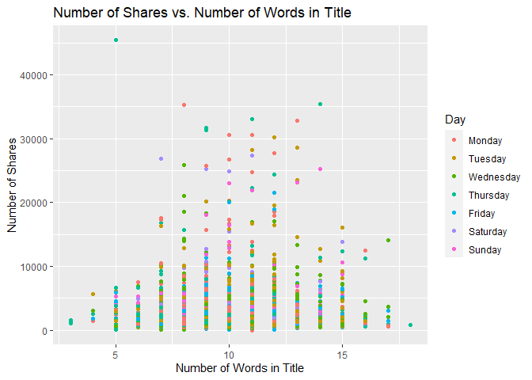

Project 3
================
Kara Belknap & Cassio Monti
2022-10-29

-   <a href="#report-for-bus-channel" id="toc-report-for-bus-channel">Report
    for <em>bus</em> Channel</a>
    -   <a href="#introduction" id="toc-introduction">Introduction</a>
    -   <a href="#required-packages" id="toc-required-packages">Required
        Packages</a>
    -   <a href="#read-in-the-data" id="toc-read-in-the-data">Read in the
        Data</a>
    -   <a href="#select-data-for-appropriate-data-channel"
        id="toc-select-data-for-appropriate-data-channel">Select Data for
        Appropriate Data Channel</a>
    -   <a href="#summarizations-for-data-channel-bus"
        id="toc-summarizations-for-data-channel-bus">Summarizations for data
        channel <em>bus</em></a>
        -   <a href="#data-split" id="toc-data-split">Data Split</a>
        -   <a href="#data-manipulation-for-statistics"
            id="toc-data-manipulation-for-statistics">Data manipulation for
            statistics</a>
        -   <a href="#belknap---summary-statistics"
            id="toc-belknap---summary-statistics">Belknap - Summary Statistics</a>
        -   <a href="#monti---summary-statistics"
            id="toc-monti---summary-statistics">Monti - Summary Statistics</a>
        -   <a href="#monti---graphs-3" id="toc-monti---graphs-3">Monti - Graphs
            (3)</a>
        -   <a href="#belknap---graphs-3" id="toc-belknap---graphs-3">Belknap -
            Graphs (3)</a>
        -   <a href="#subsetting-variables-for-modeling"
            id="toc-subsetting-variables-for-modeling">Subsetting Variables for
            Modeling</a>
    -   <a href="#modeling" id="toc-modeling">Modeling</a>
        -   <a href="#belknap---linear-regression-model-explanation"
            id="toc-belknap---linear-regression-model-explanation">Belknap - Linear
            Regression Model Explanation</a>
        -   <a href="#monti---linear-regression-model"
            id="toc-monti---linear-regression-model">Monti - Linear Regression
            Model</a>
        -   <a href="#belknap---linear-regression-model"
            id="toc-belknap---linear-regression-model">Belknap - Linear Regression
            Model</a>
        -   <a href="#monti---ensemble-tree-based-model"
            id="toc-monti---ensemble-tree-based-model">Monti - Ensemble Tree-based
            Model</a>
        -   <a href="#belknap---ensemble-tree-based-model"
            id="toc-belknap---ensemble-tree-based-model">Belknap - Ensemble
            Tree-based Model</a>
        -   <a href="#belknap---random-forest-model--explanation"
            id="toc-belknap---random-forest-model--explanation">Belknap - Random
            Forest Model &amp; Explanation</a>
        -   <a href="#monti---boosted-tree-model--explanation"
            id="toc-monti---boosted-tree-model--explanation">Monti - Boosted Tree
            Model &amp; Explanation</a>
    -   <a href="#comparison--conclusion---monti"
        id="toc-comparison--conclusion---monti">Comparison &amp; Conclusion -
        Monti</a>

# Report for *bus* Channel

This report contains Exploratory Data Analysis (EDA) about this data
channel and a modeling section applying three regression methods.

## Introduction

The objective of this analysis is to provide a comprehensive overview
about publication metrics and their relationship with the number of
shares that those publications presented during the study period. These
data have been collected from Mashable website, one of the largest news
websites from which the content of all the bus channel articles
published in 2013 and 2014 was extracted. These data were originally
collected analyzed By Fernandes et al. (2015) work, in which the authors
performed classification task comparing several machine learning
algorithms. In the present study, the subset of the data used by
Fernandes et al.(2015) corresponding to the data channel bus is used for
regression purposes. The response variable is the number of `shares`
that the papers presented after publication. In other words, we will try
to predict the number of shares the papers will have before publication.
To perform the regression, Random Forest, Boosting, and Multiple Linear
Regression are used. More information about the methods will be provided
in further sections.

Some metrics have been calculated based on the information obtained from
Marshable website. For instance, the Latent Dirichlet Allocation (LDA)
was applied to the data set to identify the 5 top relevant topics and
then measure the closeness of the current article to such topic. There
are 5 relevance of topic metrics according to LDA:

-   `LDA_00`: Closeness to LDA topic 0  
-   `LDA_01`: Closeness to LDA topic 1  
-   `LDA_02`: Closeness to LDA topic 2  
-   `LDA_03`: Closeness to LDA topic 3  
-   `LDA_04`: Closeness to LDA topic 4

Additionally, some quality metrics related to the keywords have been
calculated and will be used in this analysis. These metrics represent
the average number of shares for publications with worst, best, and
average keywords. The classification of keywords under these groups was
made by the authors of the original paper. The keyword metrics are shown
below.

-   `kw_avg_min`: Worst keyword (avg. shares)  
-   `kw_avg_max`: Best keyword (avg. shares)  
-   `kw_avg_avg`: Avg. keyword (avg. shares)

Article content metrics were also used in this study. These are general
metrics about the body of the publication that can influence the number
of shares of that paper. The content summary metrics are shown below.

\-`num_videos`: Number of videos  
-`n_tokens_content`: Number of words in the content  
-`n_non_stop_unique_tokens`: Rate of unique non-stop words in the
content  
-`num_hrefs`: Number of links  
-`num_self_hrefs`: Number of links to other articles published by
Mashable  
-`average_token_length`: Average length of the words in the content

These data were collected during 2013 and 2014 on daily basis. To
represent time dependent information, a binary variable indicating
whether the publication was made in a weekend or weekday, `is_weekend`
is used.

## Required Packages

Before we can begin our analysis, we must load in the following
packages:

``` r
library(tidyverse)
library(caret)
library(knitr)
library(corrplot)
```

`Tidyverse` is used for data management and plotting through dplyr and
ggplot packages. `Caret` package is used for data splitting and
modeling. `Knitr` package is used for nice printing of tables.
`Corrplot` is used for nice correlation plots assisting in
visualization.

## Read in the Data

Using the data file `OnlineNewsPopularity.csv`, we will read in the data
and add a new column corresponding to the type of data channel from
which the data was classified. The new variable will be called
`dataChannel`. Note that there are some rows that are unclassified
according to the six channels of interest and those are indicated by
`other`.

Once the data column is created, we can easily subset the data using the
`filter` function to create a new data set for each data channel. We
removed the original `data_channel_is_*` columns as well as two
non-predictive columns `url` and `timedelta`.

``` r
# reading in the data set
rawData <- read_csv("../OnlineNewsPopularity.csv")

# creating new variable to have more comprehensive names for data channels.
rawDataChannel <- rawData %>%
  mutate(dataChannel = ifelse(data_channel_is_lifestyle == 1, "lifestyle", 
                              ifelse(data_channel_is_entertainment == 1, "entertainment", 
                              ifelse(data_channel_is_bus == 1, "bus", 
                              ifelse(data_channel_is_socmed == 1, "socmed", 
                              ifelse(data_channel_is_tech == 1, "tech", 
                              ifelse(data_channel_is_world == 1, "world", 
                                     "other"))))))) %>%
  select(-data_channel_is_lifestyle, -data_channel_is_entertainment, 
         -data_channel_is_bus, -data_channel_is_socmed, -data_channel_is_tech,
         -data_channel_is_world, -url, -timedelta)

# assigning channel data to R objects.
lifestyleData <- rawDataChannel %>%
  filter(dataChannel == "lifestyle")

entertainmentData <- rawDataChannel %>%
  filter(dataChannel == "entertainment")

busData <- rawDataChannel %>%
  filter(dataChannel == "bus")

socmedData <- rawDataChannel %>%
  filter(dataChannel == "socmed")

techData <- rawDataChannel %>%
  filter(dataChannel == "tech")

worldData <- rawDataChannel %>%
  filter(dataChannel == "world")
```

## Select Data for Appropriate Data Channel

To select the appropriate data channel based on the `params$channel`, we
created a function `selectData` which would return the appropriate data
set and assign it to the data set `activeData`. This will be the file we
will use for the remainder of the report.

To select the appropriate data channel based on the `params$channel`, we
created a function `selectData` which would return the appropriate data
set and assign it to the data set `activeData`. This will be the file we
will use for the remainder of the report.

``` r
# function to assign automated calls for the different data channels
selectData <- function(dataChannel) { 
  if (dataChannel == "lifestyle"){
    return(lifestyleData)
  }
  if (dataChannel == "entertainment"){
    return(entertainmentData)
  }
  if (dataChannel == "bus"){
    return(busData)
  }
  if (dataChannel == "socmed"){
    return(socmedData)
  }
  if (dataChannel == "tech"){
    return(techData)
  }
  if (dataChannel == "world"){
    return(worldData)
  }
}

# activating corresponding data set.
dataChannelSelect <- params$channel

activeData <- selectData(dataChannelSelect)
```

## Summarizations for data channel *bus*

In this section, we will perform EDA for the data channel bus

### Data Split

This section splits the data set into training and test sets for the
proportion of 80/20. The data summarization will be conducted on the
training set. To split the data, the function `createDataPartition()`,
from `caret` package, was used with the argument `p=0.8` to represent
80% of the data should be in the split. The function `set.seed(555)` was
used to fix the random seed. The code below shows the creation of
training and test sets.

``` r
set.seed(555)

trainIndex <- createDataPartition(activeData$shares, p = 0.8, list = FALSE)

activeTrain <- activeData[trainIndex, ]

activeTest <- activeData[-trainIndex, ]
```

### Data manipulation for statistics

A new object is created in this section aiming to summarize publications
during weekdays and weekends and create factor levels for them to match
with `shares` variable. The functions `ifelse()` was used to vectorize
the IF-ELSE statements associated to `mutate()` which took care of
attaching the new variable to the data set. The function `factor()` was
used to explicitly coerce the days of week into levels of the newly
created categorical variable “Day”.

``` r
# IF-ELSE statements
statsData <- activeTrain %>%
  mutate(Day = ifelse(weekday_is_monday == 1, "Monday", 
                      ifelse(weekday_is_tuesday == 1, "Tuesday", 
                      ifelse(weekday_is_wednesday == 1, "Wednesday", 
                      ifelse(weekday_is_thursday == 1, "Thursday", 
                      ifelse(weekday_is_friday == 1, "Friday", 
                      ifelse(weekday_is_saturday == 1, "Saturday", 
                      ifelse(weekday_is_sunday == 1, "Sunday",
                             "missingdata")))))))) %>%
  mutate(Weekend = ifelse(is_weekend == 1, "Yes", "No"))

# Assigning factor levels
statsData$Day <- factor(statsData$Day, 
                levels = c("Monday", "Tuesday", "Wednesday", "Thursday", 
                           "Friday", "Saturday", "Sunday"))
```

### Belknap - Summary Statistics

The following table gives us information about the summary statistics
for the number of shares for articles in the data channel bus. The
`summary()` function was used to extract these metrics.

``` r
summary(activeTrain$shares)
```

    ##     Min.  1st Qu.   Median     Mean  3rd Qu.     Max. 
    ##      1.0    952.8   1400.0   3033.6   2500.0 690400.0

The following table gives us information about the average, median, and
standard deviation for the number of shares based on whether the post
was made on a weekend or a weekday. The variable “weekend” was grouped,
via `grouped_by()`, and for each level the sum, average, median, and
standard deviation of shares were calculated via `sum()`, `mean()`,
`meadian()`, `sd()`, and `summarise()` functions. The summary table is
shown below.

``` r
statsData %>% 
  group_by(Weekend) %>%
  summarise(sumShares = sum(shares), avgShares = mean(shares), medShares = median(shares), sdShares = sd(shares))
```

    ## # A tibble: 2 × 5
    ##   Weekend sumShares avgShares medShares sdShares
    ##   <chr>       <dbl>     <dbl>     <dbl>    <dbl>
    ## 1 No       13372524     2950.      1300   15966.
    ## 2 Yes       1819780     3831.      2300    7987.

Likewise, this table gives us information about the number of shares by
the day of the week. The same functions were used here, by applied to
levels of variable “Day”. Also, the quantities maximum `max()` and
minimum `min()` number of shares by levels of “Day” were calculated.

``` r
statsData %>% 
  group_by(Day) %>%
  arrange(Day) %>%
  summarise(sumShares = sum(shares), avgShares = mean(shares), medShares = median(shares), sdShares = sd(shares), maxShares = max(shares),
            minShares = min(shares))
```

    ## # A tibble: 7 × 7
    ##   Day       sumShares avgShares medShares sdShares maxShares minShares
    ##   <fct>         <dbl>     <dbl>     <dbl>    <dbl>     <dbl>     <dbl>
    ## 1 Monday      3741322     4080.      1400   31549.    690400         1
    ## 2 Tuesday     2530933     2647.      1300    6366.    106400       156
    ## 3 Wednesday   2679264     2674.      1300    7923.    158900        63
    ## 4 Thursday    2781503     2784.      1300   10944.    298400        81
    ## 5 Friday      1639502     2488.      1500    5654.    102200        22
    ## 6 Saturday     899481     4589.      2500   11197.    144400       150
    ## 7 Sunday       920299     3299.      2100    4487.     56900       692

### Monti - Summary Statistics

``` r
# two-way contingency table between shares and Days
```

``` r
# correlation matrix
```

### Monti - Graphs (3)

``` r
# bivariate correlation plot
```

``` r
# relationship between shares and LDA levels (facet_wrap+smooth)
```

``` r
# relationship between shares and keyword metrics (color)
```

``` r
# relationship between shares and content metrics (facet_wrap+smooth)
```

### Belknap - Graphs (3)

The following graph shows the number of shares compared to the number of
words in the title. The output is colored by the day of the week.

``` r
titlewordcountGraph <- ggplot(statsData, aes(x = n_tokens_title, y = shares))
titlewordcountGraph + geom_point(aes(color = Day)) + 
  ggtitle("Number of Shares vs. Number of Words in Title") +
  ylab("Number of Shares") +
  xlab("Number of Words in Title")
```

<!-- -->

The following plot shows the number of shares by the rate of positive
words in the article. A positive trend would indicate that articles with
more positive words are shared more often than articles with negative
words.

``` r
positivewordrateGraph <- ggplot(statsData, aes(x = rate_positive_words, y = shares))
positivewordrateGraph + geom_point(aes(color = Day)) + 
  ggtitle("Number of Shares vs. Rate of Positive Words") +
  ylab("Number of Shares") +
  xlab("Rate of Positive Words") 
```

<!-- -->

The following plot shows the total number of shares as related to the
parameter title subjectivity. A positive trend would indicate that
articles are shared more often when the title is subjective. A negative
trend would indicate that articles are shared more often when the title
is less subjective.

``` r
titleSubjectivityGraph <- ggplot(statsData, aes(x = title_subjectivity, y = shares))
titleSubjectivityGraph + geom_point(aes(color = n_tokens_title)) + 
  ggtitle("Number of Shares vs. Title Subjectivity") +
  ylab("Number of Shares") +
  xlab("Title Subjectivity") + 
  labs(color = "Word Count in Title")
```

### Subsetting Variables for Modeling

``` r
dfTrain = activeTrain %>%
  select(shares, starts_with("LDA_"), average_token_length,
         is_weekend, n_tokens_content, n_non_stop_unique_tokens, num_hrefs,
         num_self_hrefs, num_videos, average_token_length, kw_avg_min, 
         kw_avg_max, kw_avg_avg, is_weekend)

dfTest = activeTest %>%
  select(shares, starts_with("LDA_"), average_token_length,
         is_weekend, n_tokens_content, n_non_stop_unique_tokens, num_hrefs,
         num_self_hrefs, num_videos, average_token_length, kw_avg_min, 
         kw_avg_max, kw_avg_avg, is_weekend)

# looking for NAs
anyNA(dfTrain)
```

    ## [1] FALSE

``` r
anyNA(dfTest)
```

    ## [1] FALSE

## Modeling

In this section, we will perform regression for prediction purposes for
the data channel bus.

### Belknap - Linear Regression Model Explanation

### Monti - Linear Regression Model

``` r
LASSO = train(shares~., data = dfTrain,
              method="glmnet",
              preProcess = c("center","scale"),
              tuneGrid = expand.grid(alpha = 1, lambda = seq(0,10,0.1)),
              trControl = trainControl(method="CV",number=5))

plot(LASSO)
```

<!-- -->

``` r
coef(LASSO$finalModel, LASSO$bestTune$lambda)
```

    ## 16 x 1 sparse Matrix of class "dgCMatrix"
    ##                                  s1
    ## (Intercept)              3033.60703
    ## LDA_00                     56.17913
    ## LDA_01                      .      
    ## LDA_02                    -68.36600
    ## LDA_03                    478.19652
    ## LDA_04                   -248.34560
    ## average_token_length     -626.87901
    ## is_weekend                104.73068
    ## n_tokens_content          277.65861
    ## n_non_stop_unique_tokens  861.07065
    ## num_hrefs                 734.58854
    ## num_self_hrefs             96.58855
    ## num_videos                613.78004
    ## kw_avg_min                775.23966
    ## kw_avg_max                137.57540
    ## kw_avg_avg                860.36681

``` r
postResample(pred = predict(LASSO, newdata = dfTest), obs = dfTest$shares)
```

    ##         RMSE     Rsquared          MAE 
    ## 1.389006e+04 4.278663e-03 2.913521e+03

### Belknap - Linear Regression Model

### Monti - Ensemble Tree-based Model

### Belknap - Ensemble Tree-based Model

### Belknap - Random Forest Model & Explanation

``` r
train.control = trainControl(method = "cv", number = 5)

rfFit <- train(shares~.,
               data = dfTrain,
               method = "rf",
               trControl = train.control,
               preProcess = c("center","scale"),
               tuneGrid = data.frame(mtry = 1:5))

rfFit$bestTune$mtry
```

    ## [1] 1

``` r
plot(rfFit)
```

<!-- -->

``` r
rfFit$results
```

    ##   mtry     RMSE   Rsquared      MAE   RMSESD  RsquaredSD    MAESD
    ## 1    1 12762.77 0.02766271 2642.322 9436.975 0.010970554 434.5414
    ## 2    2 12893.56 0.02803568 2717.441 9191.081 0.006339318 416.5286
    ## 3    3 13125.61 0.02009607 2755.758 9091.854 0.007729572 407.7004
    ## 4    4 13162.60 0.02145293 2785.495 8993.058 0.005182652 403.2266
    ## 5    5 13320.02 0.01888165 2792.262 8916.329 0.007692272 397.0728

``` r
RF_pred <- predict(rfFit, newdata = activeTest)

metric_rf = postResample(RF_pred, activeTest$shares)

metric_rf
```

    ##         RMSE     Rsquared          MAE 
    ## 1.358032e+04 7.615758e-03 2.742930e+03

### Monti - Boosted Tree Model & Explanation

``` r
tunG = expand.grid(n.trees = seq(25,200,25),
                      interaction.depth = 1:4,
                      shrinkage = 0.1,
                      n.minobsinnode = 10)

gbmFit <- train(shares~.,
               data = dfTrain,
               method = "gbm",
               preProcess = c("center","scale"),
               trControl = train.control,
               tuneGrid = tunG,
               verbose = FALSE
               )


gbmFit$bestTune$n.trees
```

    ## [1] 25

``` r
gbmFit$bestTune$interaction.depth
```

    ## [1] 3

``` r
plot(gbmFit)
```

<!-- -->

``` r
gbmFit$results
```

    ##    shrinkage interaction.depth n.minobsinnode n.trees     RMSE    Rsquared      MAE
    ## 1        0.1                 1             10      25 13688.74 0.010869351 2707.457
    ## 9        0.1                 2             10      25 13706.21 0.028582573 2744.542
    ## 17       0.1                 3             10      25 13660.61 0.021551552 2736.986
    ## 25       0.1                 4             10      25 13785.77 0.012839495 2740.767
    ## 2        0.1                 1             10      50 13759.33 0.015169249 2762.957
    ## 10       0.1                 2             10      50 13824.84 0.023374294 2789.708
    ## 18       0.1                 3             10      50 13814.74 0.013407690 2789.104
    ## 26       0.1                 4             10      50 13921.45 0.009320718 2816.794
    ## 3        0.1                 1             10      75 13770.39 0.019104081 2783.668
    ## 11       0.1                 2             10      75 14020.41 0.021106925 2886.540
    ## 19       0.1                 3             10      75 13998.75 0.013143380 2849.465
    ## 27       0.1                 4             10      75 13968.86 0.007909922 2808.686
    ## 4        0.1                 1             10     100 13885.37 0.018172155 2846.288
    ## 12       0.1                 2             10     100 14289.43 0.020311623 2930.558
    ## 20       0.1                 3             10     100 14069.51 0.009151905 2844.732
    ## 28       0.1                 4             10     100 14149.55 0.004379477 2856.026
    ## 5        0.1                 1             10     125 13943.98 0.016888416 2836.701
    ## 13       0.1                 2             10     125 14361.22 0.018496935 2964.327
    ## 21       0.1                 3             10     125 14189.27 0.008601965 2891.276
    ## 29       0.1                 4             10     125 14206.46 0.003875646 2897.902
    ## 6        0.1                 1             10     150 13905.05 0.017981944 2802.222
    ## 14       0.1                 2             10     150 14271.06 0.015273404 2959.366
    ## 22       0.1                 3             10     150 14348.89 0.008638967 2920.437
    ## 30       0.1                 4             10     150 14248.87 0.005955845 2910.685
    ## 7        0.1                 1             10     175 13829.32 0.017950556 2812.578
    ## 15       0.1                 2             10     175 14222.88 0.015112291 2944.422
    ## 23       0.1                 3             10     175 14403.48 0.012193540 2962.428
    ## 31       0.1                 4             10     175 14364.20 0.003702542 2944.118
    ## 8        0.1                 1             10     200 13959.73 0.015714536 2849.956
    ## 16       0.1                 2             10     200 14306.26 0.011966953 2988.214
    ## 24       0.1                 3             10     200 14538.80 0.009498611 2970.995
    ## 32       0.1                 4             10     200 14573.72 0.002416172 2968.723
    ##      RMSESD  RsquaredSD    MAESD
    ## 1  7944.363 0.011334542 266.0530
    ## 9  7629.992 0.041751835 181.0370
    ## 17 7851.680 0.034077529 301.9642
    ## 25 7796.319 0.014838793 281.8290
    ## 2  7821.458 0.015381606 244.1647
    ## 10 7566.196 0.028560231 249.7253
    ## 18 7823.165 0.016978047 310.0434
    ## 26 7874.093 0.008854482 361.8342
    ## 3  7775.138 0.021124762 229.0365
    ## 11 7417.489 0.029944540 273.6840
    ## 19 7669.729 0.013994280 331.1391
    ## 27 7752.954 0.005669133 308.7209
    ## 4  7719.325 0.020991026 252.9212
    ## 12 7122.645 0.030513544 272.0040
    ## 20 7668.089 0.008650470 319.4876
    ## 28 7703.884 0.003300306 306.6742
    ## 5  7605.537 0.016806250 209.6311
    ## 13 7103.548 0.029994231 255.1161
    ## 21 7626.543 0.007799615 291.9923
    ## 29 7744.057 0.003466943 329.7591
    ## 6  7581.857 0.016001550 179.0370
    ## 14 7256.307 0.019444868 262.6310
    ## 22 7456.564 0.009399437 311.0469
    ## 30 7644.431 0.005162423 318.0425
    ## 7  7759.158 0.018520982 275.6238
    ## 15 7301.349 0.018409943 283.4319
    ## 23 7350.615 0.018220814 310.5633
    ## 31 7626.282 0.003608207 334.3862
    ## 8  7605.738 0.015269869 257.6289
    ## 16 7314.514 0.013516073 291.0536
    ## 24 7289.990 0.012885745 334.9563
    ## 32 7495.961 0.002589707 311.4243

``` r
gbm_pred <- predict(gbmFit, newdata = activeTest)

metric_boosting = postResample(gbm_pred, activeTest$shares)

metric_boosting
```

    ##         RMSE     Rsquared          MAE 
    ## 1.387277e+04 1.458843e-03 2.926610e+03

## Comparison & Conclusion - Monti

``` r
bestMethod = function(x){
  
  bestm = which.min(lapply(1:length(x), function(i) x[[i]][1]))
  
  out = switch(bestm,
                "Random Forest",
                "Boosting")
  
  return(out)
  
}

tb = data.frame(RF = metric_rf, Boosting = metric_boosting)

kable(tb, caption = "Accuracy Metric by Ensemble Method on Test Set",
      digits = 3)
```

|          |        RF |  Boosting |
|:---------|----------:|----------:|
| RMSE     | 13580.316 | 13872.774 |
| Rsquared |     0.008 |     0.001 |
| MAE      |  2742.930 |  2926.610 |

Accuracy Metric by Ensemble Method on Test Set

The best model is Random Forest based on RMSE metric.
