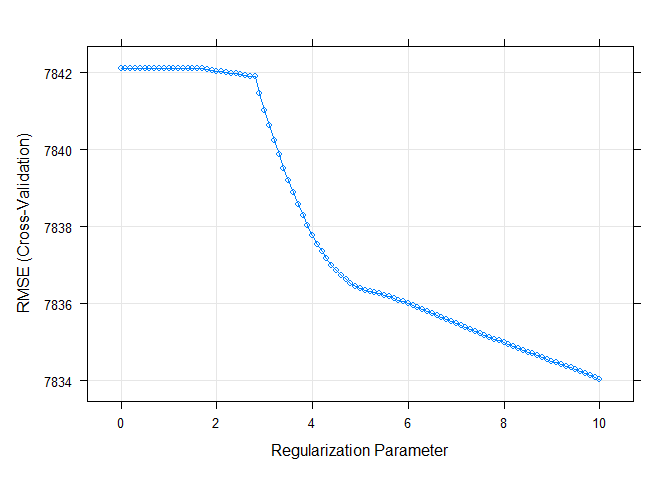
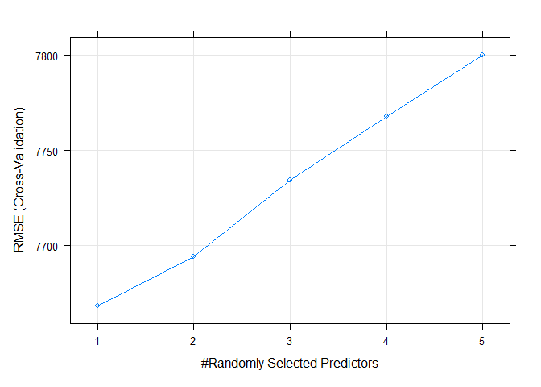
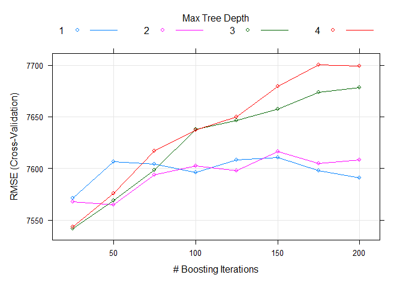

Project 3
================
Kara Belknap & Cassio Monti
2022-10-29

-   <a href="#report-for-entertainment-channel"
    id="toc-report-for-entertainment-channel">Report for
    <em>entertainment</em> Channel</a>
    -   <a href="#introduction" id="toc-introduction">Introduction</a>
    -   <a href="#required-packages" id="toc-required-packages">Required
        Packages</a>
    -   <a href="#read-in-the-data" id="toc-read-in-the-data">Read in the
        Data</a>
    -   <a href="#select-data-for-appropriate-data-channel"
        id="toc-select-data-for-appropriate-data-channel">Select Data for
        Appropriate Data Channel</a>
    -   <a href="#summarizations-for-data-channel-entertainment"
        id="toc-summarizations-for-data-channel-entertainment">Summarizations
        for data channel <em>entertainment</em></a>
        -   <a href="#data-split" id="toc-data-split">Data Split</a>
        -   <a href="#data-manipulation-for-statistics"
            id="toc-data-manipulation-for-statistics">Data manipulation for
            statistics</a>
        -   <a href="#belknap---summary-statistics"
            id="toc-belknap---summary-statistics">Belknap - Summary Statistics</a>
        -   <a href="#monti---summary-statistics"
            id="toc-monti---summary-statistics">Monti - Summary Statistics</a>
        -   <a href="#monti---graphs-3" id="toc-monti---graphs-3">Monti - Graphs
            (3)</a>
        -   <a href="#belknap---graphs-3" id="toc-belknap---graphs-3">Belknap -
            Graphs (3)</a>
        -   <a href="#subsetting-variables-for-modeling"
            id="toc-subsetting-variables-for-modeling">Subsetting Variables for
            Modeling</a>
    -   <a href="#modeling" id="toc-modeling">Modeling</a>
        -   <a href="#belknap---linear-regression-model-explanation"
            id="toc-belknap---linear-regression-model-explanation">Belknap - Linear
            Regression Model Explanation</a>
        -   <a href="#monti---linear-regression-model"
            id="toc-monti---linear-regression-model">Monti - Linear Regression
            Model</a>
        -   <a href="#belknap---linear-regression-model"
            id="toc-belknap---linear-regression-model">Belknap - Linear Regression
            Model</a>
        -   <a href="#monti---ensemble-tree-based-model"
            id="toc-monti---ensemble-tree-based-model">Monti - Ensemble Tree-based
            Model</a>
        -   <a href="#belknap---ensemble-tree-based-model"
            id="toc-belknap---ensemble-tree-based-model">Belknap - Ensemble
            Tree-based Model</a>
        -   <a href="#belknap---random-forest-model--explanation"
            id="toc-belknap---random-forest-model--explanation">Belknap - Random
            Forest Model &amp; Explanation</a>
        -   <a href="#monti---boosted-tree-model--explanation"
            id="toc-monti---boosted-tree-model--explanation">Monti - Boosted Tree
            Model &amp; Explanation</a>
    -   <a href="#comparison--conclusion---monti"
        id="toc-comparison--conclusion---monti">Comparison &amp; Conclusion -
        Monti</a>

# Report for *entertainment* Channel

This report contains Exploratory Data Analysis (EDA) about this data
channel and a modeling section applying three regression methods.

## Introduction

The objective of this analysis is to provide a comprehensive overview
about publication metrics and their relationship with the number of
shares that those publications presented during the study period. These
data have been collected from Mashable website, one of the largest news
websites from which the content of all the entertainment channel
articles published in 2013 and 2014 was extracted. These data were
originally collected analyzed By Fernandes et al. (2015) work, in which
the authors performed classification task comparing several machine
learning algorithms. In the present study, the subset of the data used
by Fernandes et al.(2015) corresponding to the data channel
entertainment is used for regression purposes. The response variable is
the number of `shares` that the papers presented after publication. In
other words, we will try to predict the number of shares the papers will
have before publication. To perform the regression, Random Forest,
Boosting, and Multiple Linear Regression are used. More information
about the methods will be provided in further sections.

Some metrics have been calculated based on the information obtained from
Marshable website. For instance, the Latent Dirichlet Allocation (LDA)
was applied to the data set to identify the 5 top relevant topics and
then measure the closeness of the current article to such topic. There
are 5 relevance of topic metrics according to LDA:

-   `LDA_00`: Closeness to LDA topic 0  
-   `LDA_01`: Closeness to LDA topic 1  
-   `LDA_02`: Closeness to LDA topic 2  
-   `LDA_03`: Closeness to LDA topic 3  
-   `LDA_04`: Closeness to LDA topic 4

Additionally, some quality metrics related to the keywords have been
calculated and will be used in this analysis. These metrics represent
the average number of shares for publications with worst, best, and
average keywords. The classification of keywords under these groups was
made by the authors of the original paper. The keyword metrics are shown
below.

-   `kw_avg_min`: Worst keyword (avg. shares)  
-   `kw_avg_max`: Best keyword (avg. shares)  
-   `kw_avg_avg`: Avg. keyword (avg. shares)

Article content metrics were also used in this study. These are general
metrics about the body of the publication that can influence the number
of shares of that paper. The content summary metrics are shown below.

\-`num_videos`: Number of videos  
-`n_tokens_content`: Number of words in the content  
-`n_non_stop_unique_tokens`: Rate of unique non-stop words in the
content  
-`num_hrefs`: Number of links  
-`num_self_hrefs`: Number of links to other articles published by
Mashable  
-`average_token_length`: Average length of the words in the content

These data were collected during 2013 and 2014 on daily basis. To
represent time dependent information, a binary variable indicating
whether the publication was made in a weekend or weekday, `is_weekend`
is used.

## Required Packages

Before we can begin our analysis, we must load in the following
packages:

``` r
library(tidyverse)
library(caret)
library(knitr)
library(corrplot)
```

`Tidyverse` is used for data management and plotting through dplyr and
ggplot packages. `Caret` package is used for data splitting and
modeling. `Knitr` package is used for nice printing of tables.
`Corrplot` is used for nice correlation plots assisting in
visualization.

## Read in the Data

Using the data file `OnlineNewsPopularity.csv`, we will read in the data
and add a new column corresponding to the type of data channel from
which the data was classified. The new variable will be called
`dataChannel`. Note that there are some rows that are unclassified
according to the six channels of interest and those are indicated by
`other`.

Once the data column is created, we can easily subset the data using the
`filter` function to create a new data set for each data channel. We
removed the original `data_channel_is_*` columns as well as two
non-predictive columns `url` and `timedelta`.

``` r
# reading in the data set
rawData <- read_csv("../OnlineNewsPopularity.csv")

# creating new variable to have more comprehensive names for data channels.
rawDataChannel <- rawData %>%
  mutate(dataChannel = ifelse(data_channel_is_lifestyle == 1, "lifestyle", 
                              ifelse(data_channel_is_entertainment == 1, "entertainment", 
                              ifelse(data_channel_is_bus == 1, "bus", 
                              ifelse(data_channel_is_socmed == 1, "socmed", 
                              ifelse(data_channel_is_tech == 1, "tech", 
                              ifelse(data_channel_is_world == 1, "world", 
                                     "other"))))))) %>%
  select(-data_channel_is_lifestyle, -data_channel_is_entertainment, 
         -data_channel_is_bus, -data_channel_is_socmed, -data_channel_is_tech,
         -data_channel_is_world, -url, -timedelta)

# assigning channel data to R objects.
lifestyleData <- rawDataChannel %>%
  filter(dataChannel == "lifestyle")

entertainmentData <- rawDataChannel %>%
  filter(dataChannel == "entertainment")

busData <- rawDataChannel %>%
  filter(dataChannel == "bus")

socmedData <- rawDataChannel %>%
  filter(dataChannel == "socmed")

techData <- rawDataChannel %>%
  filter(dataChannel == "tech")

worldData <- rawDataChannel %>%
  filter(dataChannel == "world")
```

## Select Data for Appropriate Data Channel

To select the appropriate data channel based on the `params$channel`, we
created a function `selectData` which would return the appropriate data
set and assign it to the data set `activeData`. This will be the file we
will use for the remainder of the report.

To select the appropriate data channel based on the `params$channel`, we
created a function `selectData` which would return the appropriate data
set and assign it to the data set `activeData`. This will be the file we
will use for the remainder of the report.

``` r
# function to assign automated calls for the different data channels
selectData <- function(dataChannel) { 
  if (dataChannel == "lifestyle"){
    return(lifestyleData)
  }
  if (dataChannel == "entertainment"){
    return(entertainmentData)
  }
  if (dataChannel == "bus"){
    return(busData)
  }
  if (dataChannel == "socmed"){
    return(socmedData)
  }
  if (dataChannel == "tech"){
    return(techData)
  }
  if (dataChannel == "world"){
    return(worldData)
  }
}

# activating corresponding data set.
dataChannelSelect <- params$channel

activeData <- selectData(dataChannelSelect)
```

## Summarizations for data channel *entertainment*

In this section, we will perform EDA for the data channel entertainment

### Data Split

This section splits the data set into training and test sets for the
proportion of 80/20. The data summarization will be conducted on the
training set. To split the data, the function `createDataPartition()`,
from `caret` package, was used with the argument `p=0.8` to represent
80% of the data should be in the split. The function `set.seed(555)` was
used to fix the random seed. The code below shows the creation of
training and test sets.

``` r
set.seed(555)

trainIndex <- createDataPartition(activeData$shares, p = 0.8, list = FALSE)

activeTrain <- activeData[trainIndex, ]

activeTest <- activeData[-trainIndex, ]
```

### Data manipulation for statistics

A new object is created in this section aiming to summarize publications
during weekdays and weekends and create factor levels for them to match
with `shares` variable. The functions `ifelse()` was used to vectorize
the IF-ELSE statements associated to `mutate()` which took care of
attaching the new variable to the data set. The function `factor()` was
used to explicitly coerce the days of week into levels of the newly
created categorical variable “Day”.

``` r
# IF-ELSE statements
statsData <- activeTrain %>%
  mutate(Day = ifelse(weekday_is_monday == 1, "Monday", 
                      ifelse(weekday_is_tuesday == 1, "Tuesday", 
                      ifelse(weekday_is_wednesday == 1, "Wednesday", 
                      ifelse(weekday_is_thursday == 1, "Thursday", 
                      ifelse(weekday_is_friday == 1, "Friday", 
                      ifelse(weekday_is_saturday == 1, "Saturday", 
                      ifelse(weekday_is_sunday == 1, "Sunday",
                             "missingdata")))))))) %>%
  mutate(Weekend = ifelse(is_weekend == 1, "Yes", "No"))

# Assigning factor levels
statsData$Day <- factor(statsData$Day, 
                levels = c("Monday", "Tuesday", "Wednesday", "Thursday", 
                           "Friday", "Saturday", "Sunday"))
```

### Belknap - Summary Statistics

The following table gives us information about the summary statistics
for the number of shares for articles in the data channel entertainment.
The `summary()` function was used to extract these metrics.

``` r
summary(activeTrain$shares)
```

    ##    Min. 1st Qu.  Median    Mean 3rd Qu.    Max. 
    ##      47     833    1200    2971    2100  210300

The following table gives us information about the average, median, and
standard deviation for the number of shares based on whether the post
was made on a weekend or a weekday. The variable “weekend” was grouped,
via `grouped_by()`, and for each level the sum, average, median, and
standard deviation of shares were calculated via `sum()`, `mean()`,
`meadian()`, `sd()`, and `summarise()` functions. The summary table is
shown below.

``` r
statsData %>% 
  group_by(Weekend) %>%
  summarise(sumShares = sum(shares), avgShares = mean(shares), medShares = median(shares), sdShares = sd(shares))
```

    ## # A tibble: 2 × 5
    ##   Weekend sumShares avgShares medShares sdShares
    ##   <chr>       <dbl>     <dbl>     <dbl>    <dbl>
    ## 1 No       14047136     2853.      1100    8074.
    ## 2 Yes       2731157     3778.      1700    6809.

Likewise, this table gives us information about the number of shares by
the day of the week. The same functions were used here, by applied to
levels of variable “Day”. Also, the quantities maximum `max()` and
minimum `min()` number of shares by levels of “Day” were calculated.

``` r
statsData %>% 
  group_by(Day) %>%
  arrange(Day) %>%
  summarise(sumShares = sum(shares), avgShares = mean(shares), medShares = median(shares), sdShares = sd(shares), maxShares = max(shares),
            minShares = min(shares))
```

    ## # A tibble: 7 × 7
    ##   Day       sumShares avgShares medShares sdShares maxShares minShares
    ##   <fct>         <dbl>     <dbl>     <dbl>    <dbl>     <dbl>     <dbl>
    ## 1 Monday      3051423     2789.      1100    5843.     77200        59
    ## 2 Tuesday     2643341     2643.      1100    5718.     87600        47
    ## 3 Wednesday   3042471     2838.      1100    8420.    138700        49
    ## 4 Thursday    3037045     3055.      1100   10251.    197600        57
    ## 5 Friday      2272856     2975.      1200    9618.    210300        58
    ## 6 Saturday    1132301     3737.      1700    7111.     68300       183
    ## 7 Sunday      1598856     3807.      1700    6591.     69500       171

### Monti - Summary Statistics

``` r
# two-way contingency table between shares and Days
```

``` r
# correlation matrix
```

### Monti - Graphs (3)

``` r
# bivariate correlation plot
```

``` r
# relationship between shares and LDA levels (facet_wrap+smooth)
```

``` r
# relationship between shares and keyword metrics (color)
```

``` r
# relationship between shares and content metrics (facet_wrap+smooth)
```

### Belknap - Graphs (3)

The following graph shows the number of shares compared to the number of
words in the title. The output is colored by the day of the week.

``` r
titlewordcountGraph <- ggplot(statsData, aes(x = n_tokens_title, y = shares))
titlewordcountGraph + geom_point(aes(color = Day)) + 
  ggtitle("Number of Shares vs. Number of Words in Title") +
  ylab("Number of Shares") +
  xlab("Number of Words in Title")
```

<!-- -->

The following plot shows the number of shares by the rate of positive
words in the article. A positive trend would indicate that articles with
more positive words are shared more often than articles with negative
words.

``` r
positivewordrateGraph <- ggplot(statsData, aes(x = rate_positive_words, y = shares))
positivewordrateGraph + geom_point(aes(color = Day)) + 
  ggtitle("Number of Shares vs. Rate of Positive Words") +
  ylab("Number of Shares") +
  xlab("Rate of Positive Words") 
```

<!-- -->

The following plot shows the total number of shares as related to the
parameter title subjectivity. A positive trend would indicate that
articles are shared more often when the title is subjective. A negative
trend would indicate that articles are shared more often when the title
is less subjective.

``` r
titleSubjectivityGraph <- ggplot(statsData, aes(x = title_subjectivity, y = shares))
titleSubjectivityGraph + geom_point(aes(color = n_tokens_title)) + 
  ggtitle("Number of Shares vs. Title Subjectivity") +
  ylab("Number of Shares") +
  xlab("Title Subjectivity") + 
  labs(color = "Word Count in Title")
```

### Subsetting Variables for Modeling

``` r
dfTrain = activeTrain %>%
  select(shares, starts_with("LDA_"), average_token_length,
         is_weekend, n_tokens_content, n_non_stop_unique_tokens, num_hrefs,
         num_self_hrefs, num_videos, average_token_length, kw_avg_min, 
         kw_avg_max, kw_avg_avg, is_weekend)

dfTest = activeTest %>%
  select(shares, starts_with("LDA_"), average_token_length,
         is_weekend, n_tokens_content, n_non_stop_unique_tokens, num_hrefs,
         num_self_hrefs, num_videos, average_token_length, kw_avg_min, 
         kw_avg_max, kw_avg_avg, is_weekend)

# looking for NAs
anyNA(dfTrain)
```

    ## [1] FALSE

``` r
anyNA(dfTest)
```

    ## [1] FALSE

## Modeling

In this section, we will perform regression for prediction purposes for
the data channel entertainment.

### Belknap - Linear Regression Model Explanation

### Monti - Linear Regression Model

``` r
LASSO = train(shares~., data = dfTrain,
              method="glmnet",
              preProcess = c("center","scale"),
              tuneGrid = expand.grid(alpha = 1, lambda = seq(0,10,0.1)),
              trControl = trainControl(method="CV",number=5))

plot(LASSO)
```

<!-- -->

``` r
coef(LASSO$finalModel, LASSO$bestTune$lambda)
```

    ## 16 x 1 sparse Matrix of class "dgCMatrix"
    ##                                  s1
    ## (Intercept)              2971.18700
    ## LDA_00                   -181.41140
    ## LDA_01                     35.25719
    ## LDA_02                   -110.36947
    ## LDA_03                      .      
    ## LDA_04                   -136.25484
    ## average_token_length      152.44849
    ## is_weekend                262.59035
    ## n_tokens_content          117.56980
    ## n_non_stop_unique_tokens   34.73866
    ## num_hrefs                 309.37727
    ## num_self_hrefs           -251.94569
    ## num_videos                -88.74575
    ## kw_avg_min                430.02019
    ## kw_avg_max                -69.31501
    ## kw_avg_avg               1240.37155

``` r
postResample(pred = predict(LASSO, newdata = dfTest), obs = dfTest$shares)
```

    ##         RMSE     Rsquared          MAE 
    ## 7.494770e+03 1.992281e-02 2.883256e+03

### Belknap - Linear Regression Model

### Monti - Ensemble Tree-based Model

### Belknap - Ensemble Tree-based Model

### Belknap - Random Forest Model & Explanation

``` r
train.control = trainControl(method = "cv", number = 5)

rfFit <- train(shares~.,
               data = dfTrain,
               method = "rf",
               trControl = train.control,
               preProcess = c("center","scale"),
               tuneGrid = data.frame(mtry = 1:5))

rfFit$bestTune$mtry
```

    ## [1] 1

``` r
plot(rfFit)
```

<!-- -->

``` r
rfFit$results
```

    ##   mtry     RMSE   Rsquared      MAE   RMSESD RsquaredSD    MAESD
    ## 1    1 7668.270 0.02474358 2896.622 1930.535 0.01914560 225.8759
    ## 2    2 7694.039 0.02559072 2960.872 1918.797 0.01429768 226.1291
    ## 3    3 7734.620 0.02283125 3000.205 1905.843 0.01196347 237.4495
    ## 4    4 7767.906 0.02173816 3013.959 1907.931 0.01198516 244.4183
    ## 5    5 7800.219 0.02150511 3034.596 1903.350 0.01228746 253.4675

``` r
RF_pred <- predict(rfFit, newdata = activeTest)

metric_rf = postResample(RF_pred, activeTest$shares)

metric_rf
```

    ##         RMSE     Rsquared          MAE 
    ## 7493.4836370    0.0201818 2915.9137239

### Monti - Boosted Tree Model & Explanation

``` r
tunG = expand.grid(n.trees = seq(25,200,25),
                      interaction.depth = 1:4,
                      shrinkage = 0.1,
                      n.minobsinnode = 10)

gbmFit <- train(shares~.,
               data = dfTrain,
               method = "gbm",
               preProcess = c("center","scale"),
               trControl = train.control,
               tuneGrid = tunG,
               verbose = FALSE
               )


gbmFit$bestTune$n.trees
```

    ## [1] 25

``` r
gbmFit$bestTune$interaction.depth
```

    ## [1] 3

``` r
plot(gbmFit)
```

<!-- -->

``` r
gbmFit$results
```

    ##    shrinkage interaction.depth n.minobsinnode n.trees     RMSE    Rsquared      MAE
    ## 1        0.1                 1             10      25 7571.482 0.007604909 2935.930
    ## 9        0.1                 2             10      25 7567.672 0.013027309 2908.814
    ## 17       0.1                 3             10      25 7541.859 0.013349672 2904.106
    ## 25       0.1                 4             10      25 7543.538 0.016678989 2914.223
    ## 2        0.1                 1             10      50 7606.733 0.009273261 2932.646
    ## 10       0.1                 2             10      50 7564.656 0.014912903 2902.880
    ## 18       0.1                 3             10      50 7569.135 0.013833892 2912.751
    ## 26       0.1                 4             10      50 7575.854 0.014989785 2916.318
    ## 3        0.1                 1             10      75 7603.984 0.008666597 2922.250
    ## 11       0.1                 2             10      75 7593.629 0.014157212 2912.110
    ## 19       0.1                 3             10      75 7598.616 0.011796030 2922.057
    ## 27       0.1                 4             10      75 7616.920 0.012486488 2913.073
    ## 4        0.1                 1             10     100 7595.866 0.009380474 2906.691
    ## 12       0.1                 2             10     100 7602.581 0.012238236 2928.510
    ## 20       0.1                 3             10     100 7637.877 0.009362801 2933.648
    ## 28       0.1                 4             10     100 7637.060 0.011821411 2923.984
    ## 5        0.1                 1             10     125 7608.233 0.010126310 2933.448
    ## 13       0.1                 2             10     125 7597.664 0.012220172 2914.993
    ## 21       0.1                 3             10     125 7646.614 0.009952929 2926.274
    ## 29       0.1                 4             10     125 7650.164 0.011688883 2930.362
    ## 6        0.1                 1             10     150 7610.678 0.010549115 2916.644
    ## 14       0.1                 2             10     150 7616.266 0.010895229 2921.366
    ## 22       0.1                 3             10     150 7657.274 0.008536438 2931.945
    ## 30       0.1                 4             10     150 7679.236 0.011147630 2948.681
    ## 7        0.1                 1             10     175 7598.034 0.009615134 2915.882
    ## 15       0.1                 2             10     175 7604.631 0.011056147 2915.885
    ## 23       0.1                 3             10     175 7673.552 0.007599996 2947.114
    ## 31       0.1                 4             10     175 7700.220 0.009978691 2948.838
    ## 8        0.1                 1             10     200 7590.885 0.009951310 2914.886
    ## 16       0.1                 2             10     200 7608.059 0.010121354 2915.855
    ## 24       0.1                 3             10     200 7678.523 0.008342280 2932.973
    ## 32       0.1                 4             10     200 7699.443 0.009695524 2951.539
    ##      RMSESD  RsquaredSD    MAESD
    ## 1  2744.389 0.009972792 289.0569
    ## 9  2712.140 0.016383750 297.9214
    ## 17 2734.880 0.012437380 304.6684
    ## 25 2691.495 0.018411086 286.8925
    ## 2  2693.759 0.012370129 275.5732
    ## 10 2691.132 0.017067894 303.0787
    ## 18 2712.423 0.013421852 294.1057
    ## 26 2688.337 0.012939154 282.1422
    ## 3  2709.537 0.009396976 288.3451
    ## 11 2675.378 0.015441668 294.8140
    ## 19 2702.539 0.011117052 298.7045
    ## 27 2687.786 0.008214444 286.5542
    ## 4  2714.491 0.009387105 276.0964
    ## 12 2684.653 0.012680766 296.8984
    ## 20 2708.179 0.008097498 303.7551
    ## 28 2683.234 0.007516956 301.6400
    ## 5  2705.646 0.009700716 284.7096
    ## 13 2699.177 0.011649118 307.6541
    ## 21 2692.065 0.008286494 297.3300
    ## 29 2672.178 0.007467698 314.0392
    ## 6  2702.286 0.009867733 289.1271
    ## 14 2703.081 0.008972884 306.1018
    ## 22 2706.636 0.005564456 307.4179
    ## 30 2650.210 0.008104119 305.5429
    ## 7  2720.418 0.008148267 293.6886
    ## 15 2722.266 0.009447287 324.6207
    ## 23 2728.452 0.004580420 290.9660
    ## 31 2652.611 0.006703505 319.3803
    ## 8  2717.257 0.009072330 292.0836
    ## 16 2732.284 0.007756030 315.5065
    ## 24 2724.025 0.006445840 319.7956
    ## 32 2656.050 0.006784208 323.4204

``` r
gbm_pred <- predict(gbmFit, newdata = activeTest)

metric_boosting = postResample(gbm_pred, activeTest$shares)

metric_boosting
```

    ##         RMSE     Rsquared          MAE 
    ## 7.574362e+03 6.489648e-03 2.921535e+03

## Comparison & Conclusion - Monti

``` r
bestMethod = function(x){
  
  bestm = which.min(lapply(1:length(x), function(i) x[[i]][1]))
  
  out = switch(bestm,
                "Random Forest",
                "Boosting")
  
  return(out)
  
}

tb = data.frame(RF = metric_rf, Boosting = metric_boosting)

kable(tb, caption = "Accuracy Metric by Ensemble Method on Test Set",
      digits = 3)
```

|          |       RF | Boosting |
|:---------|---------:|---------:|
| RMSE     | 7493.484 | 7574.362 |
| Rsquared |    0.020 |    0.006 |
| MAE      | 2915.914 | 2921.535 |

Accuracy Metric by Ensemble Method on Test Set

The best model is Random Forest based on RMSE metric.
