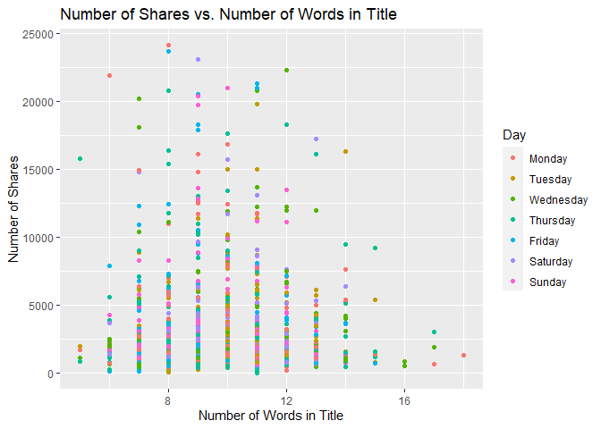

Project 3
================
Kara Belknap & Cassio Monti
2022-10-29

-   <a href="#report-for-lifestyle-channel"
    id="toc-report-for-lifestyle-channel">Report for <em>lifestyle</em>
    Channel</a>
    -   <a href="#introduction" id="toc-introduction">Introduction</a>
    -   <a href="#required-packages" id="toc-required-packages">Required
        Packages</a>
    -   <a href="#read-in-the-data" id="toc-read-in-the-data">Read in the
        Data</a>
    -   <a href="#select-data-for-appropriate-data-channel"
        id="toc-select-data-for-appropriate-data-channel">Select Data for
        Appropriate Data Channel</a>
    -   <a href="#summarizations-for-data-channel-lifestyle"
        id="toc-summarizations-for-data-channel-lifestyle">Summarizations for
        data channel <em>lifestyle</em></a>
        -   <a href="#data-split" id="toc-data-split">Data Split</a>
        -   <a href="#data-manipulation-for-statistics"
            id="toc-data-manipulation-for-statistics">Data manipulation for
            statistics</a>
        -   <a href="#belknap---summary-statistics"
            id="toc-belknap---summary-statistics">Belknap - Summary Statistics</a>
        -   <a href="#monti---summary-statistics"
            id="toc-monti---summary-statistics">Monti - Summary Statistics</a>
        -   <a href="#monti---graphs-3" id="toc-monti---graphs-3">Monti - Graphs
            (3)</a>
        -   <a href="#belknap---graphs-3" id="toc-belknap---graphs-3">Belknap -
            Graphs (3)</a>
        -   <a href="#subsetting-variables-for-modeling"
            id="toc-subsetting-variables-for-modeling">Subsetting Variables for
            Modeling</a>
    -   <a href="#modeling" id="toc-modeling">Modeling</a>
        -   <a href="#belknap---linear-regression-model-explanation"
            id="toc-belknap---linear-regression-model-explanation">Belknap - Linear
            Regression Model Explanation</a>
        -   <a href="#monti---linear-regression-model"
            id="toc-monti---linear-regression-model">Monti - Linear Regression
            Model</a>
        -   <a href="#belknap---linear-regression-model"
            id="toc-belknap---linear-regression-model">Belknap - Linear Regression
            Model</a>
        -   <a href="#monti---ensemble-tree-based-model"
            id="toc-monti---ensemble-tree-based-model">Monti - Ensemble Tree-based
            Model</a>
        -   <a href="#belknap---ensemble-tree-based-model"
            id="toc-belknap---ensemble-tree-based-model">Belknap - Ensemble
            Tree-based Model</a>
        -   <a href="#belknap---random-forest-model--explanation"
            id="toc-belknap---random-forest-model--explanation">Belknap - Random
            Forest Model &amp; Explanation</a>
        -   <a href="#monti---boosted-tree-model--explanation"
            id="toc-monti---boosted-tree-model--explanation">Monti - Boosted Tree
            Model &amp; Explanation</a>
    -   <a href="#comparison--conclusion---monti"
        id="toc-comparison--conclusion---monti">Comparison &amp; Conclusion -
        Monti</a>

# Report for *lifestyle* Channel

This report contains Exploratory Data Analysis (EDA) about this data
channel and a modeling section applying three regression methods.

## Introduction

The objective of this analysis is to provide a comprehensive overview
about publication metrics and their relationship with the number of
shares that those publications presented during the study period. These
data have been collected from Mashable website, one of the largest news
websites from which the content of all the lifestyle channel articles
published in 2013 and 2014 was extracted. These data were originally
collected analyzed By Fernandes et al. (2015) work, in which the authors
performed classification task comparing several machine learning
algorithms. In the present study, the subset of the data used by
Fernandes et al.(2015) corresponding to the data channel lifestyle is
used for regression purposes. The response variable is the number of
`shares` that the papers presented after publication. In other words, we
will try to predict the number of shares the papers will have before
publication. To perform the regression, Random Forest, Boosting, and
Multiple Linear Regression are used. More information about the methods
will be provided in further sections.

Some metrics have been calculated based on the information obtained from
Marshable website. For instance, the Latent Dirichlet Allocation (LDA)
was applied to the data set to identify the 5 top relevant topics and
then measure the closeness of the current article to such topic. There
are 5 relevance of topic metrics according to LDA:

-   `LDA_00`: Closeness to LDA topic 0  
-   `LDA_01`: Closeness to LDA topic 1  
-   `LDA_02`: Closeness to LDA topic 2  
-   `LDA_03`: Closeness to LDA topic 3  
-   `LDA_04`: Closeness to LDA topic 4

Additionally, some quality metrics related to the keywords have been
calculated and will be used in this analysis. These metrics represent
the average number of shares for publications with worst, best, and
average keywords. The classification of keywords under these groups was
made by the authors of the original paper. The keyword metrics are shown
below.

-   `kw_avg_min`: Worst keyword (avg. shares)  
-   `kw_avg_max`: Best keyword (avg. shares)  
-   `kw_avg_avg`: Avg. keyword (avg. shares)

Article content metrics were also used in this study. These are general
metrics about the body of the publication that can influence the number
of shares of that paper. The content summary metrics are shown below.

\-`num_videos`: Number of videos  
-`n_tokens_content`: Number of words in the content  
-`n_non_stop_unique_tokens`: Rate of unique non-stop words in the
content  
-`num_hrefs`: Number of links  
-`num_self_hrefs`: Number of links to other articles published by
Mashable  
-`average_token_length`: Average length of the words in the content

These data were collected during 2013 and 2014 on daily basis. To
represent time dependent information, a binary variable indicating
whether the publication was made in a weekend or weekday, `is_weekend`
is used.

## Required Packages

Before we can begin our analysis, we must load in the following
packages:

``` r
library(tidyverse)
library(caret)
library(knitr)
library(corrplot)
```

`Tidyverse` is used for data management and plotting through dplyr and
ggplot packages. `Caret` package is used for data splitting and
modeling. `Knitr` package is used for nice printing of tables.
`Corrplot` is used for nice correlation plots assisting in
visualization.

## Read in the Data

Using the data file `OnlineNewsPopularity.csv`, we will read in the data
and add a new column corresponding to the type of data channel from
which the data was classified. The new variable will be called
`dataChannel`. Note that there are some rows that are unclassified
according to the six channels of interest and those are indicated by
`other`.

Once the data column is created, we can easily subset the data using the
`filter` function to create a new data set for each data channel. We
removed the original `data_channel_is_*` columns as well as two
non-predictive columns `url` and `timedelta`.

``` r
# reading in the data set
rawData <- read_csv("../OnlineNewsPopularity.csv")

# creating new variable to have more comprehensive names for data channels.
rawDataChannel <- rawData %>%
  mutate(dataChannel = ifelse(data_channel_is_lifestyle == 1, "lifestyle", 
                              ifelse(data_channel_is_entertainment == 1, "entertainment", 
                              ifelse(data_channel_is_bus == 1, "bus", 
                              ifelse(data_channel_is_socmed == 1, "socmed", 
                              ifelse(data_channel_is_tech == 1, "tech", 
                              ifelse(data_channel_is_world == 1, "world", 
                                     "other"))))))) %>%
  select(-data_channel_is_lifestyle, -data_channel_is_entertainment, 
         -data_channel_is_bus, -data_channel_is_socmed, -data_channel_is_tech,
         -data_channel_is_world, -url, -timedelta)

# assigning channel data to R objects.
lifestyleData <- rawDataChannel %>%
  filter(dataChannel == "lifestyle")

entertainmentData <- rawDataChannel %>%
  filter(dataChannel == "entertainment")

busData <- rawDataChannel %>%
  filter(dataChannel == "bus")

socmedData <- rawDataChannel %>%
  filter(dataChannel == "socmed")

techData <- rawDataChannel %>%
  filter(dataChannel == "tech")

worldData <- rawDataChannel %>%
  filter(dataChannel == "world")
```

## Select Data for Appropriate Data Channel

To select the appropriate data channel based on the `params$channel`, we
created a function `selectData` which would return the appropriate data
set and assign it to the data set `activeData`. This will be the file we
will use for the remainder of the report.

To select the appropriate data channel based on the `params$channel`, we
created a function `selectData` which would return the appropriate data
set and assign it to the data set `activeData`. This will be the file we
will use for the remainder of the report.

``` r
# function to assign automated calls for the different data channels
selectData <- function(dataChannel) { 
  if (dataChannel == "lifestyle"){
    return(lifestyleData)
  }
  if (dataChannel == "entertainment"){
    return(entertainmentData)
  }
  if (dataChannel == "bus"){
    return(busData)
  }
  if (dataChannel == "socmed"){
    return(socmedData)
  }
  if (dataChannel == "tech"){
    return(techData)
  }
  if (dataChannel == "world"){
    return(worldData)
  }
}

# activating corresponding data set.
dataChannelSelect <- params$channel

activeData <- selectData(dataChannelSelect)
```

## Summarizations for data channel *lifestyle*

In this section, we will perform EDA for the data channel lifestyle

### Data Split

This section splits the data set into training and test sets for the
proportion of 80/20. The data summarization will be conducted on the
training set. To split the data, the function `createDataPartition()`,
from `caret` package, was used with the argument `p=0.8` to represent
80% of the data should be in the split. The function `set.seed(555)` was
used to fix the random seed. The code below shows the creation of
training and test sets.

``` r
set.seed(555)

trainIndex <- createDataPartition(activeData$shares, p = 0.8, list = FALSE)

activeTrain <- activeData[trainIndex, ]

activeTest <- activeData[-trainIndex, ]
```

### Data manipulation for statistics

A new object is created in this section aiming to summarize publications
during weekdays and weekends and create factor levels for them to match
with `shares` variable. The functions `ifelse()` was used to vectorize
the IF-ELSE statements associated to `mutate()` which took care of
attaching the new variable to the data set. The function `factor()` was
used to explicitly coerce the days of week into levels of the newly
created categorical variable “Day”.

``` r
# IF-ELSE statements
statsData <- activeTrain %>%
  mutate(Day = ifelse(weekday_is_monday == 1, "Monday", 
                      ifelse(weekday_is_tuesday == 1, "Tuesday", 
                      ifelse(weekday_is_wednesday == 1, "Wednesday", 
                      ifelse(weekday_is_thursday == 1, "Thursday", 
                      ifelse(weekday_is_friday == 1, "Friday", 
                      ifelse(weekday_is_saturday == 1, "Saturday", 
                      ifelse(weekday_is_sunday == 1, "Sunday",
                             "missingdata")))))))) %>%
  mutate(Weekend = ifelse(is_weekend == 1, "Yes", "No"))

# Assigning factor levels
statsData$Day <- factor(statsData$Day, 
                levels = c("Monday", "Tuesday", "Wednesday", "Thursday", 
                           "Friday", "Saturday", "Sunday"))
```

### Belknap - Summary Statistics

The following table gives us information about the summary statistics
for the number of shares for articles in the data channel lifestyle. The
`summary()` function was used to extract these metrics.

``` r
summary(activeTrain$shares)
```

    ##    Min. 1st Qu.  Median    Mean 3rd Qu.    Max. 
    ##      28    1100    1700    3744    3200  208300

The following table gives us information about the average, median, and
standard deviation for the number of shares based on whether the post
was made on a weekend or a weekday. The variable “weekend” was grouped,
via `grouped_by()`, and for each level the sum, average, median, and
standard deviation of shares were calculated via `sum()`, `mean()`,
`meadian()`, `sd()`, and `summarise()` functions. The summary table is
shown below.

``` r
statsData %>% 
  group_by(Weekend) %>%
  summarise(sumShares = sum(shares), avgShares = mean(shares), medShares = median(shares), sdShares = sd(shares))
```

    ## # A tibble: 2 × 5
    ##   Weekend sumShares avgShares medShares sdShares
    ##   <chr>       <dbl>     <dbl>     <dbl>    <dbl>
    ## 1 No        5034548     3691.      1500   10275.
    ## 2 Yes       1259670     3974.      2200    5175.

Likewise, this table gives us information about the number of shares by
the day of the week. The same functions were used here, by applied to
levels of variable “Day”. Also, the quantities maximum `max()` and
minimum `min()` number of shares by levels of “Day” were calculated.

``` r
statsData %>% 
  group_by(Day) %>%
  arrange(Day) %>%
  summarise(sumShares = sum(shares), avgShares = mean(shares), medShares = median(shares), sdShares = sd(shares), maxShares = max(shares),
            minShares = min(shares))
```

    ## # A tibble: 7 × 7
    ##   Day       sumShares avgShares medShares sdShares maxShares minShares
    ##   <fct>         <dbl>     <dbl>     <dbl>    <dbl>     <dbl>     <dbl>
    ## 1 Monday      1207141     4679.      1700   15581.    196700       109
    ## 2 Tuesday     1203161     4506.      1500   14908.    208300        93
    ## 3 Wednesday    912087     2923.      1500    4450.     35800        95
    ## 4 Thursday     946325     3380.      1500    5897.     56000        28
    ## 5 Friday       765834     3101.      1400    4860.     40400       127
    ## 6 Saturday     643066     4122.      2250    5428.     43000       446
    ## 7 Sunday       616604     3830.      2100    4931.     33100       613

### Monti - Summary Statistics

``` r
# two-way contingency table between shares and Days
```

``` r
# correlation matrix
```

### Monti - Graphs (3)

``` r
# bivariate correlation plot
```

``` r
# relationship between shares and LDA levels (facet_wrap+smooth)
```

``` r
# relationship between shares and keyword metrics (color)
```

``` r
# relationship between shares and content metrics (facet_wrap+smooth)
```

### Belknap - Graphs (3)

The following graph shows the number of shares compared to the number of
words in the title. The output is colored by the day of the week.

``` r
titlewordcountGraph <- ggplot(statsData, aes(x = n_tokens_title, y = shares))
titlewordcountGraph + geom_point(aes(color = Day)) + 
  ggtitle("Number of Shares vs. Number of Words in Title") +
  ylab("Number of Shares") +
  xlab("Number of Words in Title")
```

<!-- -->

The following plot shows the number of shares by the rate of positive
words in the article. A positive trend would indicate that articles with
more positive words are shared more often than articles with negative
words.

``` r
positivewordrateGraph <- ggplot(statsData, aes(x = rate_positive_words, y = shares))
positivewordrateGraph + geom_point(aes(color = Day)) + 
  ggtitle("Number of Shares vs. Rate of Positive Words") +
  ylab("Number of Shares") +
  xlab("Rate of Positive Words") 
```

<!-- -->

The following plot shows the total number of shares as related to the
parameter title subjectivity. A positive trend would indicate that
articles are shared more often when the title is subjective. A negative
trend would indicate that articles are shared more often when the title
is less subjective.

``` r
titleSubjectivityGraph <- ggplot(statsData, aes(x = title_subjectivity, y = shares))
titleSubjectivityGraph + geom_point(aes(color = n_tokens_title)) + 
  ggtitle("Number of Shares vs. Title Subjectivity") +
  ylab("Number of Shares") +
  xlab("Title Subjectivity") + 
  labs(color = "Word Count in Title")
```

### Subsetting Variables for Modeling

``` r
dfTrain = activeTrain %>%
  select(shares, starts_with("LDA_"), average_token_length,
         is_weekend, n_tokens_content, n_non_stop_unique_tokens, num_hrefs,
         num_self_hrefs, num_videos, average_token_length, kw_avg_min, 
         kw_avg_max, kw_avg_avg, is_weekend)

dfTest = activeTest %>%
  select(shares, starts_with("LDA_"), average_token_length,
         is_weekend, n_tokens_content, n_non_stop_unique_tokens, num_hrefs,
         num_self_hrefs, num_videos, average_token_length, kw_avg_min, 
         kw_avg_max, kw_avg_avg, is_weekend)

# looking for NAs
anyNA(dfTrain)
```

    ## [1] FALSE

``` r
anyNA(dfTest)
```

    ## [1] FALSE

## Modeling

In this section, we will perform regression for prediction purposes for
the data channel lifestyle.

### Belknap - Linear Regression Model Explanation

### Monti - Linear Regression Model

``` r
LASSO = train(shares~., data = dfTrain,
              method="glmnet",
              preProcess = c("center","scale"),
              tuneGrid = expand.grid(alpha = 1, lambda = seq(0,10,0.1)),
              trControl = trainControl(method="CV",number=5))

plot(LASSO)
```

<!-- -->

``` r
coef(LASSO$finalModel, LASSO$bestTune$lambda)
```

    ## 16 x 1 sparse Matrix of class "dgCMatrix"
    ##                                  s1
    ## (Intercept)              3744.32957
    ## LDA_00                      .      
    ## LDA_01                   -163.86446
    ## LDA_02                   -212.79783
    ## LDA_03                    172.02226
    ## LDA_04                      .      
    ## average_token_length     -735.97479
    ## is_weekend                -75.73633
    ## n_tokens_content          781.11950
    ## n_non_stop_unique_tokens  809.38299
    ## num_hrefs                 278.15058
    ## num_self_hrefs           -216.45534
    ## num_videos                785.85667
    ## kw_avg_min               -365.17607
    ## kw_avg_max               -404.18746
    ## kw_avg_avg                909.18695

``` r
postResample(pred = predict(LASSO, newdata = dfTest), obs = dfTest$shares)
```

    ##         RMSE     Rsquared          MAE 
    ## 5.514858e+03 3.882426e-02 3.049372e+03

### Belknap - Linear Regression Model

### Monti - Ensemble Tree-based Model

### Belknap - Ensemble Tree-based Model

### Belknap - Random Forest Model & Explanation

``` r
train.control = trainControl(method = "cv", number = 5)

rfFit <- train(shares~.,
               data = dfTrain,
               method = "rf",
               trControl = train.control,
               preProcess = c("center","scale"),
               tuneGrid = data.frame(mtry = 1:5))

rfFit$bestTune$mtry
```

    ## [1] 1

``` r
plot(rfFit)
```

<!-- -->

``` r
rfFit$results
```

    ##   mtry     RMSE    Rsquared      MAE   RMSESD  RsquaredSD    MAESD
    ## 1    1 8870.245 0.003022421 3509.842 4115.925 0.001827175 264.0684
    ## 2    2 9043.676 0.002378389 3619.956 3977.387 0.001840506 229.4345
    ## 3    3 9191.314 0.002449598 3683.992 3867.050 0.003495292 225.7122
    ## 4    4 9314.535 0.001972980 3711.929 3795.512 0.002758264 206.7487
    ## 5    5 9476.974 0.002241471 3753.965 3680.911 0.003498671 183.5011

``` r
RF_pred <- predict(rfFit, newdata = activeTest)

metric_rf = postResample(RF_pred, activeTest$shares)

metric_rf
```

    ##         RMSE     Rsquared          MAE 
    ## 5.532774e+03 3.570029e-02 3.022682e+03

### Monti - Boosted Tree Model & Explanation

``` r
tunG = expand.grid(n.trees = seq(25,200,25),
                      interaction.depth = 1:4,
                      shrinkage = 0.1,
                      n.minobsinnode = 10)

gbmFit <- train(shares~.,
               data = dfTrain,
               method = "gbm",
               preProcess = c("center","scale"),
               trControl = train.control,
               tuneGrid = tunG,
               verbose = FALSE
               )


gbmFit$bestTune$n.trees
```

    ## [1] 25

``` r
gbmFit$bestTune$interaction.depth
```

    ## [1] 1

``` r
plot(gbmFit)
```

<!-- -->

``` r
gbmFit$results
```

    ##    shrinkage interaction.depth n.minobsinnode n.trees     RMSE     Rsquared      MAE
    ## 1        0.1                 1             10      25 8788.985 0.0007414257 3489.245
    ## 9        0.1                 2             10      25 8856.292 0.0004302577 3512.172
    ## 17       0.1                 3             10      25 8820.004 0.0031240516 3534.683
    ## 25       0.1                 4             10      25 8875.835 0.0048739922 3568.447
    ## 2        0.1                 1             10      50 8823.925 0.0015048263 3511.749
    ## 10       0.1                 2             10      50 8993.563 0.0017866481 3572.414
    ## 18       0.1                 3             10      50 8927.616 0.0031039507 3576.931
    ## 26       0.1                 4             10      50 8985.645 0.0032934630 3598.711
    ## 3        0.1                 1             10      75 8861.556 0.0011081213 3517.430
    ## 11       0.1                 2             10      75 9047.249 0.0028400156 3600.477
    ## 19       0.1                 3             10      75 9013.973 0.0033470183 3620.839
    ## 27       0.1                 4             10      75 9142.823 0.0024595037 3653.866
    ## 4        0.1                 1             10     100 8925.484 0.0009524989 3548.583
    ## 12       0.1                 2             10     100 9055.929 0.0028359482 3596.893
    ## 20       0.1                 3             10     100 9078.647 0.0034838045 3644.619
    ## 28       0.1                 4             10     100 9228.481 0.0034315922 3706.355
    ## 5        0.1                 1             10     125 8879.165 0.0020570536 3522.409
    ## 13       0.1                 2             10     125 9078.230 0.0022739469 3607.353
    ## 21       0.1                 3             10     125 9126.410 0.0048770106 3658.931
    ## 29       0.1                 4             10     125 9282.674 0.0032960611 3722.264
    ## 6        0.1                 1             10     150 8964.024 0.0023449245 3561.541
    ## 14       0.1                 2             10     150 9154.439 0.0020368659 3630.409
    ## 22       0.1                 3             10     150 9212.115 0.0040388646 3725.635
    ## 30       0.1                 4             10     150 9404.493 0.0027451943 3772.983
    ## 7        0.1                 1             10     175 8940.361 0.0027702602 3547.975
    ## 15       0.1                 2             10     175 9252.640 0.0016944923 3683.072
    ## 23       0.1                 3             10     175 9337.141 0.0037535017 3763.297
    ## 31       0.1                 4             10     175 9485.299 0.0028027536 3788.470
    ## 8        0.1                 1             10     200 8912.962 0.0026515664 3542.632
    ## 16       0.1                 2             10     200 9294.443 0.0019202933 3695.467
    ## 24       0.1                 3             10     200 9440.182 0.0031955806 3842.088
    ## 32       0.1                 4             10     200 9573.463 0.0033783793 3815.943
    ##      RMSESD   RsquaredSD    MAESD
    ## 1  4500.328 0.0007141832 407.9339
    ## 9  4449.286 0.0006294420 447.0841
    ## 17 4412.426 0.0031474051 390.4971
    ## 25 4412.377 0.0048685116 372.5653
    ## 2  4494.209 0.0017258237 419.0667
    ## 10 4310.492 0.0019865551 381.8312
    ## 18 4337.830 0.0027881209 364.5948
    ## 26 4285.603 0.0033887929 316.9604
    ## 3  4458.708 0.0015129394 406.3520
    ## 11 4282.894 0.0034071442 385.0306
    ## 19 4244.655 0.0014121560 324.5552
    ## 27 4162.345 0.0026115889 301.6090
    ## 4  4424.120 0.0010656002 404.0305
    ## 12 4305.715 0.0042418427 404.9206
    ## 20 4193.049 0.0013827079 348.6834
    ## 28 4088.838 0.0042186893 279.5469
    ## 5  4456.321 0.0038030742 430.6010
    ## 13 4286.816 0.0035220295 401.9497
    ## 21 4109.276 0.0044508326 329.5915
    ## 29 4052.605 0.0039504489 322.3776
    ## 6  4353.654 0.0049270578 341.0178
    ## 14 4221.027 0.0038254528 383.8067
    ## 22 4057.260 0.0049381381 329.1074
    ## 30 3996.758 0.0036672287 324.6305
    ## 7  4390.961 0.0059538976 391.4487
    ## 15 4151.233 0.0032685704 359.5012
    ## 23 3955.196 0.0050398347 301.1976
    ## 31 3889.354 0.0029183385 302.4780
    ## 8  4402.355 0.0054072299 397.1601
    ## 16 4064.894 0.0026758509 328.1074
    ## 24 3901.892 0.0037739043 297.3476
    ## 32 3815.401 0.0040364099 329.0511

``` r
gbm_pred <- predict(gbmFit, newdata = activeTest)

metric_boosting = postResample(gbm_pred, activeTest$shares)

metric_boosting
```

    ##         RMSE     Rsquared          MAE 
    ## 5.641000e+03 3.925012e-03 2.945873e+03

## Comparison & Conclusion - Monti

``` r
bestMethod = function(x){
  
  bestm = which.min(lapply(1:length(x), function(i) x[[i]][1]))
  
  out = switch(bestm,
                "Random Forest",
                "Boosting")
  
  return(out)
  
}

tb = data.frame(RF = metric_rf, Boosting = metric_boosting)

kable(tb, caption = "Accuracy Metric by Ensemble Method on Test Set",
      digits = 3)
```

|          |       RF | Boosting |
|:---------|---------:|---------:|
| RMSE     | 5532.774 | 5641.000 |
| Rsquared |    0.036 |    0.004 |
| MAE      | 3022.682 | 2945.873 |

Accuracy Metric by Ensemble Method on Test Set

The best model is Random Forest based on RMSE metric.
