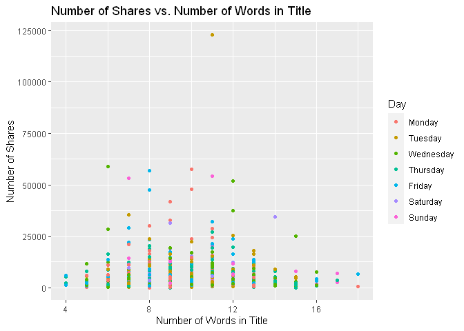
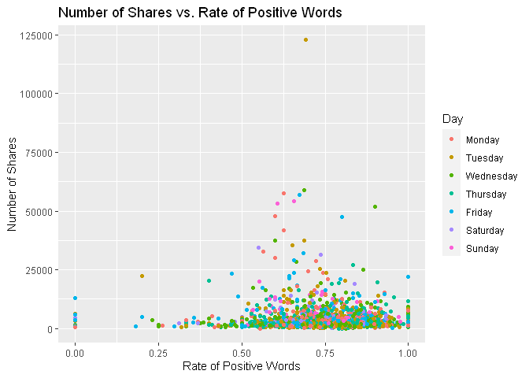
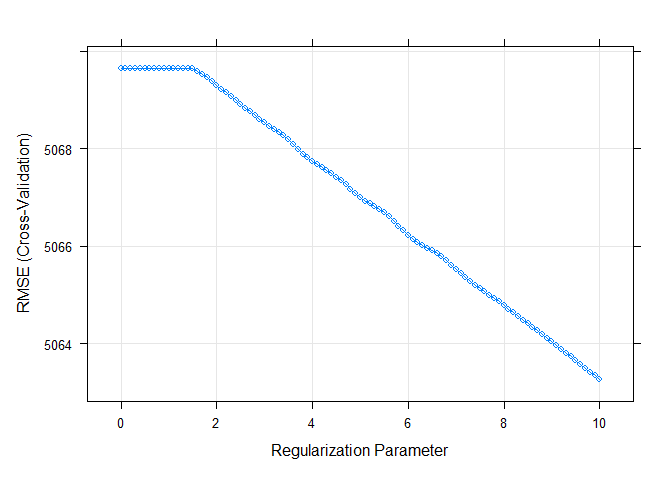
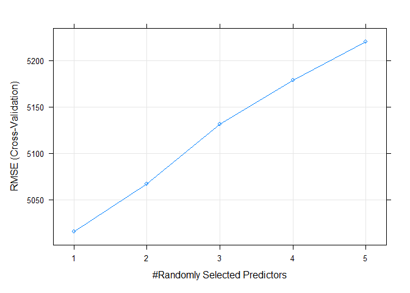
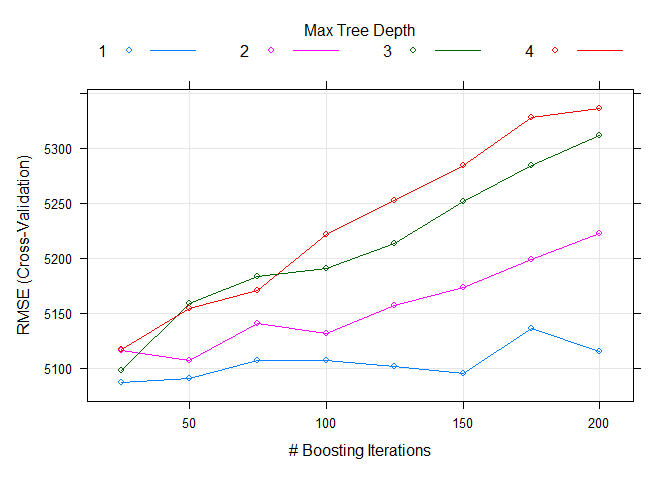

Project 3
================
Kara Belknap & Cassio Monti
2022-10-29

-   <a href="#report-for-socmed-channel"
    id="toc-report-for-socmed-channel">Report for <em>socmed</em>
    Channel</a>
    -   <a href="#introduction" id="toc-introduction">Introduction</a>
    -   <a href="#required-packages" id="toc-required-packages">Required
        Packages</a>
    -   <a href="#read-in-the-data" id="toc-read-in-the-data">Read in the
        Data</a>
    -   <a href="#select-data-for-appropriate-data-channel"
        id="toc-select-data-for-appropriate-data-channel">Select Data for
        Appropriate Data Channel</a>
    -   <a href="#summarizations-for-data-channel-socmed"
        id="toc-summarizations-for-data-channel-socmed">Summarizations for data
        channel <em>socmed</em></a>
        -   <a href="#data-split" id="toc-data-split">Data Split</a>
        -   <a href="#data-manipulation-for-statistics"
            id="toc-data-manipulation-for-statistics">Data manipulation for
            statistics</a>
        -   <a href="#belknap---summary-statistics"
            id="toc-belknap---summary-statistics">Belknap - Summary Statistics</a>
        -   <a href="#monti---summary-statistics"
            id="toc-monti---summary-statistics">Monti - Summary Statistics</a>
        -   <a href="#monti---graphs-3" id="toc-monti---graphs-3">Monti - Graphs
            (3)</a>
        -   <a href="#belknap---graphs-3" id="toc-belknap---graphs-3">Belknap -
            Graphs (3)</a>
        -   <a href="#subsetting-variables-for-modeling"
            id="toc-subsetting-variables-for-modeling">Subsetting Variables for
            Modeling</a>
    -   <a href="#modeling" id="toc-modeling">Modeling</a>
        -   <a href="#belknap---linear-regression-model-explanation"
            id="toc-belknap---linear-regression-model-explanation">Belknap - Linear
            Regression Model Explanation</a>
        -   <a href="#monti---linear-regression-model"
            id="toc-monti---linear-regression-model">Monti - Linear Regression
            Model</a>
        -   <a href="#belknap---linear-regression-model"
            id="toc-belknap---linear-regression-model">Belknap - Linear Regression
            Model</a>
        -   <a href="#monti---ensemble-tree-based-model"
            id="toc-monti---ensemble-tree-based-model">Monti - Ensemble Tree-based
            Model</a>
        -   <a href="#belknap---ensemble-tree-based-model"
            id="toc-belknap---ensemble-tree-based-model">Belknap - Ensemble
            Tree-based Model</a>
        -   <a href="#belknap---random-forest-model--explanation"
            id="toc-belknap---random-forest-model--explanation">Belknap - Random
            Forest Model &amp; Explanation</a>
        -   <a href="#monti---boosted-tree-model--explanation"
            id="toc-monti---boosted-tree-model--explanation">Monti - Boosted Tree
            Model &amp; Explanation</a>
    -   <a href="#comparison--conclusion---monti"
        id="toc-comparison--conclusion---monti">Comparison &amp; Conclusion -
        Monti</a>

# Report for *socmed* Channel

This report contains Exploratory Data Analysis (EDA) about this data
channel and a modeling section applying three regression methods.

## Introduction

The objective of this analysis is to provide a comprehensive overview
about publication metrics and their relationship with the number of
shares that those publications presented during the study period. These
data have been collected from Mashable website, one of the largest news
websites from which the content of all the socmed channel articles
published in 2013 and 2014 was extracted. These data were originally
collected analyzed By Fernandes et al. (2015) work, in which the authors
performed classification task comparing several machine learning
algorithms. In the present study, the subset of the data used by
Fernandes et al.(2015) corresponding to the data channel socmed is used
for regression purposes. The response variable is the number of `shares`
that the papers presented after publication. In other words, we will try
to predict the number of shares the papers will have before publication.
To perform the regression, Random Forest, Boosting, and Multiple Linear
Regression are used. More information about the methods will be provided
in further sections.

Some metrics have been calculated based on the information obtained from
Marshable website. For instance, the Latent Dirichlet Allocation (LDA)
was applied to the data set to identify the 5 top relevant topics and
then measure the closeness of the current article to such topic. There
are 5 relevance of topic metrics according to LDA:

-   `LDA_00`: Closeness to LDA topic 0  
-   `LDA_01`: Closeness to LDA topic 1  
-   `LDA_02`: Closeness to LDA topic 2  
-   `LDA_03`: Closeness to LDA topic 3  
-   `LDA_04`: Closeness to LDA topic 4

Additionally, some quality metrics related to the keywords have been
calculated and will be used in this analysis. These metrics represent
the average number of shares for publications with worst, best, and
average keywords. The classification of keywords under these groups was
made by the authors of the original paper. The keyword metrics are shown
below.

-   `kw_avg_min`: Worst keyword (avg. shares)  
-   `kw_avg_max`: Best keyword (avg. shares)  
-   `kw_avg_avg`: Avg. keyword (avg. shares)

Article content metrics were also used in this study. These are general
metrics about the body of the publication that can influence the number
of shares of that paper. The content summary metrics are shown below.

\-`num_videos`: Number of videos  
-`n_tokens_content`: Number of words in the content  
-`n_non_stop_unique_tokens`: Rate of unique non-stop words in the
content  
-`num_hrefs`: Number of links  
-`num_self_hrefs`: Number of links to other articles published by
Mashable  
-`average_token_length`: Average length of the words in the content

These data were collected during 2013 and 2014 on daily basis. To
represent time dependent information, a binary variable indicating
whether the publication was made in a weekend or weekday, `is_weekend`
is used.

## Required Packages

Before we can begin our analysis, we must load in the following
packages:

``` r
library(tidyverse)
library(caret)
library(knitr)
library(corrplot)
```

`Tidyverse` is used for data management and plotting through dplyr and
ggplot packages. `Caret` package is used for data splitting and
modeling. `Knitr` package is used for nice printing of tables.
`Corrplot` is used for nice correlation plots assisting in
visualization.

## Read in the Data

Using the data file `OnlineNewsPopularity.csv`, we will read in the data
and add a new column corresponding to the type of data channel from
which the data was classified. The new variable will be called
`dataChannel`. Note that there are some rows that are unclassified
according to the six channels of interest and those are indicated by
`other`.

Once the data column is created, we can easily subset the data using the
`filter` function to create a new data set for each data channel. We
removed the original `data_channel_is_*` columns as well as two
non-predictive columns `url` and `timedelta`.

``` r
# reading in the data set
rawData <- read_csv("../OnlineNewsPopularity.csv")

# creating new variable to have more comprehensive names for data channels.
rawDataChannel <- rawData %>%
  mutate(dataChannel = ifelse(data_channel_is_lifestyle == 1, "lifestyle", 
                              ifelse(data_channel_is_entertainment == 1, "entertainment", 
                              ifelse(data_channel_is_bus == 1, "bus", 
                              ifelse(data_channel_is_socmed == 1, "socmed", 
                              ifelse(data_channel_is_tech == 1, "tech", 
                              ifelse(data_channel_is_world == 1, "world", 
                                     "other"))))))) %>%
  select(-data_channel_is_lifestyle, -data_channel_is_entertainment, 
         -data_channel_is_bus, -data_channel_is_socmed, -data_channel_is_tech,
         -data_channel_is_world, -url, -timedelta)

# assigning channel data to R objects.
lifestyleData <- rawDataChannel %>%
  filter(dataChannel == "lifestyle")

entertainmentData <- rawDataChannel %>%
  filter(dataChannel == "entertainment")

busData <- rawDataChannel %>%
  filter(dataChannel == "bus")

socmedData <- rawDataChannel %>%
  filter(dataChannel == "socmed")

techData <- rawDataChannel %>%
  filter(dataChannel == "tech")

worldData <- rawDataChannel %>%
  filter(dataChannel == "world")
```

## Select Data for Appropriate Data Channel

To select the appropriate data channel based on the `params$channel`, we
created a function `selectData` which would return the appropriate data
set and assign it to the data set `activeData`. This will be the file we
will use for the remainder of the report.

To select the appropriate data channel based on the `params$channel`, we
created a function `selectData` which would return the appropriate data
set and assign it to the data set `activeData`. This will be the file we
will use for the remainder of the report.

``` r
# function to assign automated calls for the different data channels
selectData <- function(dataChannel) { 
  if (dataChannel == "lifestyle"){
    return(lifestyleData)
  }
  if (dataChannel == "entertainment"){
    return(entertainmentData)
  }
  if (dataChannel == "bus"){
    return(busData)
  }
  if (dataChannel == "socmed"){
    return(socmedData)
  }
  if (dataChannel == "tech"){
    return(techData)
  }
  if (dataChannel == "world"){
    return(worldData)
  }
}

# activating corresponding data set.
dataChannelSelect <- params$channel

activeData <- selectData(dataChannelSelect)
```

## Summarizations for data channel *socmed*

In this section, we will perform EDA for the data channel socmed

### Data Split

This section splits the data set into training and test sets for the
proportion of 80/20. The data summarization will be conducted on the
training set. To split the data, the function `createDataPartition()`,
from `caret` package, was used with the argument `p=0.8` to represent
80% of the data should be in the split. The function `set.seed(555)` was
used to fix the random seed. The code below shows the creation of
training and test sets.

``` r
set.seed(555)

trainIndex <- createDataPartition(activeData$shares, p = 0.8, list = FALSE)

activeTrain <- activeData[trainIndex, ]

activeTest <- activeData[-trainIndex, ]
```

### Data manipulation for statistics

A new object is created in this section aiming to summarize publications
during weekdays and weekends and create factor levels for them to match
with `shares` variable. The functions `ifelse()` was used to vectorize
the IF-ELSE statements associated to `mutate()` which took care of
attaching the new variable to the data set. The function `factor()` was
used to explicitly coerce the days of week into levels of the newly
created categorical variable “Day”.

``` r
# IF-ELSE statements
statsData <- activeTrain %>%
  mutate(Day = ifelse(weekday_is_monday == 1, "Monday", 
                      ifelse(weekday_is_tuesday == 1, "Tuesday", 
                      ifelse(weekday_is_wednesday == 1, "Wednesday", 
                      ifelse(weekday_is_thursday == 1, "Thursday", 
                      ifelse(weekday_is_friday == 1, "Friday", 
                      ifelse(weekday_is_saturday == 1, "Saturday", 
                      ifelse(weekday_is_sunday == 1, "Sunday",
                             "missingdata")))))))) %>%
  mutate(Weekend = ifelse(is_weekend == 1, "Yes", "No"))

# Assigning factor levels
statsData$Day <- factor(statsData$Day, 
                levels = c("Monday", "Tuesday", "Wednesday", "Thursday", 
                           "Friday", "Saturday", "Sunday"))
```

### Belknap - Summary Statistics

The following table gives us information about the summary statistics
for the number of shares for articles in the data channel socmed. The
`summary()` function was used to extract these metrics.

``` r
summary(activeTrain$shares)
```

    ##    Min. 1st Qu.  Median    Mean 3rd Qu.    Max. 
    ##       5    1400    2100    3570    3800  122800

The following table gives us information about the average, median, and
standard deviation for the number of shares based on whether the post
was made on a weekend or a weekday. The variable “weekend” was grouped,
via `grouped_by()`, and for each level the sum, average, median, and
standard deviation of shares were calculated via `sum()`, `mean()`,
`meadian()`, `sd()`, and `summarise()` functions. The summary table is
shown below.

``` r
statsData %>% 
  group_by(Weekend) %>%
  summarise(sumShares = sum(shares), avgShares = mean(shares), medShares = median(shares), sdShares = sd(shares))
```

    ## # A tibble: 2 × 5
    ##   Weekend sumShares avgShares medShares sdShares
    ##   <chr>       <dbl>     <dbl>     <dbl>    <dbl>
    ## 1 No        5637790     3484.      2100    5144.
    ## 2 Yes       1001941     4140.      2400    5938.

Likewise, this table gives us information about the number of shares by
the day of the week. The same functions were used here, by applied to
levels of variable “Day”. Also, the quantities maximum `max()` and
minimum `min()` number of shares by levels of “Day” were calculated.

``` r
statsData %>% 
  group_by(Day) %>%
  arrange(Day) %>%
  summarise(sumShares = sum(shares), avgShares = mean(shares), medShares = median(shares), sdShares = sd(shares), maxShares = max(shares),
            minShares = min(shares))
```

    ## # A tibble: 7 × 7
    ##   Day       sumShares avgShares medShares sdShares maxShares minShares
    ##   <fct>         <dbl>     <dbl>     <dbl>    <dbl>     <dbl>     <dbl>
    ## 1 Monday      1017936     3715.      2350    4658.     41900        53
    ## 2 Tuesday     1342087     3647.      1900    7352.    122800       238
    ## 3 Wednesday   1116566     3394.      2100    4810.     59000        23
    ## 4 Thursday    1163035     3118.      2000    3286.     26900         5
    ## 5 Friday       998166     3643.      2100    4423.     29000       213
    ## 6 Saturday     498551     3561.      2450    3890.     34500       837
    ## 7 Sunday       503390     4935.      2300    7887.     54100       455

### Monti - Summary Statistics

``` r
# two-way contingency table between shares and Days
```

``` r
# correlation matrix
```

### Monti - Graphs (3)

``` r
# bivariate correlation plot
```

``` r
# relationship between shares and LDA levels (facet_wrap+smooth)
```

``` r
# relationship between shares and keyword metrics (color)
```

``` r
# relationship between shares and content metrics (facet_wrap+smooth)
```

### Belknap - Graphs (3)

The following graph shows the number of shares compared to the number of
words in the title. The output is colored by the day of the week.

``` r
titlewordcountGraph <- ggplot(statsData, aes(x = n_tokens_title, y = shares))
titlewordcountGraph + geom_point(aes(color = Day)) + 
  ggtitle("Number of Shares vs. Number of Words in Title") +
  ylab("Number of Shares") +
  xlab("Number of Words in Title")
```

<!-- -->

The following plot shows the number of shares by the rate of positive
words in the article. A positive trend would indicate that articles with
more positive words are shared more often than articles with negative
words.

``` r
positivewordrateGraph <- ggplot(statsData, aes(x = rate_positive_words, y = shares))
positivewordrateGraph + geom_point(aes(color = Day)) + 
  ggtitle("Number of Shares vs. Rate of Positive Words") +
  ylab("Number of Shares") +
  xlab("Rate of Positive Words") 
```

<!-- -->

The following plot shows the total number of shares as related to the
parameter title subjectivity. A positive trend would indicate that
articles are shared more often when the title is subjective. A negative
trend would indicate that articles are shared more often when the title
is less subjective.

``` r
titleSubjectivityGraph <- ggplot(statsData, aes(x = title_subjectivity, y = shares))
titleSubjectivityGraph + geom_point(aes(color = n_tokens_title)) + 
  ggtitle("Number of Shares vs. Title Subjectivity") +
  ylab("Number of Shares") +
  xlab("Title Subjectivity") + 
  labs(color = "Word Count in Title")
```

### Subsetting Variables for Modeling

``` r
dfTrain = activeTrain %>%
  select(shares, starts_with("LDA_"), average_token_length,
         is_weekend, n_tokens_content, n_non_stop_unique_tokens, num_hrefs,
         num_self_hrefs, num_videos, average_token_length, kw_avg_min, 
         kw_avg_max, kw_avg_avg, is_weekend)

dfTest = activeTest %>%
  select(shares, starts_with("LDA_"), average_token_length,
         is_weekend, n_tokens_content, n_non_stop_unique_tokens, num_hrefs,
         num_self_hrefs, num_videos, average_token_length, kw_avg_min, 
         kw_avg_max, kw_avg_avg, is_weekend)

# looking for NAs
anyNA(dfTrain)
```

    ## [1] FALSE

``` r
anyNA(dfTest)
```

    ## [1] FALSE

## Modeling

In this section, we will perform regression for prediction purposes for
the data channel socmed.

### Belknap - Linear Regression Model Explanation

### Monti - Linear Regression Model

``` r
LASSO = train(shares~., data = dfTrain,
              method="glmnet",
              preProcess = c("center","scale"),
              tuneGrid = expand.grid(alpha = 1, lambda = seq(0,10,0.1)),
              trControl = trainControl(method="CV",number=5))

plot(LASSO)
```

<!-- -->

``` r
coef(LASSO$finalModel, LASSO$bestTune$lambda)
```

    ## 16 x 1 sparse Matrix of class "dgCMatrix"
    ##                                  s1
    ## (Intercept)              3569.74785
    ## LDA_00                    532.73014
    ## LDA_01                   -174.11777
    ## LDA_02                   -102.57402
    ## LDA_03                      .      
    ## LDA_04                    271.04117
    ## average_token_length       73.69788
    ## is_weekend                225.84288
    ## n_tokens_content          386.16486
    ## n_non_stop_unique_tokens -420.64263
    ## num_hrefs                -449.30861
    ## num_self_hrefs           -276.81259
    ## num_videos                127.54327
    ## kw_avg_min               -226.59396
    ## kw_avg_max               -326.97725
    ## kw_avg_avg                753.48867

``` r
postResample(pred = predict(LASSO, newdata = dfTest), obs = dfTest$shares)
```

    ##         RMSE     Rsquared          MAE 
    ## 6.467527e+03 1.024631e-02 2.808442e+03

### Belknap - Linear Regression Model

### Monti - Ensemble Tree-based Model

### Belknap - Ensemble Tree-based Model

### Belknap - Random Forest Model & Explanation

``` r
train.control = trainControl(method = "cv", number = 5)

rfFit <- train(shares~.,
               data = dfTrain,
               method = "rf",
               trControl = train.control,
               preProcess = c("center","scale"),
               tuneGrid = data.frame(mtry = 1:5))

rfFit$bestTune$mtry
```

    ## [1] 1

``` r
plot(rfFit)
```

<!-- -->

``` r
rfFit$results
```

    ##   mtry     RMSE   Rsquared      MAE   RMSESD RsquaredSD    MAESD
    ## 1    1 5015.654 0.03600848 2487.962 1502.633 0.01595348 173.4344
    ## 2    2 5067.278 0.03398126 2526.084 1473.765 0.01688040 174.9631
    ## 3    3 5131.737 0.02730280 2562.035 1438.062 0.01419997 168.1884
    ## 4    4 5178.784 0.02771508 2578.007 1433.309 0.01687354 161.9834
    ## 5    5 5220.426 0.02675524 2600.867 1407.812 0.01555926 156.7562

``` r
RF_pred <- predict(rfFit, newdata = activeTest)

metric_rf = postResample(RF_pred, activeTest$shares)

metric_rf
```

    ##         RMSE     Rsquared          MAE 
    ## 6.447580e+03 1.289943e-02 2.828842e+03

### Monti - Boosted Tree Model & Explanation

``` r
tunG = expand.grid(n.trees = seq(25,200,25),
                      interaction.depth = 1:4,
                      shrinkage = 0.1,
                      n.minobsinnode = 10)

gbmFit <- train(shares~.,
               data = dfTrain,
               method = "gbm",
               preProcess = c("center","scale"),
               trControl = train.control,
               tuneGrid = tunG,
               verbose = FALSE
               )


gbmFit$bestTune$n.trees
```

    ## [1] 25

``` r
gbmFit$bestTune$interaction.depth
```

    ## [1] 1

``` r
plot(gbmFit)
```

<!-- -->

``` r
gbmFit$results
```

    ##    shrinkage interaction.depth n.minobsinnode n.trees     RMSE   Rsquared      MAE
    ## 1        0.1                 1             10      25 5087.295 0.01115598 2553.341
    ## 9        0.1                 2             10      25 5116.444 0.01266102 2538.919
    ## 17       0.1                 3             10      25 5097.866 0.01508762 2520.494
    ## 25       0.1                 4             10      25 5116.562 0.01763228 2537.222
    ## 2        0.1                 1             10      50 5090.714 0.01455510 2531.281
    ## 10       0.1                 2             10      50 5107.208 0.02391405 2528.814
    ## 18       0.1                 3             10      50 5158.368 0.01806043 2539.312
    ## 26       0.1                 4             10      50 5154.164 0.01943158 2540.004
    ## 3        0.1                 1             10      75 5106.729 0.01391666 2538.017
    ## 11       0.1                 2             10      75 5140.240 0.02126571 2535.538
    ## 19       0.1                 3             10      75 5183.316 0.01842474 2543.974
    ## 27       0.1                 4             10      75 5170.934 0.02014073 2556.134
    ## 4        0.1                 1             10     100 5106.747 0.01458094 2545.473
    ## 12       0.1                 2             10     100 5131.417 0.02348926 2537.423
    ## 20       0.1                 3             10     100 5190.703 0.01841219 2576.984
    ## 28       0.1                 4             10     100 5221.106 0.01711304 2590.156
    ## 5        0.1                 1             10     125 5101.314 0.01666192 2524.293
    ## 13       0.1                 2             10     125 5156.982 0.02420934 2541.404
    ## 21       0.1                 3             10     125 5213.120 0.01788261 2596.675
    ## 29       0.1                 4             10     125 5252.112 0.01500559 2621.016
    ## 6        0.1                 1             10     150 5095.235 0.01980948 2527.385
    ## 14       0.1                 2             10     150 5173.418 0.02189165 2572.279
    ## 22       0.1                 3             10     150 5251.079 0.01680541 2620.131
    ## 30       0.1                 4             10     150 5284.539 0.01446502 2641.932
    ## 7        0.1                 1             10     175 5136.541 0.01720261 2542.224
    ## 15       0.1                 2             10     175 5198.557 0.01943681 2590.093
    ## 23       0.1                 3             10     175 5284.420 0.01417062 2655.963
    ## 31       0.1                 4             10     175 5327.887 0.01351145 2674.597
    ## 8        0.1                 1             10     200 5114.792 0.01956793 2526.632
    ## 16       0.1                 2             10     200 5221.998 0.01835093 2598.604
    ## 24       0.1                 3             10     200 5311.885 0.01384334 2678.053
    ## 32       0.1                 4             10     200 5335.919 0.01227137 2677.467
    ##      RMSESD  RsquaredSD    MAESD
    ## 1  1448.649 0.010225491 157.0366
    ## 9  1430.147 0.014903000 142.4395
    ## 17 1454.929 0.011191002 161.5760
    ## 25 1441.412 0.012145561 157.2676
    ## 2  1446.235 0.011847454 158.4636
    ## 10 1436.862 0.024142346 131.9404
    ## 18 1418.040 0.015494255 160.1537
    ## 26 1430.670 0.011645381 145.8087
    ## 3  1435.226 0.009848938 159.1738
    ## 11 1411.062 0.020627660 133.8066
    ## 19 1391.768 0.014522639 150.2812
    ## 27 1434.835 0.012705502 155.3544
    ## 4  1426.681 0.006323400 147.8442
    ## 12 1435.371 0.020924459 144.3975
    ## 20 1440.919 0.012107072 191.7126
    ## 28 1430.539 0.012034909 167.3352
    ## 5  1427.517 0.007656675 137.2228
    ## 13 1426.148 0.024317314 138.0223
    ## 21 1413.468 0.010169691 196.8958
    ## 29 1424.442 0.010267774 174.6251
    ## 6  1416.930 0.010063537 137.0830
    ## 14 1432.980 0.020557543 164.2642
    ## 22 1441.914 0.013207701 220.3284
    ## 30 1417.114 0.010601553 172.0922
    ## 7  1393.952 0.010276417 128.8848
    ## 15 1437.231 0.017208510 164.7109
    ## 23 1421.175 0.009194509 209.4823
    ## 31 1406.515 0.010130724 173.6433
    ## 8  1408.371 0.011634196 137.1983
    ## 16 1420.407 0.015500143 172.9689
    ## 24 1424.228 0.009649611 223.0220
    ## 32 1402.424 0.009578046 176.3831

``` r
gbm_pred <- predict(gbmFit, newdata = activeTest)

metric_boosting = postResample(gbm_pred, activeTest$shares)

metric_boosting
```

    ##         RMSE     Rsquared          MAE 
    ## 6.560303e+03 5.044925e-05 2.938976e+03

## Comparison & Conclusion - Monti

``` r
bestMethod = function(x){
  
  bestm = which.min(lapply(1:length(x), function(i) x[[i]][1]))
  
  out = switch(bestm,
                "Random Forest",
                "Boosting")
  
  return(out)
  
}

tb = data.frame(RF = metric_rf, Boosting = metric_boosting)

kable(tb, caption = "Accuracy Metric by Ensemble Method on Test Set",
      digits = 3)
```

|          |       RF | Boosting |
|:---------|---------:|---------:|
| RMSE     | 6447.580 | 6560.303 |
| Rsquared |    0.013 |    0.000 |
| MAE      | 2828.842 | 2938.976 |

Accuracy Metric by Ensemble Method on Test Set

The best model is Random Forest based on RMSE metric.
