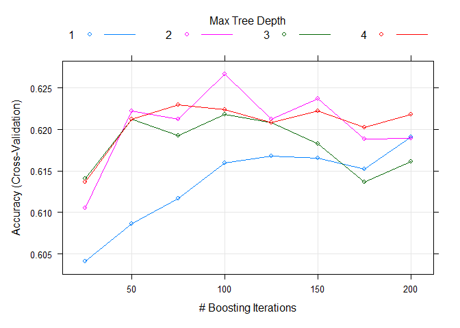

Project 3
================
Kara Belknap & Cassio Monti
2022-10-29

-   <a href="#project-3" id="toc-project-3">Project 3</a>
    -   <a href="#report-for-data-channel--tech"
        id="toc-report-for-data-channel--tech">Report for Data Channel =
        tech</a>
    -   <a href="#monti---introduction" id="toc-monti---introduction">Monti -
        Introduction</a>
-   <a href="#relevance-of-topic-metrics-5-top-topics-according-to-lda"
    id="toc-relevance-of-topic-metrics-5-top-topics-according-to-lda">Relevance
    of topic metrics (5 top topics according to LDA).</a>
    -   <a href="#getting-started" id="toc-getting-started">Getting Started</a>
    -   <a href="#read-in-the-data" id="toc-read-in-the-data">Read in the
        Data</a>
    -   <a href="#select-data-for-appropriate-data-channel"
        id="toc-select-data-for-appropriate-data-channel">Select Data for
        Appropriate Data Channel</a>
    -   <a href="#summarizations-for-data-channel-tech"
        id="toc-summarizations-for-data-channel-tech">Summarizations for data
        channel tech</a>
        -   <a href="#subsetting-variables-of-interest"
            id="toc-subsetting-variables-of-interest">Subsetting Variables of
            Interest</a>
        -   <a href="#data-manipulation-for-statistics"
            id="toc-data-manipulation-for-statistics">Data manipulation for
            statistics</a>
        -   <a href="#belknap---summary-stats"
            id="toc-belknap---summary-stats">Belknap - Summary Stats</a>
        -   <a href="#monti---summary-stats" id="toc-monti---summary-stats">Monti -
            Summary Stats</a>
        -   <a href="#monti---graphs-3" id="toc-monti---graphs-3">Monti - Graphs
            (3)</a>
        -   <a href="#belknap---graphs-3" id="toc-belknap---graphs-3">Belknap -
            Graphs (3)</a>
    -   <a href="#modeling" id="toc-modeling">Modeling</a>
        -   <a href="#data-split" id="toc-data-split">Data Split</a>
        -   <a href="#belknap---linear-regression-model-explanation"
            id="toc-belknap---linear-regression-model-explanation">Belknap - Linear
            Regression Model Explanation</a>
        -   <a href="#monti---linear-regression-model"
            id="toc-monti---linear-regression-model">Monti - Linear Regression
            Model</a>
        -   <a href="#belknap---linear-regression-model"
            id="toc-belknap---linear-regression-model">Belknap - Linear Regression
            Model</a>
        -   <a href="#monti---ensemble-tree-based-model"
            id="toc-monti---ensemble-tree-based-model">Monti - Ensemble Tree-based
            Model</a>
        -   <a href="#belknap---ensemble-tree-based-model"
            id="toc-belknap---ensemble-tree-based-model">Belknap - Ensemble
            Tree-based Model</a>
        -   <a href="#belknap---random-forest-model--explanation"
            id="toc-belknap---random-forest-model--explanation">Belknap - Random
            Forest Model &amp; Explanation</a>
-   <a href="#now-rf-works" id="toc-now-rf-works">NOW RF Works</a>
    -   <a href="#monti---boosted-tree-model--explanation"
        id="toc-monti---boosted-tree-model--explanation">Monti - Boosted Tree
        Model &amp; Explanation</a>
    -   <a
        href="#comparison--conclusion---monti-or-belknap-whoever-doesnt-do-automation-of-r-markdown"
        id="toc-comparison--conclusion---monti-or-belknap-whoever-doesnt-do-automation-of-r-markdown">Comparison
        &amp; Conclusion - Monti or Belknap (whoever doesn’t do automation of R
        Markdown)</a>

# Project 3

## Report for Data Channel = tech

## Monti - Introduction

The objective of this project is to analyze data

timedelta: Days between the article publication and the data set
acquisition (non-predictive)

Quality of keywords set of metrics:

kw_min_min: Worst keyword (min. shares) kw_max_min: Worst keyword (max.
shares) kw_avg_min: Worst keyword (avg. shares) kw_min_max: Best keyword
(min. shares) kw_max_max: Best keyword (max. shares) kw_avg_max: Best
keyword (avg. shares) kw_min_avg: Avg. keyword (min. shares) kw_max_avg:
Avg. keyword (max. shares) kw_avg_avg: Avg. keyword (avg. shares)

Mashable is one of the largest news websites from which the content of
all the articles published in 2013 and 2014 was extracted.

LDA means Latent Dirichlet Allocation algorithm and this algorithm was
applied to the data set to Marshable texts (known before publication) to
identify the 5 top relevant topics and then measure the closeness of the
current article to such topic.

# Relevance of topic metrics (5 top topics according to LDA).

LDA_00: Closeness to LDA topic 0 LDA_01: Closeness to LDA topic 1
LDA_02: Closeness to LDA topic 2 LDA_03: Closeness to LDA topic 3
LDA_04: Closeness to LDA topic 4

Day of week on which papers were published

weekday_is_monday: Was the article published on a Monday?
weekday_is_tuesday: Was the article published on a Tuesday?
weekday_is_wednesday: Was the article published on a Wednesday?
weekday_is_thursday: Was the article published on a Thursday?
weekday_is_friday: Was the article published on a Friday?
weekday_is_saturday: Was the article published on a Saturday?
weekday_is_sunday: Was the article published on a Sunday?

article content summary metrics:

n_tokens_title: Number of words in the title n_tokens_content: Number of
words in the content n_unique_tokens: Rate of unique words in the
content n_non_stop_words: Rate of non-stop words in the content
n_non_stop_unique_tokens: Rate of unique non-stop words in the content
num_hrefs: Number of links num_self_hrefs: Number of links to other
articles published by Mashable num_imgs: Number of images num_videos:
Number of videos average_token_length: Average length of the words in
the content num_keywords: Number of keywords in the metadata

## Getting Started

Before we can begin our analysis, we must load in the following
packages:

``` r
library(tidyverse)
library(caret)
library(randomForest)
library(knitr)
```

## Read in the Data

Using the data file `OnlineNewsPopularity.csv`, we will read in the data
and add a new column corresponding to the type of data channel from
which the data was classified. The new variable will be called
`dataChannel`. Note that there are some rows that are unclassified
according to the six channels of interest and those are indicated by
`other`.

Once the data column is created, we can easily subset the data using the
`filter` function to create a new data set for each data channel. We
removed the original `data_channel_is_*` columns as well as two
non-predictive columns `url` and `timedelta`.

``` r
rawData <- read_csv("../OnlineNewsPopularity.csv")

rawDataChannel <- rawData %>%
  mutate(dataChannel = ifelse(data_channel_is_lifestyle == 1, "lifestyle", 
                              ifelse(data_channel_is_entertainment == 1, "entertainment", 
                              ifelse(data_channel_is_bus == 1, "bus", 
                              ifelse(data_channel_is_socmed == 1, "socmed", 
                              ifelse(data_channel_is_tech == 1, "tech", 
                              ifelse(data_channel_is_world == 1, "world", 
                                     "other"))))))) %>%
  select(-data_channel_is_lifestyle, -data_channel_is_entertainment, 
         -data_channel_is_bus, -data_channel_is_socmed, -data_channel_is_tech,
         -data_channel_is_world, -url, -timedelta)


lifestyleData <- rawDataChannel %>%
  filter(dataChannel == "lifestyle")

entertainmentData <- rawDataChannel %>%
  filter(dataChannel == "entertainment")

busData <- rawDataChannel %>%
  filter(dataChannel == "bus")

socmedData <- rawDataChannel %>%
  filter(dataChannel == "socmed")

techData <- rawDataChannel %>%
  filter(dataChannel == "tech")

worldData <- rawDataChannel %>%
  filter(dataChannel == "world")
```

## Select Data for Appropriate Data Channel

To select the appropriate data channel based on the `params$channel`, we
created a function `selectData` which would return the appropriate data
set and assign it to the data set `activeData`. This will be the file we
will use for the remainder of the report.

``` r
selectData <- function(dataChannel) { 
  if (dataChannel == "lifestyle"){
    return(lifestyleData)
  }
  if (dataChannel == "entertainment"){
    return(entertainmentData)
  }
  if (dataChannel == "bus"){
    return(busData)
  }
  if (dataChannel == "socmed"){
    return(socmedData)
  }
  if (dataChannel == "tech"){
    return(techData)
  }
  if (dataChannel == "world"){
    return(worldData)
  }
}

dataChannelSelect <- params$channel

activeData <- selectData(dataChannelSelect)
```

## Summarizations for data channel tech

NEW TOPICS !!!!!!!!!!!!!!!!!!!!

### Subsetting Variables of Interest

Define .

``` r
D1 = 1800

activeData$shares = as.factor(if_else(activeData$shares > D1,1,0))

activeData = activeData %>%
  select(shares, starts_with("weekday_is_"), starts_with("kw_"),
         starts_with("LDA_"),starts_with("n_"), starts_with("num_"), 
         average_token_length,is_weekend)

# looking for NAs
anyNA(activeData)
```

    ## [1] FALSE

### Data manipulation for statistics

``` r
statsData <- activeData %>%
  mutate(Day = ifelse(weekday_is_monday == 1, "Monday", 
                      ifelse(weekday_is_tuesday == 1, "Tuesday", 
                      ifelse(weekday_is_wednesday == 1, "Wednesday", 
                      ifelse(weekday_is_thursday == 1, "Thursday", 
                      ifelse(weekday_is_friday == 1, "Friday", 
                      ifelse(weekday_is_saturday == 1, "Saturday", 
                      ifelse(weekday_is_sunday == 1, "Sunday",
                             "missingdata")))))))) %>%
  mutate(Weekend = ifelse(is_weekend == 1, "Yes", "No"))

statsData$Day <- factor(statsData$Day, 
                levels = c("Monday", "Tuesday", "Wednesday", "Thursday", 
                           "Friday", "Saturday", "Sunday"))
```

### Belknap - Summary Stats

The following table gives us information about the summary statistics
for the number of shares for articles in the data channel tech.

``` r
table(activeData$shares)
```

    ## 
    ##    0    1 
    ## 3986 3360

The following table gives us information about the average, median, and
standard deviation for the number of shares based on whether the post
was made on a weekend or a weekday.

``` r
statsData %>% 
  group_by(Weekend) %>%
  summarise(sumShares = sum(shares), avgShares = mean(shares), medShares = median(shares), sdShares = sd(shares))
```

Likewise, this table gives us information about the number of shares by
the day of the week.

``` r
statsData %>% 
  group_by(Day) %>%
  arrange(Day) %>%
  summarise(sumShares = sum(shares), avgShares = mean(shares), medShares = median(shares), sdShares = sd(shares), maxShares = max(shares))
```

### Monti - Summary Stats

### Monti - Graphs (3)

### Belknap - Graphs (3)

The following graph shows the number of shares compared to the number of
words in the title. The output is colored by the day of the week.

``` r
titlewordcountGraph <- ggplot(statsData, aes(x = n_tokens_title, y = shares))
titlewordcountGraph + geom_point(aes(color = Day)) + 
  ggtitle("Number of Shares vs. Number of Words in Title") +
  ylab("Number of Shares") +
  xlab("Number of Words in Title")
```

The following plot shows the number of shares by the rate of positive
words in the article. A positive trend would indicate that articles with
more positive words are shared more often than articles with negative
words.

``` r
positivewordrateGraph <- ggplot(statsData, aes(x = rate_positive_words, y = shares))
positivewordrateGraph + geom_point(aes(color = Day)) + 
  ggtitle("Number of Shares vs. Rate of Positive Words") +
  ylab("Number of Shares") +
  xlab("Rate of Positive Words") 
```

The following plot shows the total number of shares as related to the
parameter title subjectivity. A positive trend would indicate that
articles are shared more often when the title is subjective. A negative
trend would indicate that articles are shared more often when the title
is less subjective.

``` r
titleSubjectivityGraph <- ggplot(statsData, aes(x = title_subjectivity, y = shares))
titleSubjectivityGraph + geom_point(aes(color = n_tokens_title)) + 
  ggtitle("Number of Shares vs. Title Subjectivity") +
  ylab("Number of Shares") +
  xlab("Title Subjectivity") + 
  labs(color = "Word Count in Title")
```

## Modeling

### Data Split

Prior to conducting regression analysis, we split the data into a
training set (70%) and a test set (30%).

``` r
set.seed(555)

trainIndex <- createDataPartition(activeData$shares, p = 0.7, list = FALSE)

activeTrain <- activeData[trainIndex, ]

activeTest <- activeData[-trainIndex, ]
```

### Belknap - Linear Regression Model Explanation

### Monti - Linear Regression Model

### Belknap - Linear Regression Model

### Monti - Ensemble Tree-based Model

### Belknap - Ensemble Tree-based Model

### Belknap - Random Forest Model & Explanation

NEEDS MORE WORK.

# NOW RF Works

``` r
train.control = trainControl(method = "cv", number = 5)

rfFit <- train(shares~.,
               data = activeTrain,
               method = "rf",
               trControl = train.control,
               preProcess = c("center","scale"),
               tuneGrid = data.frame(mtry = 1:10))

plot(rfFit)
```

<!-- -->

``` r
rfFit$bestTune$mtry
```

    ## [1] 2

``` r
rfFit$results
```

    ##    mtry  Accuracy     Kappa  AccuracySD    KappaSD
    ## 1     1 0.6074278 0.1719571 0.008332239 0.01782875
    ## 2     2 0.6235651 0.2253074 0.008622480 0.01938080
    ## 3     3 0.6222028 0.2269387 0.006441125 0.01367253
    ## 4     4 0.6188954 0.2206218 0.011546368 0.02397641
    ## 5     5 0.6181204 0.2194163 0.007833667 0.01584740
    ## 6     6 0.6144239 0.2118702 0.011861986 0.02500403
    ## 7     7 0.6185073 0.2209419 0.011048952 0.02262577
    ## 8     8 0.6200629 0.2238964 0.013522538 0.02820086
    ## 9     9 0.6188969 0.2214724 0.014188935 0.02897785
    ## 10   10 0.6152053 0.2142081 0.013349178 0.02802411

``` r
RF_pred <- predict(rfFit, newdata = activeTest)

acc_rf = confusionMatrix(RF_pred, activeTest$shares)

acc_rf
```

    ## Confusion Matrix and Statistics
    ## 
    ##           Reference
    ## Prediction   0   1
    ##          0 921 551
    ##          1 274 457
    ##                                           
    ##                Accuracy : 0.6255          
    ##                  95% CI : (0.6049, 0.6458)
    ##     No Information Rate : 0.5424          
    ##     P-Value [Acc > NIR] : 1.924e-15       
    ##                                           
    ##                   Kappa : 0.229           
    ##                                           
    ##  Mcnemar's Test P-Value : < 2.2e-16       
    ##                                           
    ##             Sensitivity : 0.7707          
    ##             Specificity : 0.4534          
    ##          Pos Pred Value : 0.6257          
    ##          Neg Pred Value : 0.6252          
    ##              Prevalence : 0.5424          
    ##          Detection Rate : 0.4181          
    ##    Detection Prevalence : 0.6682          
    ##       Balanced Accuracy : 0.6120          
    ##                                           
    ##        'Positive' Class : 0               
    ## 

### Monti - Boosted Tree Model & Explanation

``` r
tunG = expand.grid(n.trees = seq(25,200,25),
                      interaction.depth = 1:4,
                      shrinkage = 0.1,
                      n.minobsinnode = 10)

gbmFit <- train(shares~.,
               data = activeTrain, 
               method = "gbm", 
               preProcess = c("center","scale"),
               trControl = train.control,
               tuneGrid = tunG,
               verbose = FALSE
               )

gbmFit$bestTune$n.trees
```

    ## [1] 125

``` r
gbmFit$bestTune$interaction.depth
```

    ## [1] 2

``` r
gbmFit$results
```

    ##    shrinkage interaction.depth n.minobsinnode n.trees  Accuracy     Kappa  AccuracySD
    ## 1        0.1                 1             10      25 0.5998385 0.1702173 0.014390026
    ## 9        0.1                 2             10      25 0.6085917 0.1923140 0.008327563
    ## 17       0.1                 3             10      25 0.6082003 0.1914437 0.012645200
    ## 25       0.1                 4             10      25 0.6132549 0.2025675 0.014719190
    ## 2        0.1                 1             10      50 0.6058661 0.1876104 0.014241117
    ## 10       0.1                 2             10      50 0.6128705 0.2040176 0.008104089
    ## 18       0.1                 3             10      50 0.6152004 0.2097183 0.012843738
    ## 26       0.1                 4             10      50 0.6175351 0.2134329 0.011917087
    ## 3        0.1                 1             10      75 0.6074236 0.1920221 0.012327307
    ## 11       0.1                 2             10      75 0.6111201 0.2006658 0.009031726
    ## 19       0.1                 3             10      75 0.6142273 0.2085194 0.017957080
    ## 27       0.1                 4             10      75 0.6171437 0.2141893 0.017218867
    ## 4        0.1                 1             10     100 0.6124786 0.2025619 0.014032306
    ## 12       0.1                 2             10     100 0.6138431 0.2074568 0.006348894
    ## 20       0.1                 3             10     100 0.6188945 0.2188182 0.016096971
    ## 28       0.1                 4             10     100 0.6169503 0.2149884 0.014068800
    ## 5        0.1                 1             10     125 0.6146179 0.2070945 0.014397755
    ## 13       0.1                 2             10     125 0.6190922 0.2189386 0.007458180
    ## 21       0.1                 3             10     125 0.6157813 0.2140317 0.021182521
    ## 29       0.1                 4             10     125 0.6161713 0.2145793 0.016236169
    ## 6        0.1                 1             10     150 0.6142297 0.2080301 0.014680428
    ## 14       0.1                 2             10     150 0.6171471 0.2152502 0.013702211
    ## 22       0.1                 3             10     150 0.6150042 0.2129303 0.017054646
    ## 30       0.1                 4             10     150 0.6115054 0.2049708 0.016060498
    ## 7        0.1                 1             10     175 0.6167580 0.2136623 0.014150405
    ## 15       0.1                 2             10     175 0.6171452 0.2157037 0.013063867
    ## 23       0.1                 3             10     175 0.6161715 0.2160738 0.017907804
    ## 31       0.1                 4             10     175 0.6093661 0.2012269 0.017426591
    ## 8        0.1                 1             10     200 0.6152016 0.2112251 0.017069473
    ## 16       0.1                 2             10     200 0.6128671 0.2072639 0.013804143
    ## 24       0.1                 3             10     200 0.6155880 0.2154824 0.018084784
    ## 32       0.1                 4             10     200 0.6080050 0.1993487 0.016423628
    ##       KappaSD
    ## 1  0.02798491
    ## 9  0.01609942
    ## 17 0.02732462
    ## 25 0.02994802
    ## 2  0.02908412
    ## 10 0.01519302
    ## 18 0.02611463
    ## 26 0.02242003
    ## 3  0.02340848
    ## 11 0.01752128
    ## 19 0.03481266
    ## 27 0.03344649
    ## 4  0.02826097
    ## 12 0.01116916
    ## 20 0.03129411
    ## 28 0.02708944
    ## 5  0.02722590
    ## 13 0.01414640
    ## 21 0.04230313
    ## 29 0.03123246
    ## 6  0.02766497
    ## 14 0.02629457
    ## 22 0.03472039
    ## 30 0.03091033
    ## 7  0.02706728
    ## 15 0.02577592
    ## 23 0.03602325
    ## 31 0.03359708
    ## 8  0.03310165
    ## 16 0.02748584
    ## 24 0.03535276
    ## 32 0.03129963

``` r
plot(gbmFit)
```

<!-- -->

``` r
gbm_pred <- predict(gbmFit, newdata = activeTest)

acc_boosting = confusionMatrix(gbm_pred, activeTest$shares)

acc_boosting
```

    ## Confusion Matrix and Statistics
    ## 
    ##           Reference
    ## Prediction   0   1
    ##          0 899 532
    ##          1 296 476
    ##                                           
    ##                Accuracy : 0.6241          
    ##                  95% CI : (0.6035, 0.6444)
    ##     No Information Rate : 0.5424          
    ##     P-Value [Acc > NIR] : 5.405e-15       
    ##                                           
    ##                   Kappa : 0.2287          
    ##                                           
    ##  Mcnemar's Test P-Value : 3.166e-16       
    ##                                           
    ##             Sensitivity : 0.7523          
    ##             Specificity : 0.4722          
    ##          Pos Pred Value : 0.6282          
    ##          Neg Pred Value : 0.6166          
    ##              Prevalence : 0.5424          
    ##          Detection Rate : 0.4081          
    ##    Detection Prevalence : 0.6496          
    ##       Balanced Accuracy : 0.6123          
    ##                                           
    ##        'Positive' Class : 0               
    ## 

## Comparison & Conclusion - Monti or Belknap (whoever doesn’t do automation of R Markdown)

``` r
tb = data.frame(RF = acc_rf$overall[[1]],
                Boosting = acc_boosting$overall[[1]])

kable(tb, caption = "Accuracy Metric by Ensemble Method on Test Set")
```
