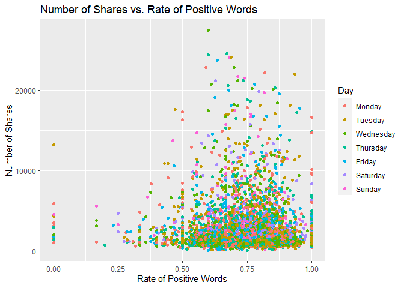

Project 3
================
Kara Belknap & Cassio Monti
2022-10-29

-   <a href="#report-for-tech-channel"
    id="toc-report-for-tech-channel">Report for <em>tech</em> Channel</a>
    -   <a href="#introduction" id="toc-introduction">Introduction</a>
    -   <a href="#required-packages" id="toc-required-packages">Required
        Packages</a>
    -   <a href="#read-in-the-data" id="toc-read-in-the-data">Read in the
        Data</a>
    -   <a href="#select-data-for-appropriate-data-channel"
        id="toc-select-data-for-appropriate-data-channel">Select Data for
        Appropriate Data Channel</a>
    -   <a href="#summarizations-for-data-channel-tech"
        id="toc-summarizations-for-data-channel-tech">Summarizations for data
        channel <em>tech</em></a>
        -   <a href="#data-split" id="toc-data-split">Data Split</a>
        -   <a href="#data-manipulation-for-statistics"
            id="toc-data-manipulation-for-statistics">Data manipulation for
            statistics</a>
        -   <a href="#belknap---summary-statistics"
            id="toc-belknap---summary-statistics">Belknap - Summary Statistics</a>
        -   <a href="#monti---summary-statistics"
            id="toc-monti---summary-statistics">Monti - Summary Statistics</a>
        -   <a href="#monti---graphs-3" id="toc-monti---graphs-3">Monti - Graphs
            (3)</a>
        -   <a href="#belknap---graphs-3" id="toc-belknap---graphs-3">Belknap -
            Graphs (3)</a>
        -   <a href="#subsetting-variables-for-modeling"
            id="toc-subsetting-variables-for-modeling">Subsetting Variables for
            Modeling</a>
    -   <a href="#modeling" id="toc-modeling">Modeling</a>
        -   <a href="#belknap---linear-regression-model-explanation"
            id="toc-belknap---linear-regression-model-explanation">Belknap - Linear
            Regression Model Explanation</a>
        -   <a href="#monti---linear-regression-model"
            id="toc-monti---linear-regression-model">Monti - Linear Regression
            Model</a>
        -   <a href="#belknap---linear-regression-model"
            id="toc-belknap---linear-regression-model">Belknap - Linear Regression
            Model</a>
        -   <a href="#monti---ensemble-tree-based-model"
            id="toc-monti---ensemble-tree-based-model">Monti - Ensemble Tree-based
            Model</a>
        -   <a href="#belknap---ensemble-tree-based-model"
            id="toc-belknap---ensemble-tree-based-model">Belknap - Ensemble
            Tree-based Model</a>
        -   <a href="#belknap---random-forest-model--explanation"
            id="toc-belknap---random-forest-model--explanation">Belknap - Random
            Forest Model &amp; Explanation</a>
        -   <a href="#monti---boosted-tree-model--explanation"
            id="toc-monti---boosted-tree-model--explanation">Monti - Boosted Tree
            Model &amp; Explanation</a>
    -   <a href="#comparison--conclusion---monti"
        id="toc-comparison--conclusion---monti">Comparison &amp; Conclusion -
        Monti</a>

# Report for *tech* Channel

This report contains Exploratory Data Analysis (EDA) about this data
channel and a modeling section applying three regression methods.

## Introduction

The objective of this analysis is to provide a comprehensive overview
about publication metrics and their relationship with the number of
shares that those publications presented during the study period. These
data have been collected from Mashable website, one of the largest news
websites from which the content of all the tech channel articles
published in 2013 and 2014 was extracted. These data were originally
collected analyzed By Fernandes et al. (2015) work, in which the authors
performed classification task comparing several machine learning
algorithms. In the present study, the subset of the data used by
Fernandes et al.(2015) corresponding to the data channel tech is used
for regression purposes. The response variable is the number of `shares`
that the papers presented after publication. In other words, we will try
to predict the number of shares the papers will have before publication.
To perform the regression, Random Forest, Boosting, and Multiple Linear
Regression are used. More information about the methods will be provided
in further sections.

Some metrics have been calculated based on the information obtained from
Marshable website. For instance, the Latent Dirichlet Allocation (LDA)
was applied to the data set to identify the 5 top relevant topics and
then measure the closeness of the current article to such topic. There
are 5 relevance of topic metrics according to LDA:

-   `LDA_00`: Closeness to LDA topic 0  
-   `LDA_01`: Closeness to LDA topic 1  
-   `LDA_02`: Closeness to LDA topic 2  
-   `LDA_03`: Closeness to LDA topic 3  
-   `LDA_04`: Closeness to LDA topic 4

Additionally, some quality metrics related to the keywords have been
calculated and will be used in this analysis. These metrics represent
the average number of shares for publications with worst, best, and
average keywords. The classification of keywords under these groups was
made by the authors of the original paper. The keyword metrics are shown
below.

-   `kw_avg_min`: Worst keyword (avg. shares)  
-   `kw_avg_max`: Best keyword (avg. shares)  
-   `kw_avg_avg`: Avg. keyword (avg. shares)

Article content metrics were also used in this study. These are general
metrics about the body of the publication that can influence the number
of shares of that paper. The content summary metrics are shown below.

\-`num_videos`: Number of videos  
-`n_tokens_content`: Number of words in the content  
-`n_non_stop_unique_tokens`: Rate of unique non-stop words in the
content  
-`num_hrefs`: Number of links  
-`num_self_hrefs`: Number of links to other articles published by
Mashable  
-`average_token_length`: Average length of the words in the content

These data were collected during 2013 and 2014 on daily basis. To
represent time dependent information, a binary variable indicating
whether the publication was made in a weekend or weekday, `is_weekend`
is used.

## Required Packages

Before we can begin our analysis, we must load in the following
packages:

``` r
library(tidyverse)
library(caret)
library(knitr)
library(corrplot)
```

`Tidyverse` is used for data management and plotting through dplyr and
ggplot packages. `Caret` package is used for data splitting and
modeling. `Knitr` package is used for nice printing of tables.
`Corrplot` is used for nice correlation plots assisting in
visualization.

## Read in the Data

Using the data file `OnlineNewsPopularity.csv`, we will read in the data
and add a new column corresponding to the type of data channel from
which the data was classified. The new variable will be called
`dataChannel`. Note that there are some rows that are unclassified
according to the six channels of interest and those are indicated by
`other`.

Once the data column is created, we can easily subset the data using the
`filter` function to create a new data set for each data channel. We
removed the original `data_channel_is_*` columns as well as two
non-predictive columns `url` and `timedelta`.

``` r
# reading in the data set
rawData <- read_csv("../OnlineNewsPopularity.csv")

# creating new variable to have more comprehensive names for data channels.
rawDataChannel <- rawData %>%
  mutate(dataChannel = ifelse(data_channel_is_lifestyle == 1, "lifestyle", 
                              ifelse(data_channel_is_entertainment == 1, "entertainment", 
                              ifelse(data_channel_is_bus == 1, "bus", 
                              ifelse(data_channel_is_socmed == 1, "socmed", 
                              ifelse(data_channel_is_tech == 1, "tech", 
                              ifelse(data_channel_is_world == 1, "world", 
                                     "other"))))))) %>%
  select(-data_channel_is_lifestyle, -data_channel_is_entertainment, 
         -data_channel_is_bus, -data_channel_is_socmed, -data_channel_is_tech,
         -data_channel_is_world, -url, -timedelta)

# assigning channel data to R objects.
lifestyleData <- rawDataChannel %>%
  filter(dataChannel == "lifestyle")

entertainmentData <- rawDataChannel %>%
  filter(dataChannel == "entertainment")

busData <- rawDataChannel %>%
  filter(dataChannel == "bus")

socmedData <- rawDataChannel %>%
  filter(dataChannel == "socmed")

techData <- rawDataChannel %>%
  filter(dataChannel == "tech")

worldData <- rawDataChannel %>%
  filter(dataChannel == "world")
```

## Select Data for Appropriate Data Channel

To select the appropriate data channel based on the `params$channel`, we
created a function `selectData` which would return the appropriate data
set and assign it to the data set `activeData`. This will be the file we
will use for the remainder of the report.

To select the appropriate data channel based on the `params$channel`, we
created a function `selectData` which would return the appropriate data
set and assign it to the data set `activeData`. This will be the file we
will use for the remainder of the report.

``` r
# function to assign automated calls for the different data channels
selectData <- function(dataChannel) { 
  if (dataChannel == "lifestyle"){
    return(lifestyleData)
  }
  if (dataChannel == "entertainment"){
    return(entertainmentData)
  }
  if (dataChannel == "bus"){
    return(busData)
  }
  if (dataChannel == "socmed"){
    return(socmedData)
  }
  if (dataChannel == "tech"){
    return(techData)
  }
  if (dataChannel == "world"){
    return(worldData)
  }
}

# activating corresponding data set.
dataChannelSelect <- params$channel

activeData <- selectData(dataChannelSelect)
```

## Summarizations for data channel *tech*

In this section, we will perform EDA for the data channel tech

### Data Split

This section splits the data set into training and test sets for the
proportion of 80/20. The data summarization will be conducted on the
training set. To split the data, the function `createDataPartition()`,
from `caret` package, was used with the argument `p=0.8` to represent
80% of the data should be in the split. The function `set.seed(555)` was
used to fix the random seed. The code below shows the creation of
training and test sets.

``` r
set.seed(555)

trainIndex <- createDataPartition(activeData$shares, p = 0.8, list = FALSE)

activeTrain <- activeData[trainIndex, ]

activeTest <- activeData[-trainIndex, ]
```

### Data manipulation for statistics

A new object is created in this section aiming to summarize publications
during weekdays and weekends and create factor levels for them to match
with `shares` variable. The functions `ifelse()` was used to vectorize
the IF-ELSE statements associated to `mutate()` which took care of
attaching the new variable to the data set. The function `factor()` was
used to explicitly coerce the days of week into levels of the newly
created categorical variable “Day”.

``` r
# IF-ELSE statements
statsData <- activeTrain %>%
  mutate(Day = ifelse(weekday_is_monday == 1, "Monday", 
                      ifelse(weekday_is_tuesday == 1, "Tuesday", 
                      ifelse(weekday_is_wednesday == 1, "Wednesday", 
                      ifelse(weekday_is_thursday == 1, "Thursday", 
                      ifelse(weekday_is_friday == 1, "Friday", 
                      ifelse(weekday_is_saturday == 1, "Saturday", 
                      ifelse(weekday_is_sunday == 1, "Sunday",
                             "missingdata")))))))) %>%
  mutate(Weekend = ifelse(is_weekend == 1, "Yes", "No"))

# Assigning factor levels
statsData$Day <- factor(statsData$Day, 
                levels = c("Monday", "Tuesday", "Wednesday", "Thursday", 
                           "Friday", "Saturday", "Sunday"))
```

### Belknap - Summary Statistics

The following table gives us information about the summary statistics
for the number of shares for articles in the data channel tech. The
`summary()` function was used to extract these metrics.

``` r
summary(activeTrain$shares)
```

    ##    Min. 1st Qu.  Median    Mean 3rd Qu.    Max. 
    ##      64    1100    1700    3053    3000  663600

The following table gives us information about the average, median, and
standard deviation for the number of shares based on whether the post
was made on a weekend or a weekday. The variable “weekend” was grouped,
via `grouped_by()`, and for each level the sum, average, median, and
standard deviation of shares were calculated via `sum()`, `mean()`,
`meadian()`, `sd()`, and `summarise()` functions. The summary table is
shown below.

``` r
statsData %>% 
  group_by(Weekend) %>%
  summarise(sumShares = sum(shares), avgShares = mean(shares), medShares = median(shares), sdShares = sd(shares))
```

    ## # A tibble: 2 × 5
    ##   Weekend sumShares avgShares medShares sdShares
    ##   <chr>       <dbl>     <dbl>     <dbl>    <dbl>
    ## 1 No       15106809     2947.      1600   10215.
    ## 2 Yes       2841463     3779.      2300    5725.

Likewise, this table gives us information about the number of shares by
the day of the week. The same functions were used here, by applied to
levels of variable “Day”. Also, the quantities maximum `max()` and
minimum `min()` number of shares by levels of “Day” were calculated.

``` r
statsData %>% 
  group_by(Day) %>%
  arrange(Day) %>%
  summarise(sumShares = sum(shares), avgShares = mean(shares), medShares = median(shares), sdShares = sd(shares), maxShares = max(shares),
            minShares = min(shares))
```

    ## # A tibble: 7 × 7
    ##   Day       sumShares avgShares medShares sdShares maxShares minShares
    ##   <fct>         <dbl>     <dbl>     <dbl>    <dbl>     <dbl>     <dbl>
    ## 1 Monday      2715620     2721.      1600    3438.     48800       192
    ## 2 Tuesday     3369803     2888.      1600    4987.     88500       104
    ## 3 Wednesday   3841822     3415.      1600   20088.    663600        64
    ## 4 Thursday    2831942     2695.      1600    3928.     55200        86
    ## 5 Friday      2347622     2987.      1700    5519.    104100        82
    ## 6 Saturday    1572769     3683.      2300    5578.     96100       168
    ## 7 Sunday      1268694     3904.      2400    5918.     83300       206

### Monti - Summary Statistics

``` r
# two-way contingency table between shares and Days
```

``` r
# correlation matrix
```

### Monti - Graphs (3)

``` r
# bivariate correlation plot
```

``` r
# relationship between shares and LDA levels (facet_wrap+smooth)
```

``` r
# relationship between shares and keyword metrics (color)
```

``` r
# relationship between shares and content metrics (facet_wrap+smooth)
```

### Belknap - Graphs (3)

The following graph shows the number of shares compared to the number of
words in the title. The output is colored by the day of the week.

``` r
titlewordcountGraph <- ggplot(statsData, aes(x = n_tokens_title, y = shares))
titlewordcountGraph + geom_point(aes(color = Day)) + 
  ggtitle("Number of Shares vs. Number of Words in Title") +
  ylab("Number of Shares") +
  xlab("Number of Words in Title")
```

<!-- -->

The following plot shows the number of shares by the rate of positive
words in the article. A positive trend would indicate that articles with
more positive words are shared more often than articles with negative
words.

``` r
positivewordrateGraph <- ggplot(statsData, aes(x = rate_positive_words, y = shares))
positivewordrateGraph + geom_point(aes(color = Day)) + 
  ggtitle("Number of Shares vs. Rate of Positive Words") +
  ylab("Number of Shares") +
  xlab("Rate of Positive Words") 
```

<!-- -->

The following plot shows the total number of shares as related to the
parameter title subjectivity. A positive trend would indicate that
articles are shared more often when the title is subjective. A negative
trend would indicate that articles are shared more often when the title
is less subjective.

``` r
titleSubjectivityGraph <- ggplot(statsData, aes(x = title_subjectivity, y = shares))
titleSubjectivityGraph + geom_point(aes(color = n_tokens_title)) + 
  ggtitle("Number of Shares vs. Title Subjectivity") +
  ylab("Number of Shares") +
  xlab("Title Subjectivity") + 
  labs(color = "Word Count in Title")
```

### Subsetting Variables for Modeling

``` r
dfTrain = activeTrain %>%
  select(shares, starts_with("LDA_"), average_token_length,
         is_weekend, n_tokens_content, n_non_stop_unique_tokens, num_hrefs,
         num_self_hrefs, num_videos, average_token_length, kw_avg_min, 
         kw_avg_max, kw_avg_avg, is_weekend)

dfTest = activeTest %>%
  select(shares, starts_with("LDA_"), average_token_length,
         is_weekend, n_tokens_content, n_non_stop_unique_tokens, num_hrefs,
         num_self_hrefs, num_videos, average_token_length, kw_avg_min, 
         kw_avg_max, kw_avg_avg, is_weekend)

# looking for NAs
anyNA(dfTrain)
```

    ## [1] FALSE

``` r
anyNA(dfTest)
```

    ## [1] FALSE

## Modeling

In this section, we will perform regression for prediction purposes for
the data channel tech.

### Belknap - Linear Regression Model Explanation

### Monti - Linear Regression Model

``` r
LASSO = train(shares~., data = dfTrain,
              method="glmnet",
              preProcess = c("center","scale"),
              tuneGrid = expand.grid(alpha = 1, lambda = seq(0,10,0.1)),
              trControl = trainControl(method="CV",number=5))

plot(LASSO)
```

<!-- -->

``` r
coef(LASSO$finalModel, LASSO$bestTune$lambda)
```

    ## 16 x 1 sparse Matrix of class "dgCMatrix"
    ##                                   s1
    ## (Intercept)              3052.946419
    ## LDA_00                    272.566354
    ## LDA_01                     -5.835775
    ## LDA_02                      3.346684
    ## LDA_03                     -4.662164
    ## LDA_04                      .       
    ## average_token_length      -98.160937
    ## is_weekend                144.596110
    ## n_tokens_content          572.144253
    ## n_non_stop_unique_tokens  -43.395180
    ## num_hrefs                 711.709279
    ## num_self_hrefs           -646.945122
    ## num_videos                145.994185
    ## kw_avg_min               -332.557140
    ## kw_avg_max               -340.324949
    ## kw_avg_avg                546.561878

``` r
postResample(pred = predict(LASSO, newdata = dfTest), obs = dfTest$shares)
```

    ##         RMSE     Rsquared          MAE 
    ## 5.073304e+03 2.163631e-02 2.423177e+03

### Belknap - Linear Regression Model

### Monti - Ensemble Tree-based Model

### Belknap - Ensemble Tree-based Model

### Belknap - Random Forest Model & Explanation

``` r
train.control = trainControl(method = "cv", number = 5)

rfFit <- train(shares~.,
               data = dfTrain,
               method = "rf",
               trControl = train.control,
               preProcess = c("center","scale"),
               tuneGrid = data.frame(mtry = 1:5))

rfFit$bestTune$mtry
```

    ## [1] 1

``` r
plot(rfFit)
```

<!-- -->

``` r
rfFit$results
```

    ##   mtry     RMSE   Rsquared      MAE   RMSESD  RsquaredSD    MAESD
    ## 1    1 7612.440 0.01652274 2297.971 6780.757 0.006107986 251.7358
    ## 2    2 7699.579 0.01432189 2358.056 6730.396 0.005912658 239.1351
    ## 3    3 7847.120 0.01013411 2415.868 6654.302 0.004244214 220.3677
    ## 4    4 7886.674 0.01133133 2425.499 6622.374 0.003571656 208.8880
    ## 5    5 8083.735 0.00853461 2474.570 6516.466 0.003239824 191.1413

``` r
RF_pred <- predict(rfFit, newdata = activeTest)

metric_rf = postResample(RF_pred, activeTest$shares)

metric_rf
```

    ##         RMSE     Rsquared          MAE 
    ## 5.017775e+03 3.558115e-02 2.379065e+03

### Monti - Boosted Tree Model & Explanation

``` r
tunG = expand.grid(n.trees = seq(25,200,25),
                      interaction.depth = 1:4,
                      shrinkage = 0.1,
                      n.minobsinnode = 10)

gbmFit <- train(shares~.,
               data = dfTrain,
               method = "gbm",
               preProcess = c("center","scale"),
               trControl = train.control,
               tuneGrid = tunG,
               verbose = FALSE
               )


gbmFit$bestTune$n.trees
```

    ## [1] 25

``` r
gbmFit$bestTune$interaction.depth
```

    ## [1] 4

``` r
plot(gbmFit)
```

<!-- -->

``` r
gbmFit$results
```

    ##    shrinkage interaction.depth n.minobsinnode n.trees     RMSE    Rsquared      MAE
    ## 1        0.1                 1             10      25 7902.920 0.002026224 2388.588
    ## 9        0.1                 2             10      25 7820.669 0.002448103 2363.458
    ## 17       0.1                 3             10      25 7843.486 0.007993376 2377.357
    ## 25       0.1                 4             10      25 7798.252 0.006231302 2337.680
    ## 2        0.1                 1             10      50 7920.903 0.002421015 2390.064
    ## 10       0.1                 2             10      50 8009.642 0.003205796 2400.823
    ## 18       0.1                 3             10      50 7848.469 0.010051203 2342.121
    ## 26       0.1                 4             10      50 7898.686 0.008625478 2344.523
    ## 3        0.1                 1             10      75 7951.863 0.002615256 2391.628
    ## 11       0.1                 2             10      75 8051.570 0.003003784 2384.269
    ## 19       0.1                 3             10      75 7962.077 0.011312875 2349.026
    ## 27       0.1                 4             10      75 8015.614 0.009040064 2353.523
    ## 4        0.1                 1             10     100 7969.201 0.002554598 2402.168
    ## 12       0.1                 2             10     100 8143.776 0.003650101 2386.821
    ## 20       0.1                 3             10     100 8025.158 0.010919657 2360.369
    ## 28       0.1                 4             10     100 8170.861 0.009599770 2358.774
    ## 5        0.1                 1             10     125 8027.605 0.002392473 2418.719
    ## 13       0.1                 2             10     125 8238.532 0.003488773 2395.867
    ## 21       0.1                 3             10     125 8159.226 0.009570779 2369.704
    ## 29       0.1                 4             10     125 8302.340 0.008931440 2374.430
    ## 6        0.1                 1             10     150 8054.969 0.002688487 2416.093
    ## 14       0.1                 2             10     150 8321.161 0.003626465 2396.580
    ## 22       0.1                 3             10     150 8247.449 0.009650603 2380.212
    ## 30       0.1                 4             10     150 8535.171 0.008946031 2404.178
    ## 7        0.1                 1             10     175 8098.213 0.002537806 2421.291
    ## 15       0.1                 2             10     175 8441.808 0.004044870 2413.470
    ## 23       0.1                 3             10     175 8411.025 0.008567966 2406.151
    ## 31       0.1                 4             10     175 8662.910 0.006742314 2421.303
    ## 8        0.1                 1             10     200 8110.792 0.002470633 2422.970
    ## 16       0.1                 2             10     200 8558.600 0.004108959 2435.240
    ## 24       0.1                 3             10     200 8416.488 0.008638009 2400.782
    ## 32       0.1                 4             10     200 8814.811 0.005913140 2445.650
    ##      RMSESD  RsquaredSD    MAESD
    ## 1  6644.242 0.002827057 142.0642
    ## 9  6689.745 0.002757503 182.9365
    ## 17 6642.079 0.005803083 181.6644
    ## 25 6707.652 0.005711833 186.2634
    ## 2  6629.350 0.003319308 144.3515
    ## 10 6579.511 0.002788472 179.6432
    ## 18 6641.691 0.007277373 184.3835
    ## 26 6660.699 0.009254697 176.0799
    ## 3  6610.382 0.003489382 162.8395
    ## 11 6559.085 0.002717575 161.6420
    ## 19 6593.375 0.009185155 192.9197
    ## 27 6599.874 0.010439575 167.6282
    ## 4  6606.774 0.003439551 161.3508
    ## 12 6509.408 0.003240417 170.4970
    ## 20 6550.219 0.008419172 175.8761
    ## 28 6520.144 0.010127220 184.8377
    ## 5  6568.117 0.003188780 145.2855
    ## 13 6458.630 0.002677186 157.8979
    ## 21 6483.484 0.007392632 179.1097
    ## 29 6457.069 0.009526828 191.4503
    ## 6  6555.476 0.003557536 154.8825
    ## 14 6414.515 0.002467541 170.6708
    ## 22 6432.173 0.007223344 180.4704
    ## 30 6351.044 0.009836893 209.6292
    ## 7  6530.921 0.003406809 154.4083
    ## 15 6356.653 0.002725056 172.6323
    ## 23 6360.414 0.006609913 184.7214
    ## 31 6297.095 0.006528205 199.5870
    ## 8  6527.339 0.003165214 141.0855
    ## 16 6297.442 0.002700937 176.7515
    ## 24 6348.445 0.006789758 184.4255
    ## 32 6205.822 0.005232295 181.2785

``` r
gbm_pred <- predict(gbmFit, newdata = activeTest)

metric_boosting = postResample(gbm_pred, activeTest$shares)

metric_boosting
```

    ##         RMSE     Rsquared          MAE 
    ## 5172.2463604    0.0108016 2426.4075714

## Comparison & Conclusion - Monti

``` r
bestMethod = function(x){
  
  bestm = which.min(lapply(1:length(x), function(i) x[[i]][1]))
  
  out = switch(bestm,
                "Random Forest",
                "Boosting")
  
  return(out)
  
}

tb = data.frame(RF = metric_rf, Boosting = metric_boosting)

kable(tb, caption = "Accuracy Metric by Ensemble Method on Test Set",
      digits = 3)
```

|          |       RF | Boosting |
|:---------|---------:|---------:|
| RMSE     | 5017.775 | 5172.246 |
| Rsquared |    0.036 |    0.011 |
| MAE      | 2379.065 | 2426.408 |

Accuracy Metric by Ensemble Method on Test Set

The best model is Random Forest based on RMSE metric.
