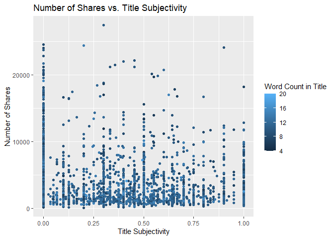

Project 3
================
Kara Belknap & Cassio Monti
2022-10-29

# Project 3

## Report for Data Channel = tech

## Monti - Introduction

## Getting Started

Before we can begin our analysis, we must load in the following
packages:

``` r
library(tidyverse)
library(caret)
library(randomForest)
```

## Read in the Data

Using the datafile `OnlineNewsPopularity.csv`, we will read in the data
and add a new column corresponding to the type of data channel from
which the data was classified. The new variable will be called
`dataChannel`. Note that there are some rows that are unclassified
according to the six channels of interest and those are indicated by
`other`.

Once the data column is created, we can easily subset the data using the
`filter` function to create a new dataset for each data channel. We
removed the original `data_channel_is_*` columns as well as two
non-predictive columns `url` and `timedelta`.

``` r
rawData <- read_csv("OnlineNewsPopularity.csv")
```

    ## Rows: 39644 Columns: 61
    ## ── Column specification ─────────────────────────────────────────────────────────
    ## Delimiter: ","
    ## chr  (1): url
    ## dbl (60): timedelta, n_tokens_title, n_tokens_content, n_unique_tokens, n_non...
    ## 
    ## ℹ Use `spec()` to retrieve the full column specification for this data.
    ## ℹ Specify the column types or set `show_col_types = FALSE` to quiet this message.

``` r
rawDataChannel <- rawData %>%
  mutate(dataChannel = ifelse(data_channel_is_lifestyle == 1, "lifestyle", 
                              ifelse(data_channel_is_entertainment == 1, "entertainment", 
                                     ifelse(data_channel_is_bus == 1, "bus", 
                                            ifelse(data_channel_is_socmed == 1, "socmed", 
                                                   ifelse(data_channel_is_tech == 1, "tech", 
                                                          ifelse(data_channel_is_world == 1, "world", "other"))))))) %>%
  select(-data_channel_is_lifestyle, -data_channel_is_entertainment, -data_channel_is_bus, -data_channel_is_socmed, 
         -data_channel_is_tech, -data_channel_is_world, -url, -timedelta)


lifestyleData <- rawDataChannel %>%
  filter(dataChannel == "lifestyle")

entertainmentData <- rawDataChannel %>%
  filter(dataChannel == "entertainment")

busData <- rawDataChannel %>%
  filter(dataChannel == "bus")

socmedData <- rawDataChannel %>%
  filter(dataChannel == "socmed")

techData <- rawDataChannel %>%
  filter(dataChannel == "tech")

worldData <- rawDataChannel %>%
  filter(dataChannel == "world")
```

## Select Data for Appropriate Data Channel

To select the appropriate data channel based on the `params$channel`, we
created a function `selectData` which would return the appropriate
dataset and assign it to the dataset `activeData`. This will be the file
we will use for the remainder of the report.

``` r
selectData <- function(dataChannel) { 
  if (dataChannel == "lifestyle"){
    return(lifestyleData)
  }
  if (dataChannel == "entertainment"){
    return(entertainmentData)
  }
  if (dataChannel == "bus"){
    return(busData)
  }
  if (dataChannel == "socmed"){
    return(socmedData)
  }
  if (dataChannel == "tech"){
    return(techData)
  }
  if (dataChannel == "world"){
    return(worldData)
  }
  }

dataChannelSelect <- params$channel

activeData <- selectData(dataChannelSelect)
```

## Summarizations for data channel tech

### Data manipulation for statistics

``` r
statsData <- activeData %>%
  mutate(Day = as.factor(ifelse(weekday_is_monday == 1, "Monday", 
                      ifelse(weekday_is_tuesday == 1, "Tuesday", 
                             ifelse(weekday_is_wednesday == 1, "Wednesday", 
                                    ifelse(weekday_is_thursday == 1, "Thursday", 
                                           ifelse(weekday_is_friday == 1, "Friday", 
                                                  ifelse(weekday_is_saturday == 1, "Saturday", 
                                                         ifelse(weekday_is_sunday == 1, "Sunday", "missingdata"))))))))) %>%
  mutate(Weekend = ifelse(is_weekend == 1, "Yes", "No"))

statsData$Day <- factor(statsData$Day, levels = c("Monday", "Tuesday", "Wednesday", "Thursday", "Friday", "Saturday", "Sunday"))
```

### Belknap - Summary Stats

The following table gives us information about the summary statistics
for the number of shares for articles in the data channel tech.

``` r
summary(activeData$shares)
```

    ##    Min. 1st Qu.  Median    Mean 3rd Qu.    Max. 
    ##      36    1100    1700    3072    3000  663600

The following table gives us information about the average, median, and
standard deviation for the number of shares based on whether the post
was made on a weekend or a weekday.

``` r
statsData %>% 
  group_by(Weekend) %>%
  summarise(sumShares = sum(shares), avgShares = mean(shares), medShares = median(shares), sdShares = sd(shares))
```

    ## # A tibble: 2 × 5
    ##   Weekend sumShares avgShares medShares sdShares
    ##   <chr>       <dbl>     <dbl>     <dbl>    <dbl>
    ## 1 No       19112348     2975.      1600    9415.
    ## 2 Yes       3456645     3753.      2300    5540.

Likewise, this table gives us information about the number of shares by
the day of the week.

``` r
statsData %>% 
  group_by(Day) %>%
  arrange(Day) %>%
  summarise(sumShares = sum(shares), avgShares = mean(shares), medShares = median(shares), sdShares = sd(shares), maxShares = max(shares))
```

    ## # A tibble: 7 × 6
    ##   Day       sumShares avgShares medShares sdShares maxShares
    ##   <fct>         <dbl>     <dbl>     <dbl>    <dbl>     <dbl>
    ## 1 Monday      3484532     2821.      1600    3915.     51000
    ## 2 Tuesday     4250146     2883.      1600    4722.     88500
    ## 3 Wednesday   4765065     3363.      1600   18145.    663600
    ## 4 Thursday    3595351     2745.      1600    4165.     55200
    ## 5 Friday      3017254     3051.      1800    5366.    104100
    ## 6 Saturday    1898113     3615.      2300    5410.     96100
    ## 7 Sunday      1558532     3936.      2400    5710.     83300

### Monti - Summary Stats

### Monti - Graphs (3)

### Belknap - Graphs (3)

The following graph shows the number of shares compared to the number of
words in the title. The output is colored by the day of the week.

``` r
titlewordcountGraph <- ggplot(statsData, aes(x = n_tokens_title, y = shares))
titlewordcountGraph + geom_point(aes(color = Day)) + 
  ggtitle("Number of Shares vs. Number of Words in Title") +
  ylab("Number of Shares") +
  xlab("Number of Words in Title")
```

<!-- -->

The following plot shows the number of shares by the rate of positive
words in the article. A positive trend would indicate that articles with
more positive words are shared more often than articles with negative
words.

``` r
positivewordrateGraph <- ggplot(statsData, aes(x = rate_positive_words, y = shares))
positivewordrateGraph + geom_point(aes(color = Day)) + 
  ggtitle("Number of Shares vs. Rate of Positive Words") +
  ylab("Number of Shares") +
  xlab("Rate of Positive Words") 
```

<!-- -->

The following plot shows the total number of shares as related to the
parameter title subjectivity. A positive trend would indicate that
articles are shared more often when the title is subjective. A negative
trend would indicate that articles are shared more often when the title
is less subjective.

``` r
titleSubjectivityGraph <- ggplot(statsData, aes(x = title_subjectivity, y = shares))
titleSubjectivityGraph + geom_point(aes(color = n_tokens_title)) + 
  ggtitle("Number of Shares vs. Title Subjectivity") +
  ylab("Number of Shares") +
  xlab("Title Subjectivity") + 
  labs(color = "Word Count in Title")
```

<!-- -->

## Modeling

### Data Split

Prior to conducting regression analysis, we split the data into a
training set (70%) and a test set (30%).

``` r
set.seed(555)

trainIndex <- createDataPartition(activeData$shares, p = 0.7, list = FALSE)
activeTrain <- activeData[trainIndex, ]
activeTest <- activeData[-trainIndex, ]


activeTrain <- activeTrain %>%
  select(-dataChannel)

activeTest <- activeTest %>%
  select(-dataChannel)
```

### Belknap - Linear Regression Model Explanation

### Monti - Linear Regression Model

### Belknap - Linear Regression Model

### Monti - Ensemble Tree-based Model

### Belknap - Ensemble Tree-based Model

### Belknap - Random Forest Model & Explanation

NEEDS MORE WORK.

``` r
str(activeTrain)

rfFit <- train(shares ~ .,
               data = activeTrain, 
               method = "rf", 
               trControl = trainControl(method = "cv", number = 5), 
               tuneGrid = data.frame(mtry = 1:3))

rfFit$results


rfPred <- predict(rfFit, newData = activeTest)
postResample(rfPred, activeTest$shares)
```

### Monti - Boosted Tree Model & Explanation

## Comparison & Conclusion - Monti or Belknap (whoever doesn’t do automation of R Markdown)
