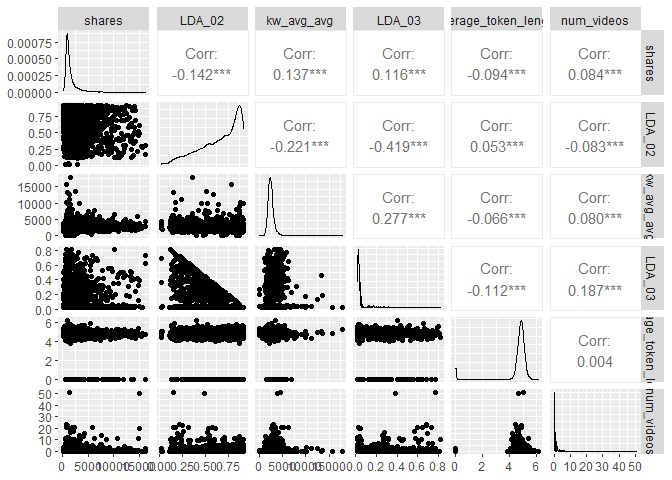
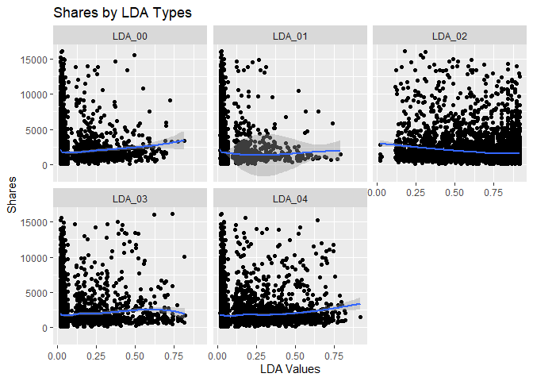
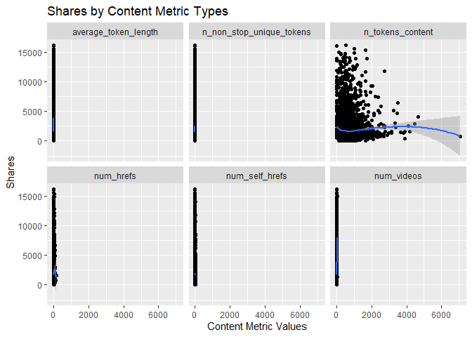
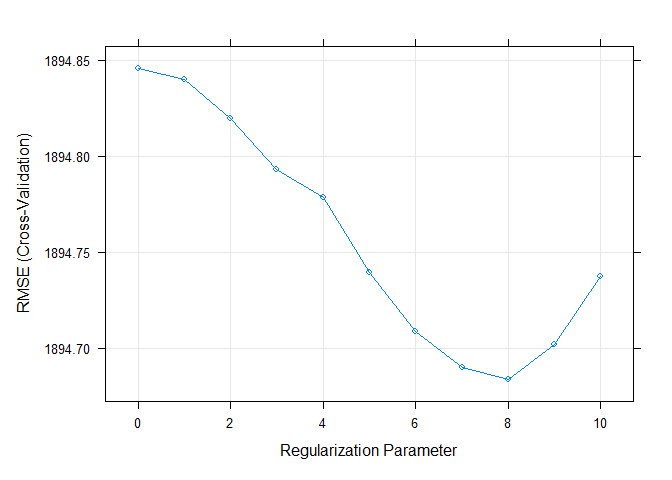

Project 3
================
Kara Belknap & Cassio Monti
2022-11-5

-   <a href="#report-for-world-channel"
    id="toc-report-for-world-channel">Report for <em>world</em> Channel</a>
    -   <a href="#introduction" id="toc-introduction">Introduction</a>
    -   <a href="#required-packages" id="toc-required-packages">Required
        Packages</a>
    -   <a href="#read-in-the-data" id="toc-read-in-the-data">Read in the
        Data</a>
    -   <a href="#select-data-for-appropriate-data-channel"
        id="toc-select-data-for-appropriate-data-channel">Select Data for
        Appropriate Data Channel</a>
    -   <a href="#summarizations-for-data-channel-world"
        id="toc-summarizations-for-data-channel-world">Summarizations for data
        channel <em>world</em></a>
        -   <a href="#data-split" id="toc-data-split">Data Split</a>
        -   <a href="#data-manipulation-for-statistics"
            id="toc-data-manipulation-for-statistics">Data manipulation for
            statistics</a>
        -   <a href="#belknap---summary-statistics"
            id="toc-belknap---summary-statistics">Belknap - Summary Statistics</a>
        -   <a href="#monti---summary-statistics"
            id="toc-monti---summary-statistics">Monti - Summary Statistics</a>
        -   <a href="#monti---graphs-3" id="toc-monti---graphs-3">Monti - Graphs
            (3)</a>
        -   <a href="#belknap---graphs-3" id="toc-belknap---graphs-3">Belknap -
            Graphs (3)</a>
        -   <a href="#subsetting-variables-for-modeling"
            id="toc-subsetting-variables-for-modeling">Subsetting Variables for
            Modeling</a>
    -   <a href="#modeling" id="toc-modeling">Modeling</a>
        -   <a href="#belknap---linear-regression-model-explanation"
            id="toc-belknap---linear-regression-model-explanation">Belknap - Linear
            Regression Model Explanation</a>
        -   <a href="#monti---linear-regression-model-lasso-regression"
            id="toc-monti---linear-regression-model-lasso-regression">Monti - Linear
            Regression Model (LASSO Regression)</a>
        -   <a href="#belknap---linear-regression-model"
            id="toc-belknap---linear-regression-model">Belknap - Linear Regression
            Model</a>
        -   <a href="#belknap---random-forest-model--explanation"
            id="toc-belknap---random-forest-model--explanation">Belknap - Random
            Forest Model &amp; Explanation</a>
        -   <a href="#monti---boosted-tree-model--explanation"
            id="toc-monti---boosted-tree-model--explanation">Monti - Boosted Tree
            Model &amp; Explanation</a>
    -   <a href="#comparison--conclusion---monti"
        id="toc-comparison--conclusion---monti">Comparison &amp; Conclusion -
        Monti</a>

# Report for *world* Channel

This report contains Exploratory Data Analysis (EDA) about this data
channel and a modeling section applying three regression methods.

## Introduction

The objective of this analysis is to provide a comprehensive overview
about publication metrics and their relationship with the number of
shares that those publications presented during the study period. These
data have been collected from Mashable website, one of the largest news
websites from which the content of all the world channel articles
published in 2013 and 2014 was extracted. These data were originally
collected analyzed By Fernandes et al. (2015) work, in which the authors
performed classification task comparing several machine learning
algorithms. In the present study, the subset of the data used by
Fernandes et al.(2015) corresponding to the data channel world is used
for regression purposes. The response variable is the number of `shares`
that the papers presented after publication. In other words, we will try
to predict the number of shares the papers will have before publication.
To perform the regression, Random Forest, Boosting, and Multiple Linear
Regression are used. More information about the methods will be provided
in further sections.

Some metrics have been calculated based on the information obtained from
Marshable website. For instance, the Latent Dirichlet Allocation (LDA)
was applied to the data set to identify the 5 top relevant topics and
then measure the closeness of the current article to such topic. There
are 5 relevance of topic metrics according to LDA:

-   `LDA_00`: Closeness to LDA topic 0  
-   `LDA_01`: Closeness to LDA topic 1  
-   `LDA_02`: Closeness to LDA topic 2  
-   `LDA_03`: Closeness to LDA topic 3  
-   `LDA_04`: Closeness to LDA topic 4

Additionally, some quality metrics related to the keywords have been
calculated and will be used in this analysis. These metrics represent
the average number of shares for publications with worst, best, and
average keywords. The classification of keywords under these groups was
made by the authors of the original paper. The keyword metrics are shown
below.

-   `kw_avg_min`: Worst keyword (avg. shares)  
-   `kw_avg_max`: Best keyword (avg. shares)  
-   `kw_avg_avg`: Avg. keyword (avg. shares)

Article content metrics were also used in this study. These are general
metrics about the body of the publication that can influence the number
of shares of that paper. The content summary metrics are shown below.

\-`num_videos`: Number of videos  
-`n_tokens_content`: Number of words in the content  
-`n_non_stop_unique_tokens`: Rate of unique non-stop words in the
content  
-`num_hrefs`: Number of links  
-`num_self_hrefs`: Number of links to other articles published by
Mashable  
-`average_token_length`: Average length of the words in the content

These data were collected during 2013 and 2014 on daily basis. To
represent time dependent information, a binary variable indicating
whether the publication was made in a weekend or weekday, `is_weekend`
is used.

## Required Packages

Before we can begin our analysis, we must load in the following
packages:

``` r
library(tidyverse)
library(caret)
library(PerformanceAnalytics)
library(knitr)
```

`Tidyverse` is used for data management and plotting through dplyr and
ggplot packages. `Caret` package is used for data splitting and
modeling. `knitr` package is used to provide nice looking tables.
`PerformanceAnalytics` is used for nice correlation plots assisting in
the visualization.

## Read in the Data

Using the data file `OnlineNewsPopularity.csv`, we will read in the data
and add a new column corresponding to the type of data channel from
which the data was classified. The new variable will be called
`dataChannel`. Note that there are some rows that are unclassified
according to the six channels of interest and those are indicated by
`other`.

Once the data column is created, we can easily subset the data using the
`filter` function to create a new data set for each data channel. We
removed the original `data_channel_is_*` columns as well as two
non-predictive columns `url` and `timedelta`.

``` r
# reading in the data set
rawData <- read_csv("../OnlineNewsPopularity.csv")

# creating new variable to have more comprehensive names for data channels.
rawDataChannel <- rawData %>%
  mutate(dataChannel = ifelse(data_channel_is_lifestyle == 1, "lifestyle", 
                              ifelse(data_channel_is_entertainment == 1, "entertainment", 
                              ifelse(data_channel_is_bus == 1, "bus", 
                              ifelse(data_channel_is_socmed == 1, "socmed", 
                              ifelse(data_channel_is_tech == 1, "tech", 
                              ifelse(data_channel_is_world == 1, "world", 
                                     "other"))))))) %>%
  select(-data_channel_is_lifestyle, -data_channel_is_entertainment, 
         -data_channel_is_bus, -data_channel_is_socmed, -data_channel_is_tech,
         -data_channel_is_world, -url, -timedelta)

# assigning channel data to R objects.
lifestyleData <- rawDataChannel %>%
  filter(dataChannel == "lifestyle")

entertainmentData <- rawDataChannel %>%
  filter(dataChannel == "entertainment")

busData <- rawDataChannel %>%
  filter(dataChannel == "bus")

socmedData <- rawDataChannel %>%
  filter(dataChannel == "socmed")

techData <- rawDataChannel %>%
  filter(dataChannel == "tech")

worldData <- rawDataChannel %>%
  filter(dataChannel == "world")
```

## Select Data for Appropriate Data Channel

To select the appropriate data channel based on the `params$channel`, we
created a function `selectData` which would return the appropriate data
set and assign it to the data set `activeData`. This will be the file we
will use for the remainder of the report.

To select the appropriate data channel based on the `params$channel`, we
created a function `selectData` which would return the appropriate data
set and assign it to the data set `activeData`. This will be the file we
will use for the remainder of the report.

``` r
# function to assign automated calls for the different data channels
selectData <- function(dataChannel) { 
  if (dataChannel == "lifestyle"){
    return(lifestyleData)
  }
  if (dataChannel == "entertainment"){
    return(entertainmentData)
  }
  if (dataChannel == "bus"){
    return(busData)
  }
  if (dataChannel == "socmed"){
    return(socmedData)
  }
  if (dataChannel == "tech"){
    return(techData)
  }
  if (dataChannel == "world"){
    return(worldData)
  }
}

# activating corresponding data set.
dataChannelSelect <- params$channel

activeData <- selectData(dataChannelSelect)
```

## Summarizations for data channel *world*

In this section, we will perform EDA for the data channel world

### Data Split

This section splits the data set into training and test sets for the
proportion of 70/30. The data summarization will be conducted on the
training set. To split the data, the function `createDataPartition()`,
from `caret` package, was used with the argument `p=0.7` to represent
80% of the data should be in the split. The function `set.seed(555)` was
used to fix the random seed. The code below shows the creation of
training and test sets.

``` r
set.seed(555)

trainIndex <- createDataPartition(activeData$shares, p = 0.7, list = FALSE)

activeTrain <- activeData[trainIndex, ]

activeTest <- activeData[-trainIndex, ]
```

### Data manipulation for statistics

A new object is created in this section aiming to summarize publications
during weekdays and weekends and create factor levels for them to match
with `shares` variable. The functions `ifelse()` was used to vectorize
the IF-ELSE statements associated to `mutate()` which took care of
attaching the new variable to the data set. The function `factor()` was
used to explicitly coerce the days of week into levels of the newly
created categorical variable “Day”.

``` r
# IF-ELSE statements
statsData <- activeTrain %>%
  mutate(Day = ifelse(weekday_is_monday == 1, "Monday", 
                      ifelse(weekday_is_tuesday == 1, "Tuesday", 
                      ifelse(weekday_is_wednesday == 1, "Wednesday", 
                      ifelse(weekday_is_thursday == 1, "Thursday", 
                      ifelse(weekday_is_friday == 1, "Friday", 
                      ifelse(weekday_is_saturday == 1, "Saturday", 
                      ifelse(weekday_is_sunday == 1, "Sunday",
                             "missingdata")))))))) %>%
  mutate(Weekend = ifelse(is_weekend == 1, "Yes", "No"))

# Assigning factor levels
statsData$Day <- factor(statsData$Day, 
                levels = c("Monday", "Tuesday", "Wednesday", "Thursday", 
                           "Friday", "Saturday", "Sunday"))
```

### Belknap - Summary Statistics

The following table gives us information about the summary statistics
for the number of shares for articles in the data channel world. The
`summary()` function was used to extract these metrics.

``` r
summary(activeTrain$shares)
```

    ##    Min. 1st Qu.  Median    Mean 3rd Qu.    Max. 
    ##      42     827    1100    2287    1900  284700

The following table gives us information about the average, median, and
standard deviation for the number of shares based on whether the post
was made on a weekend or a weekday. The variable “weekend” was grouped,
via `grouped_by()`, and for each level the sum, average, median, and
standard deviation of shares were calculated via `sum()`, `mean()`,
`meadian()`, `sd()`, and `summarise()` functions. The summary table is
shown below.

``` r
statsData %>% 
  group_by(Weekend) %>%
  summarise(sumShares = sum(shares), avgShares = mean(shares), medShares = median(shares), sdShares = sd(shares))
```

    ## # A tibble: 2 × 5
    ##   Weekend sumShares avgShares medShares sdShares
    ##   <chr>       <dbl>     <dbl>     <dbl>    <dbl>
    ## 1 No       11487592     2228.      1100    6461.
    ## 2 Yes       2008315     2699.      1500    4691.

Likewise, this table gives us information about the number of shares by
the day of the week. The same functions were used here, by applied to
levels of variable “Day”. Also, the quantities maximum `max()` and
minimum `min()` number of shares by levels of “Day” were calculated.

``` r
statsData %>% 
  group_by(Day) %>%
  arrange(Day) %>%
  summarise(sumShares = sum(shares), avgShares = mean(shares), medShares = median(shares), sdShares = sd(shares), maxShares = max(shares),
            minShares = min(shares))
```

    ## # A tibble: 7 × 7
    ##   Day       sumShares avgShares medShares sdShares maxShares minShares
    ##   <fct>         <dbl>     <dbl>     <dbl>    <dbl>     <dbl>     <dbl>
    ## 1 Monday      2436420     2551.      1100    6566.    108400        43
    ## 2 Tuesday     2358495     2144.      1050    5479.    115700        42
    ## 3 Wednesday   1995054     1825.      1100    3024.     53500        48
    ## 4 Thursday    2683933     2444.      1100    9862.    284700        42
    ## 5 Friday      2013690     2213.      1100    5147.    111300        70
    ## 6 Saturday    1007706     2807.      1500    5221.     75500        43
    ## 7 Sunday      1000609     2599.      1400    4140.     52600        91

### Monti - Summary Statistics

First, we will analyse the frequency of occurrence of publications on
each day of the week. The one-way contingency table below presents those
frequencies.

``` r
table(statsData$Day)
```

    ## 
    ##    Monday   Tuesday Wednesday  Thursday    Friday  Saturday    Sunday 
    ##       955      1100      1093      1098       910       359       385

A second discrete analysis performed here is the two-way contingency
table related to the discretization of the response variable if we
divided `shares` into two categories. The function `cut()` was used for
the end. In this case, we count the frequency of the number of
publications in days of week with the two levels of response variable.
These levels represent smaller number of shares (on the left) and larger
number of shares (on the right). The table below shows this counting.

``` r
table(statsData$Day, cut(statsData$shares, breaks = 2))
```

    ##            
    ##             (-243,1.42e+05] (1.42e+05,2.85e+05]
    ##   Monday                955                   0
    ##   Tuesday              1100                   0
    ##   Wednesday            1093                   0
    ##   Thursday             1097                   1
    ##   Friday                910                   0
    ##   Saturday              359                   0
    ##   Sunday                385                   0

An important EDA analysis for regression tasks is the calculation of
correlation matrix. The function `cor()` is used in this section to
return the top 10 most correlated potential predictor variables with the
response variable `shares`. The code below presents the process of
obtaining these variables and their respective correlations with the
response variable.

``` r
var_sel = select(activeTrain,starts_with("LDA_"), average_token_length,
         is_weekend, n_tokens_content, n_non_stop_unique_tokens, num_hrefs,
         num_self_hrefs, num_videos, average_token_length, kw_avg_min, 
         kw_avg_max, kw_avg_avg, is_weekend)

# correlation matrix
correlation = cor(activeTrain$shares, var_sel)

# sorting the highest correlations
p = sort(abs(correlation), decreasing = T)

# getting column ID
var_id = which(abs(correlation) %in% p[1:10])

# collecting variable names
var_cor = colnames(correlation)[var_id]

#combining names with correlations
tbcor = cbind(var_cor, correlation[var_id])

# converting to tibble
tbcor = as_tibble(tbcor)

# updating column names
colnames(tbcor)=c("Variables","Correlation")

# rounding the digits
tbcor$Correlation = round(as.numeric(tbcor$Correlation),3)

# nice printing with kable
kable(tbcor, caption = "Top 10 Response Correlated Variables")
```

| Variables                | Correlation |
|:-------------------------|------------:|
| LDA_00                   |       0.026 |
| LDA_01                   |       0.030 |
| LDA_02                   |      -0.108 |
| LDA_03                   |       0.076 |
| LDA_04                   |       0.052 |
| average_token_length     |      -0.063 |
| is_weekend               |       0.025 |
| n_non_stop_unique_tokens |      -0.029 |
| num_videos               |       0.036 |
| kw_avg_avg               |       0.068 |

Top 10 Response Correlated Variables

The variables that present most correlation with the response variable
`shares` are LDA_00, LDA_01, LDA_02, LDA_03, LDA_04,
average_token_length, is_weekend, n_non_stop_unique_tokens, num_videos,
kw_avg_avg. These variables will be studied in more depth via PCA to
understand the orientation of the most variable potential predictors.
The code below presents the PCA analysis as part of the EDA.

``` r
id = which(colnames(activeTrain) %in% var_cor)

# PCA
PC = prcomp(activeTrain[,id], center = TRUE, scale = TRUE)

pc_directions=as.data.frame(PC$rotation)

kable(pc_directions, caption="PCs for EDA", digits = 3)
```

|                          |    PC1 |    PC2 |    PC3 |    PC4 |    PC5 |    PC6 |    PC7 |    PC8 |    PC9 |  PC10 |
|:-------------------------|-------:|-------:|-------:|-------:|-------:|-------:|-------:|-------:|-------:|------:|
| n_non_stop_unique_tokens | -0.258 |  0.641 | -0.138 | -0.026 | -0.003 | -0.023 |  0.064 | -0.043 |  0.705 | 0.000 |
| num_videos               |  0.145 |  0.062 | -0.394 | -0.360 | -0.092 | -0.077 | -0.769 |  0.292 | -0.008 | 0.000 |
| average_token_length     | -0.325 |  0.607 | -0.118 | -0.048 |  0.028 | -0.070 |  0.081 |  0.000 | -0.706 | 0.000 |
| kw_avg_avg               |  0.349 |  0.052 | -0.324 | -0.050 |  0.206 | -0.040 |  0.500 |  0.688 |  0.011 | 0.000 |
| is_weekend               |  0.042 | -0.044 |  0.001 |  0.176 |  0.002 | -0.980 | -0.004 | -0.059 |  0.027 | 0.000 |
| LDA_00                   |  0.192 |  0.169 |  0.021 |  0.647 |  0.542 |  0.117 | -0.329 |  0.030 | -0.018 | 0.316 |
| LDA_01                   |  0.111 |  0.089 | -0.088 |  0.478 | -0.803 |  0.074 |  0.004 |  0.173 | -0.031 | 0.248 |
| LDA_02                   | -0.611 | -0.334 | -0.189 | -0.087 |  0.082 | -0.036 |  0.054 |  0.173 |  0.044 | 0.656 |
| LDA_03                   |  0.407 |  0.033 | -0.513 | -0.173 |  0.002 |  0.018 |  0.193 | -0.602 | -0.041 | 0.371 |
| LDA_04                   |  0.310 |  0.252 |  0.632 | -0.386 | -0.051 | -0.073 | -0.008 |  0.111 | -0.001 | 0.521 |

PCs for EDA

### Monti - Graphs (3)

The plot below presents histograms, scatter plots, and correlations in a
bivariate structure of the top 5 variables chosen the correlation
analysis. Notice the shape of the distributions and the values of the
correlations for the first column, which the one related to the response
variable `shares`.

``` r
# bivariate correlation plot
cor_data <- select(activeTrain,shares,var_id[1:5])
chart.Correlation(cor_data, histogram=TRUE)
```

<!-- -->

The biplot below presents the PC1 and PC2 from the PCA analysis. The
function `ggplot()` was used to create the plot and the segments created
via `geom_segment()` were rescaled so that we could better see the
variable names. The most variation in the data is contained in the PC1,
hence, the most important variables in the data approximately are
oriented towards the axis of PC1 and, therefore, may be good predictors
for the `shares` response. Likewise, for PC2, which contains the second
most variability in the data set, the variables that are oriented
approximately towards the axis of PC2 are the second most important
variables.

``` r
pc_df<-data.frame(PC$x)
# plotting PC1 and PC2 for the top 5 variables
# biplot(PC, cex = 1)
ggplot(pc_directions)+
  geom_point(data = pc_df, mapping = aes(x=PC1, y=PC2))+
  geom_segment(aes(x = 0, y = 0, yend = 50 * PC2, xend = 50 * PC1))+
  geom_label(mapping = aes(, x = 51 * PC1, y = 51 * PC2, label = row.names(pc_directions)))
```

<!-- -->

The scatter plots below show the different levels of the variables
related to the LDA metrics, from 0 to 4, and graphs the relationship
with the response variable `shares`. The function `ggplot()` is used to
create the plot frame and `geom_point()`, `geom_smooth`, and
`facert_wrap()` function are used to plot the scatter points, the smooth
GAM (Generalized Additive Models) lines, and split the data by LDA type,
respectively. It is possible to see the behavior of the response
variable in relation to each LDA types.

``` r
LDA.dat = activeTrain %>%
  select(shares, starts_with("LDA")) %>%
  pivot_longer(cols = LDA_00:LDA_04, names_to = "LDA", values_to = "values")

# relationship between shares and LDA levels (facet_wrap+smooth)
ggplot(LDA.dat, aes(y = shares, x = values))+
  geom_point() + geom_smooth(method = "loess")+ facet_wrap(~LDA)+
labs(x = "LDA Values", y = "Shares", title = "Shares by LDA Types")
```

<!-- -->

The scatter plots below show the different types of the variables
related to the Keyword metrics and graphs the relationship with the
response variable `shares`. The function `ggplot()` is used to create
the plot frame and `geom_point()`, `geom_smooth`, and `facert_wrap()`
function are used to plot the scatter points, the smooth GAM
(Generalized Additive Models) lines, and split the data by keyword type,
respectively. It is possible to see the behavior of the response
variable in relation to each of the 3 keyword metric types.

``` r
# relationship between shares and keyword metrics
kw.dat = activeTrain %>%
  select(shares, kw_avg_max, kw_avg_avg, kw_avg_min) %>%
  pivot_longer(cols = 2:4, names_to = "keyword", values_to = "values")

# relationship between shares and keyword metrics types (facet_wrap+smooth)
ggplot(kw.dat, aes(y = shares, x = values))+
  geom_point() + geom_smooth(method = "loess")+ facet_wrap(~keyword)+
labs(x = "Keyword Metric Values", y = "Shares", title = "Shares by Keyword Metric Types")
```

<!-- -->

Finally, the scatter plots below show the different types of the
variables related to the Content metrics and graphs the relationship
with the response variable `shares`. The function `ggplot()` is used to
create the plot frame and `geom_point()`, `geom_smooth`, and
`facert_wrap()` function are used to plot the scatter points, the smooth
GAM (Generalized Additive Models) lines, and split the data by content
type, respectively. It is possible to see the behavior of the response
variable in relation to each of the 4 content metric types.

``` r
# relationship between shares and content metrics (facet_wrap+smooth)
cont.dat = activeTrain %>%
  select(shares, num_videos, n_tokens_content, n_non_stop_unique_tokens,
         num_hrefs, num_self_hrefs, average_token_length) %>%
  pivot_longer(cols = 2:7, names_to = "content", values_to = "values")

# relationship between shares and content metrics types (facet_wrap+smooth)
ggplot(cont.dat, aes(y = shares, x = values))+
  geom_point() + geom_smooth(method = "loess")+ facet_wrap(~content)+
labs(x = "Content Metric Values", y = "Shares", title = "Shares by Content Metric Types")
```

<!-- -->

### Belknap - Graphs (3)

The following graph shows the number of shares compared to the number of
words in the title. The output is colored by the day of the week.

``` r
titlewordcountGraph <- ggplot(statsData, aes(x = n_tokens_title, y = shares))
titlewordcountGraph + geom_point(aes(color = Day)) + 
  ggtitle("Number of Shares vs. Number of Words in Title") +
  ylab("Number of Shares") +
  xlab("Number of Words in Title")
```

<!-- -->

The following plot shows the number of shares by the rate of positive
words in the article. A positive trend would indicate that articles with
more positive words are shared more often than articles with negative
words.

``` r
positivewordrateGraph <- ggplot(statsData, aes(x = rate_positive_words, y = shares))
positivewordrateGraph + geom_point(aes(color = Day)) + 
  ggtitle("Number of Shares vs. Rate of Positive Words") +
  ylab("Number of Shares") +
  xlab("Rate of Positive Words") 
```

<!-- -->

The following plot shows the total number of shares as related to the
parameter title subjectivity. A positive trend would indicate that
articles are shared more often when the title is subjective. A negative
trend would indicate that articles are shared more often when the title
is less subjective.

``` r
titleSubjectivityGraph <- ggplot(statsData, aes(x = title_subjectivity, y = shares))
titleSubjectivityGraph + geom_point(aes(color = n_tokens_title)) + 
  ggtitle("Number of Shares vs. Title Subjectivity") +
  ylab("Number of Shares") +
  xlab("Title Subjectivity") + 
  labs(color = "Word Count in Title")
```

### Subsetting Variables for Modeling

The variables selected below are those described in the introduction of
this study and will be used in the modeling section. The function
`select()` was used to subset the corresponding variables from the
training and test sets and two new objects are created specially for the
modeling section, `dfTrain` and `dfTest`.

``` r
dfTrain = activeTrain %>%
  select(shares, starts_with("LDA_"), average_token_length,
         is_weekend, n_tokens_content, n_non_stop_unique_tokens, num_hrefs,
         num_self_hrefs, num_videos, average_token_length, kw_avg_min, 
         kw_avg_max, kw_avg_avg, is_weekend)

dfTest = activeTest %>%
  select(shares, starts_with("LDA_"), average_token_length,
         is_weekend, n_tokens_content, n_non_stop_unique_tokens, num_hrefs,
         num_self_hrefs, num_videos, average_token_length, kw_avg_min, 
         kw_avg_max, kw_avg_avg, is_weekend)
```

## Modeling

In this section, we will perform regression for prediction purposes for
the data channel world. All models were fitted using 5-fold
Cross-Validation via `train()` function from `caret` package.

### Belknap - Linear Regression Model Explanation

(add some thoughts here)

### Monti - Linear Regression Model (LASSO Regression)

The linear regression chosen for this next model is based on penalized
regression via LASSO method. This method has a particular advantage of
having a triangular shape of parameters search space so that it allows
the estimated coefficients to be zero. Hence, LASSO regression is also a
variable selection method. In this application, we will test the
prediction capability of LASSO regression only. It was tested a sequence
of values for the Regularization Parameter (lambda), a tuning parameter,
from 0 to 10 by 1 via `seq(0,10,1)` assigned to the `tuneGrid =`argument
in the `train()` function from `caret` package. The code below presents
the estimated coefficients for the best hyperparameter.

``` r
LASSO = train(shares~., data = dfTrain,
              method="glmnet",
              preProcess = c("center","scale"),
              tuneGrid = expand.grid(alpha = 1, lambda = seq(0,10,1)),
              trControl = trainControl(method="CV",number=5))

coef(LASSO$finalModel, LASSO$bestTune$lambda)
```

    ## 16 x 1 sparse Matrix of class "dgCMatrix"
    ##                                  s1
    ## (Intercept)              2287.44186
    ## LDA_00                    -44.80817
    ## LDA_01                     33.56468
    ## LDA_02                   -531.36419
    ## LDA_03                     91.20521
    ## LDA_04                      .      
    ## average_token_length     -546.09730
    ## is_weekend                124.73387
    ## n_tokens_content          -63.14016
    ## n_non_stop_unique_tokens  221.89737
    ## num_hrefs                 239.73473
    ## num_self_hrefs             36.01440
    ## num_videos                114.63860
    ## kw_avg_min                -13.99598
    ## kw_avg_max                -12.86262
    ## kw_avg_avg                239.88462

The best lambda for this model is 10 and this value can be seen in the
table below which summarizes all the metrics for the 5-fold
cross-validation.

``` r
lasso_out = data.frame(LASSO$results)

kable(lasso_out, caption = "Output Training Metrics for LASSO",
      digits = 3)
```

| alpha | lambda |     RMSE | Rsquared |      MAE |   RMSESD | RsquaredSD |   MAESD |
|------:|-------:|---------:|---------:|---------:|---------:|-----------:|--------:|
|     1 |      0 | 5719.827 |    0.022 | 1898.680 | 2752.570 |      0.011 | 177.315 |
|     1 |      1 | 5719.824 |    0.022 | 1898.675 | 2752.562 |      0.011 | 177.307 |
|     1 |      2 | 5719.701 |    0.022 | 1898.502 | 2752.603 |      0.011 | 177.283 |
|     1 |      3 | 5719.562 |    0.022 | 1898.308 | 2752.675 |      0.011 | 177.283 |
|     1 |      4 | 5719.432 |    0.022 | 1898.130 | 2752.757 |      0.011 | 177.292 |
|     1 |      5 | 5719.305 |    0.022 | 1897.956 | 2752.834 |      0.011 | 177.285 |
|     1 |      6 | 5719.177 |    0.022 | 1897.783 | 2752.908 |      0.011 | 177.262 |
|     1 |      7 | 5719.045 |    0.022 | 1897.614 | 2752.969 |      0.011 | 177.232 |
|     1 |      8 | 5718.933 |    0.022 | 1897.458 | 2753.052 |      0.011 | 177.220 |
|     1 |      9 | 5718.816 |    0.022 | 1897.261 | 2753.153 |      0.011 | 177.255 |
|     1 |     10 | 5718.701 |    0.022 | 1897.069 | 2753.251 |      0.011 | 177.292 |

Output Training Metrics for LASSO

The plot below shows the RMSE by Regularization Parameter (lambda). It
is easy to see that RMSE is minimized when $\lambda$ = 10.

``` r
plot(LASSO)
```

<!-- -->

The validation step for LASSO regression is applied on the test set
after predicting the response variable for unseen data (test set). By
using `predict()` and `postResample()` functions, the metrics RMSE (Root
Means Squared Error), R2 (Coefficient of Determination), and MAE (Mean
Absolute Error) are calculated and displayed below.

``` r
metric_LASSO = postResample(pred = predict(LASSO, newdata = dfTest),
                            obs = dfTest$shares)

metric_LASSO
```

    ##         RMSE     Rsquared          MAE 
    ## 5592.1974953    0.0214552 1911.6124566

### Belknap - Linear Regression Model

(add some thoughts here)

``` r
lmFit = train(shares~., data = dfTrain,
              method="lm",
              preProcess = c("center","scale"),
              trControl = trainControl(method="CV",number=5))

summary(lmFit)
```

    ## 
    ## Call:
    ## lm(formula = .outcome ~ ., data = dat)
    ## 
    ## Residuals:
    ##    Min     1Q Median     3Q    Max 
    ##  -7760  -1446   -803   -163 280822 
    ## 
    ## Coefficients: (1 not defined because of singularities)
    ##                          Estimate Std. Error t value Pr(>|t|)    
    ## (Intercept)               2287.44      80.87  28.287  < 2e-16 ***
    ## LDA_00                     -60.61      91.25  -0.664 0.506556    
    ## LDA_01                      39.24      86.25   0.455 0.649200    
    ## LDA_02                    -534.85     106.56  -5.019 5.34e-07 ***
    ## LDA_03                      88.85      98.53   0.902 0.367239    
    ## LDA_04                         NA         NA      NA       NA    
    ## average_token_length      -611.09     161.21  -3.791 0.000152 ***
    ## is_weekend                 134.63      81.15   1.659 0.097153 .  
    ## n_tokens_content           -60.27     103.07  -0.585 0.558782    
    ## n_non_stop_unique_tokens   283.93     156.63   1.813 0.069916 .  
    ## num_hrefs                  262.01      94.92   2.760 0.005795 ** 
    ## num_self_hrefs              45.24      85.14   0.531 0.595175    
    ## num_videos                 120.23      83.25   1.444 0.148706    
    ## kw_avg_min                 -39.45      98.38  -0.401 0.688395    
    ## kw_avg_max                 -36.07      92.28  -0.391 0.695872    
    ## kw_avg_avg                 266.71     106.59   2.502 0.012367 *  
    ## ---
    ## Signif. codes:  0 '***' 0.001 '**' 0.01 '*' 0.05 '.' 0.1 ' ' 1
    ## 
    ## Residual standard error: 6211 on 5885 degrees of freedom
    ## Multiple R-squared:  0.02009,    Adjusted R-squared:  0.01776 
    ## F-statistic: 8.619 on 14 and 5885 DF,  p-value: < 2.2e-16

(add some thoughts here)

``` r
lm_out = data.frame(lmFit$results)

kable(lm_out, caption = "Output Training Metrics for Linear Regression",
      digits = 3)
```

| intercept |     RMSE | Rsquared |      MAE |   RMSESD | RsquaredSD |   MAESD |
|:----------|---------:|---------:|---------:|---------:|-----------:|--------:|
| TRUE      | 5958.975 |    0.022 | 1899.643 | 2018.604 |      0.018 | 108.383 |

Output Training Metrics for Linear Regression

``` r
metric_lm = postResample(pred = predict(lmFit, newdata = dfTest), 
                         obs = dfTest$shares)

metric_lm
```

    ##         RMSE     Rsquared          MAE 
    ## 5.590949e+03 2.193465e-02 1.912026e+03

### Belknap - Random Forest Model & Explanation

(add some thoughts here about RF)

``` r
train.control = trainControl(method = "cv", number = 5)

rfFit <- train(shares~.,
               data = dfTrain,
               method = "rf",
               trControl = train.control,
               preProcess = c("center","scale"),
               tuneGrid = data.frame(mtry = 1:5))

rfFit$bestTune$mtry
```

    ## [1] 1

(add some thoughts here)

``` r
plot(rfFit)
```

<!-- -->

(add some thoughts here)

``` r
rf_out = data.frame(rfFit$results)

kable(rf_out, caption = "Output Training Metrics for Random Forest",
      digits = 3)
```

| mtry |     RMSE | Rsquared |      MAE |   RMSESD | RsquaredSD |  MAESD |
|-----:|---------:|---------:|---------:|---------:|-----------:|-------:|
|    1 | 5924.467 |    0.031 | 1901.671 | 2059.352 |      0.021 | 77.365 |
|    2 | 5957.473 |    0.031 | 1968.691 | 2037.479 |      0.023 | 79.222 |
|    3 | 5986.748 |    0.029 | 1993.732 | 2022.912 |      0.023 | 78.023 |
|    4 | 6037.058 |    0.023 | 2020.985 | 2000.370 |      0.018 | 77.870 |
|    5 | 6047.035 |    0.023 | 2034.542 | 2000.876 |      0.019 | 84.271 |

Output Training Metrics for Random Forest

(add some thoughts here)

``` r
RF_pred <- predict(rfFit, newdata = activeTest)

metric_rf = postResample(RF_pred, activeTest$shares)

metric_rf
```

    ##         RMSE     Rsquared          MAE 
    ## 5.609240e+03 1.884229e-02 1.914800e+03

### Monti - Boosted Tree Model & Explanation

(add some thoughts here)

``` r
tunG = expand.grid(n.trees = seq(25,200,25),
                      interaction.depth = 1:4,
                      shrinkage = 0.1,
                      n.minobsinnode = 10)

gbmFit <- train(shares~.,
               data = dfTrain,
               method = "gbm",
               preProcess = c("center","scale"),
               trControl = train.control,
               tuneGrid = tunG,
               verbose = FALSE
               )


gbmFit$bestTune$n.trees
```

    ## [1] 50

``` r
gbmFit$bestTune$interaction.depth
```

    ## [1] 1

The best n.trees and interaction.depth parameters for this model are 50
and 1, respectively. These values can be seen in the table below, which
summarizes all the metrics for the 5-fold cross-validation. It is easy
to see that these values minimize the RMSE.

``` r
gbm_out = data.frame(gbmFit$results)

kable(gbm_out, caption = "Output Training Metrics for Boosting",
      digits = 3)
```

|     | shrinkage | interaction.depth | n.minobsinnode | n.trees |     RMSE | Rsquared |      MAE |   RMSESD | RsquaredSD |   MAESD |
|:----|----------:|------------------:|---------------:|--------:|---------:|---------:|---------:|---------:|-----------:|--------:|
| 1   |       0.1 |                 1 |             10 |      25 | 5930.263 |    0.017 | 1901.898 | 2139.557 |      0.009 | 115.264 |
| 9   |       0.1 |                 2 |             10 |      25 | 5988.171 |    0.008 | 1908.203 | 2135.962 |      0.005 | 150.336 |
| 17  |       0.1 |                 3 |             10 |      25 | 6017.479 |    0.008 | 1928.832 | 2111.260 |      0.006 | 140.921 |
| 25  |       0.1 |                 4 |             10 |      25 | 5995.669 |    0.011 | 1924.932 | 2100.124 |      0.006 | 128.050 |
| 2   |       0.1 |                 1 |             10 |      50 | 5922.555 |    0.020 | 1890.946 | 2144.877 |      0.012 | 141.274 |
| 10  |       0.1 |                 2 |             10 |      50 | 6033.059 |    0.008 | 1926.491 | 2099.807 |      0.006 | 136.019 |
| 18  |       0.1 |                 3 |             10 |      50 | 6041.801 |    0.010 | 1928.331 | 2060.120 |      0.008 | 117.904 |
| 26  |       0.1 |                 4 |             10 |      50 | 6053.406 |    0.011 | 1934.304 | 2061.091 |      0.008 | 144.904 |
| 3   |       0.1 |                 1 |             10 |      75 | 5926.596 |    0.021 | 1897.683 | 2129.165 |      0.010 | 137.555 |
| 11  |       0.1 |                 2 |             10 |      75 | 6041.165 |    0.011 | 1918.392 | 2093.733 |      0.007 | 131.851 |
| 19  |       0.1 |                 3 |             10 |      75 | 6062.561 |    0.014 | 1940.124 | 2032.523 |      0.012 | 135.532 |
| 27  |       0.1 |                 4 |             10 |      75 | 6074.667 |    0.012 | 1949.936 | 2037.812 |      0.009 | 130.347 |
| 4   |       0.1 |                 1 |             10 |     100 | 5929.549 |    0.021 | 1892.995 | 2123.829 |      0.011 | 134.851 |
| 12  |       0.1 |                 2 |             10 |     100 | 6075.301 |    0.009 | 1941.849 | 2069.240 |      0.006 | 145.329 |
| 20  |       0.1 |                 3 |             10 |     100 | 6091.573 |    0.013 | 1962.230 | 2023.939 |      0.011 | 129.551 |
| 28  |       0.1 |                 4 |             10 |     100 | 6098.251 |    0.012 | 1963.983 | 2011.254 |      0.010 | 124.179 |
| 5   |       0.1 |                 1 |             10 |     125 | 5937.281 |    0.021 | 1892.990 | 2119.611 |      0.011 | 139.881 |
| 13  |       0.1 |                 2 |             10 |     125 | 6083.872 |    0.011 | 1943.796 | 2037.246 |      0.008 | 134.132 |
| 21  |       0.1 |                 3 |             10 |     125 | 6085.509 |    0.015 | 1962.768 | 2034.601 |      0.011 | 131.988 |
| 29  |       0.1 |                 4 |             10 |     125 | 6137.851 |    0.012 | 1985.482 | 1995.688 |      0.010 | 133.389 |
| 6   |       0.1 |                 1 |             10 |     150 | 5942.691 |    0.021 | 1907.586 | 2121.412 |      0.011 | 146.382 |
| 14  |       0.1 |                 2 |             10 |     150 | 6101.087 |    0.010 | 1953.717 | 2029.080 |      0.007 | 133.392 |
| 22  |       0.1 |                 3 |             10 |     150 | 6119.054 |    0.013 | 1969.543 | 2039.186 |      0.010 | 137.318 |
| 30  |       0.1 |                 4 |             10 |     150 | 6170.178 |    0.010 | 2007.476 | 1976.356 |      0.010 | 134.963 |
| 7   |       0.1 |                 1 |             10 |     175 | 5941.435 |    0.021 | 1905.679 | 2117.782 |      0.011 | 137.811 |
| 15  |       0.1 |                 2 |             10 |     175 | 6127.731 |    0.010 | 1966.483 | 2026.405 |      0.007 | 149.073 |
| 23  |       0.1 |                 3 |             10 |     175 | 6150.570 |    0.011 | 1991.238 | 2029.819 |      0.009 | 144.555 |
| 31  |       0.1 |                 4 |             10 |     175 | 6191.225 |    0.011 | 2025.572 | 1957.481 |      0.010 | 125.463 |
| 8   |       0.1 |                 1 |             10 |     200 | 5952.384 |    0.021 | 1914.756 | 2114.138 |      0.011 | 141.292 |
| 16  |       0.1 |                 2 |             10 |     200 | 6161.907 |    0.011 | 1990.307 | 1993.795 |      0.008 | 152.115 |
| 24  |       0.1 |                 3 |             10 |     200 | 6165.717 |    0.011 | 1995.045 | 2020.388 |      0.008 | 149.840 |
| 32  |       0.1 |                 4 |             10 |     200 | 6222.400 |    0.010 | 2038.512 | 1946.889 |      0.009 | 137.958 |

Output Training Metrics for Boosting

The plot below shows the RMSE by Number of Boosting Iterations and
display Max Tree Depth lines for the 5-fold CV performed. It is easy to
see that RMSE is minimized when n.trees = 50 and interaction.depth = 1.

``` r
plot(gbmFit)
```

<!-- -->

The validation step for Boosting is applied on the test set after
predicting the response variable for unseen data (test set). By using
`predict()` and `postResample()` functions, the metrics RMSE (Root Means
Squared Error), R2 (Coefficient of Determination), and MAE (Mean
Absolute Error) are calculated and displayed below.

``` r
gbm_pred <- predict(gbmFit, newdata = activeTest)

metric_boosting = postResample(gbm_pred, activeTest$shares)

metric_boosting
```

    ##         RMSE     Rsquared          MAE 
    ## 5.615487e+03 1.539181e-02 1.890319e+03

## Comparison & Conclusion - Monti

For the overall comparison among all 4 created models in previous
sections, the test set was used for predictions and some quality of fit
metrics were calculated based on these prediction on unseen data. The
code below shows the function that returns the name of the best model
based on RMSE values estimated on the test set. The code below displays
the table comparing all 4 models.

``` r
bestMethod = function(x){
  
  bestm = which.min(lapply(1:length(x), function(i) x[[i]][1]))
  
  out = switch(bestm,
                "Random Forest",
                "Boosting",
               "LASSO Regression",
               "Linear Regression")
  
  return(out)
  
}

tb = data.frame(RF = metric_rf, Boosting = metric_boosting,
                LASSO = metric_LASSO, Linear = metric_lm)

kable(tb, caption = "Accuracy Metric by Ensemble Method on Test Set",
      digits = 3)
```

|          |       RF | Boosting |    LASSO |   Linear |
|:---------|---------:|---------:|---------:|---------:|
| RMSE     | 5609.240 | 5615.487 | 5592.197 | 5590.949 |
| Rsquared |    0.019 |    0.015 |    0.021 |    0.022 |
| MAE      | 1914.800 | 1890.319 | 1911.612 | 1912.026 |

Accuracy Metric by Ensemble Method on Test Set

After comparing all the 4 models fit throughout this analysis, the best
model was chosen based on the RMSE value, such that the model with
minimum RMSE is the “winner”. Therefore, the best model is Linear
Regression based on RMSE metric. The RMSE, R2 (coefficient of
Determination), and MAE metrics for all 4 models can be seen in the
table above.
